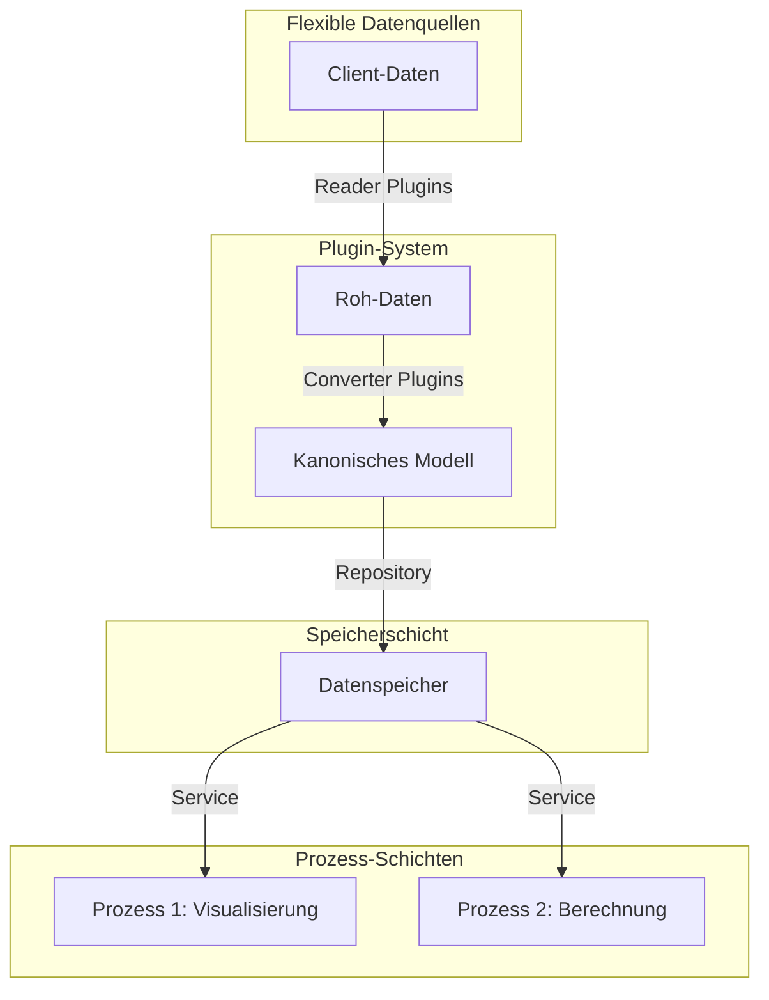
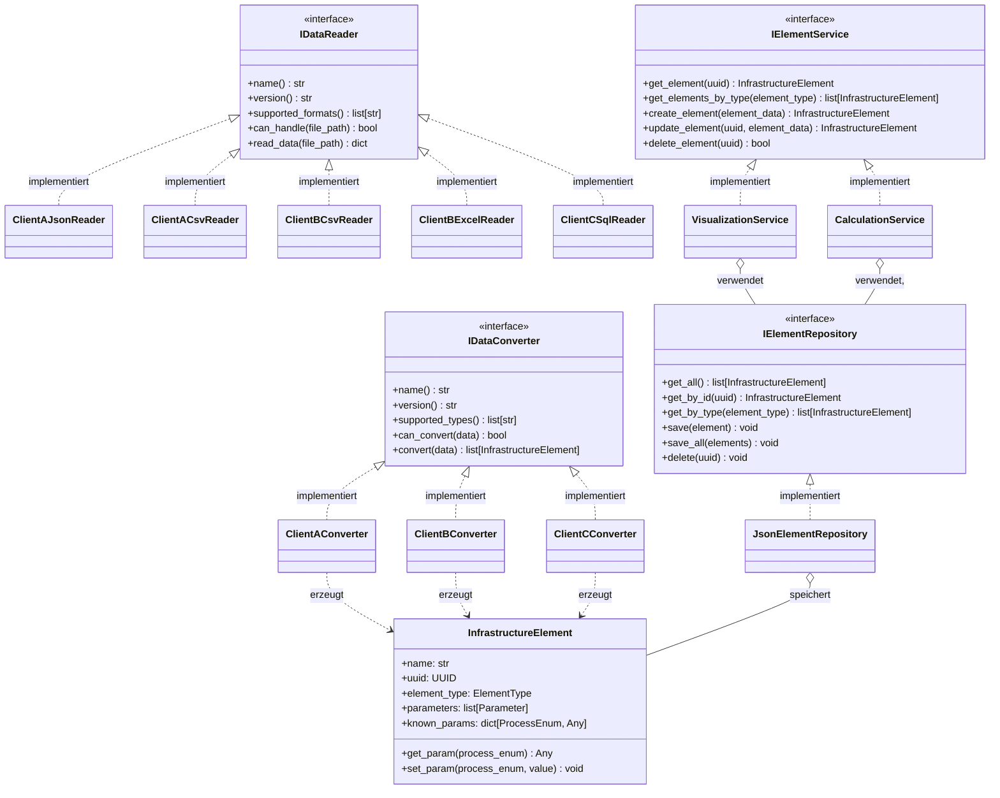
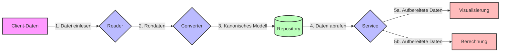
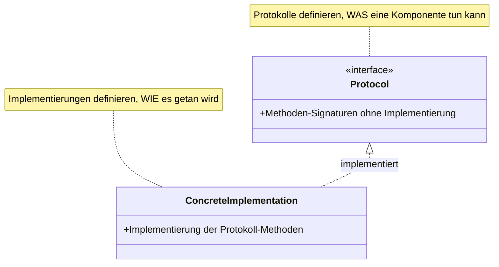
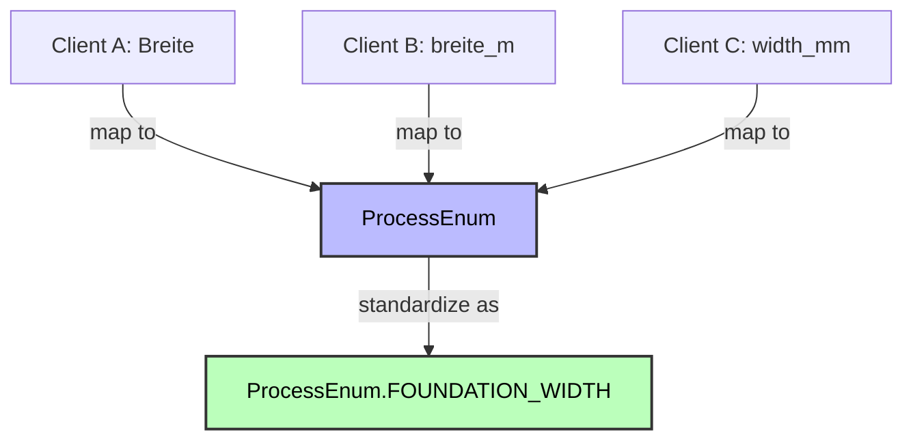
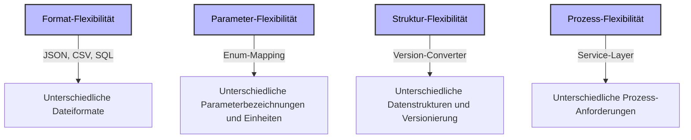
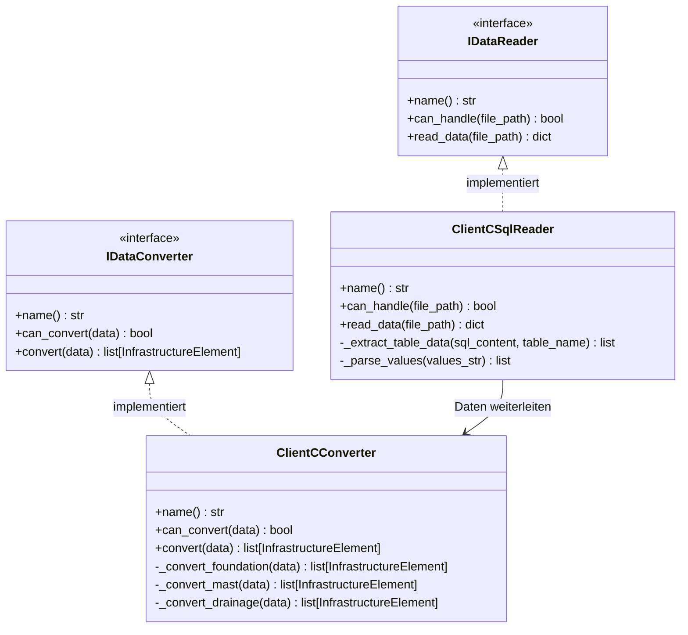
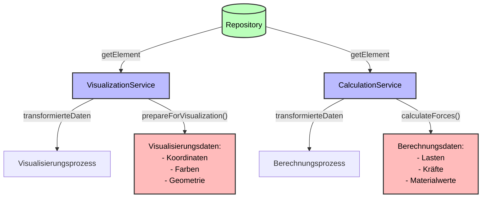

# PYM-Data: Plugin-basiertes Infrastruktur-Modellierungssystem

Dieses Projekt demonstriert eine flexible, erweiterbare Architektur zur Verarbeitung von Infrastrukturdaten aus verschiedenen Quellen und in unterschiedlichen Formaten. Durch die Verwendung eines plugin-basierten Designs können neue Datenquellen und Formatkonverter einfach hinzugefügt werden, ohne den Kerncode zu ändern.

## Überblick

Das System ist darauf ausgelegt, Infrastrukturdaten (Fundamente, Masten, Gleise usw.) aus verschiedenen Kundenformaten einzulesen, in ein einheitliches kanonisches Modell zu konvertieren und für unterschiedliche Prozesse wie Visualisierung und Berechnung bereitzustellen.



## Architektur

Das System basiert auf einer mehrschichtigen Architektur mit klaren Verantwortlichkeiten:

### Komponenten-Übersicht



### Datenfluss



## Schlüsselkonzepte

### Plugin-System mit Protokollen

Das System verwendet Protokolle (Interfaces) als Vertragsgarantie zwischen Komponenten. Dies ermöglicht eine lose Kopplung und einfache Erweiterbarkeit.



### Zentrales Enum-System für Parameter

Ein zentrales Enum-System ermöglicht die konsistente Zuordnung von unterschiedlich benannten Parametern aus verschiedenen Kunden-Datenformaten zu einem einheitlichen Modell:



Dieses Enum-System löst mehrere Probleme:

1. **Unterschiedliche Benennungen**: "Breite", "width_mm", "breite_m" werden alle einem Standardparameter zugeordnet
2. **Unterschiedliche Einheiten**: Automatische Umrechnung von mm nach m usw.
3. **Unterschiedliche Strukturen**: Parameter können an verschiedenen Stellen in der Kundendatenstruktur vorkommen

### Mehrstufige Datenspeicherung

Im kanonischen Modell werden Parameter sowohl als Liste (für Flexibilität) als auch als Dictionary (für schnellen Zugriff) gespeichert:

```python
class InfrastructureElement:
    # Grundlegende Attribute
    name: str
    uuid: UUID
    element_type: ElementType

    # Parameter-Speicherung
    parameters: list[Parameter]  # Flexible Speicherung
    known_params: dict[ProcessEnum, Any]  # Für schnellen Zugriff
```

## Unterstützte Client-Formate

Das System unterstützt derzeit drei verschiedene Clients mit unterschiedlichen Datenformaten:

### Client A

- **Formate**: JSON, CSV
- **Besonderheiten**:
  - Verschiedene Projektversionen mit unterschiedlichen Feldnamen
  - Deutschsprachige Parameter
  - Dateiendungen: .json, .csv

### Client B

- **Formate**: CSV, Excel
- **Besonderheiten**:
  - Semikolon-getrennte Werte
  - Einheiten im Feldnamen (z.B. "breite_m")
  - Dateiendungen: .csv, .excel

### Client C

- **Formate**: SQL
- **Besonderheiten**:
  - Daten als SQL-INSERT-Anweisungen
  - Millimeter als Standardeinheit
  - Englische Feldnamen mit Unterstrichen
  - Dateiendungen: .sql

## Flexibilität des Systems demonstriert

Die Implementierung demonstriert verschiedene Arten von Flexibilität:



## Projektstruktur

```
pym_data/
  ├── README.md                    # Diese Datei
  ├── config/                      # Konfigurationsdateien
  ├── code/
  │   ├── common/                  # Gemeinsame Komponenten
  │   │   ├── enums/               # Enums für Parameter usw.
  │   │   ├── interfaces/          # Protokolle für Plugins
  │   │   ├── models/              # Kanonisches Datenmodell
  │   │   └── utils/               # Hilfsfunktionen
  │   ├── repository/              # Datenspeicher-Implementierungen
  │   ├── services/                # Service-Implementierungen
  │   └── processes/               # Prozess-Implementierungen
  └── clients/                     # Client-spezifische Implementierungen
      ├── clientA/
      │   ├── code/                # Reader und Converter für Client A
      │   ├── project1/            # Beispieldaten für Projekt 1
      │   └── project2/            # Beispieldaten für Projekt 2
      ├── clientB/
      │   ├── code/                # Reader und Converter für Client B
      │   └── projects/            # Beispieldaten
      └── clientC/
          ├── code/                # Reader und Converter für Client C
          └── projects/            # Beispieldaten
```

## Client-spezifische Implementierung

Jeder Client hat seine eigene Implementierung, die speziell auf seine Datenformate zugeschnitten ist. Beispiel für Client C (SQL-Daten):



## Prozess-spezifische Implementierung

Die gleichen Daten können für verschiedene Prozesse unterschiedlich aufbereitet werden:



## Vorteile der Architektur

1. **Erweiterbarkeit**: Neue Clients können einfach durch Hinzufügen neuer Reader und Converter integriert werden
2. **Wartbarkeit**: Klare Trennung der Verantwortlichkeiten, einfach zu verstehende Komponenten
3. **Testbarkeit**: Jede Komponente kann isoliert getestet werden
4. **Flexibilität**: Unterstützung für verschiedene Datenformate, Versionen und Prozesse
5. **Wiederverwendbarkeit**: Gemeinsame Komponenten wie das Repository können von verschiedenen Prozessen genutzt werden

## Weitere Dokumentation

Detaillierte Dokumentation zu den einzelnen Komponenten finden Sie in den spezialisierten Dokumentationsdateien:

- [Kanonisches Datenmodell & Enum-System](code/common/CANONICAL_MODEL.md) - Das Herzstück der Architektur
- [Repository Pattern](code/repository/REPOSITORY_PATTERN.md) - Details zur Datenspeicherung
- [Service Layer](code/services/SERVICE_LAYER.md) - Die vermittelnde Schicht zwischen Repository und Prozessen
- [Prozess-Implementierung](code/processes/PROCESS_IMPLEMENTATION.md) - Visualisierung & Berechnung
- [Client A Plugin](clients/clientA/code/CLIENT_A_PLUGIN.md) - JSON/CSV-basierte Implementierung
- [Client B Plugin](clients/clientB/code/CLIENT_B_PLUGIN.md) - CSV-mit-Semikolon-basierte Implementierung
- [Client C Plugin](clients/clientC/code/CLIENT_C_PLUGIN.md) - SQL-basierte Implementierung
- [Testing Strategie](code/tests/TESTING_STRATEGY.md) - Ansatz zum Testen der Komponenten
- [Setup Guide](SETUP.md) - Anleitung zur Installation und Konfiguration des Systems
