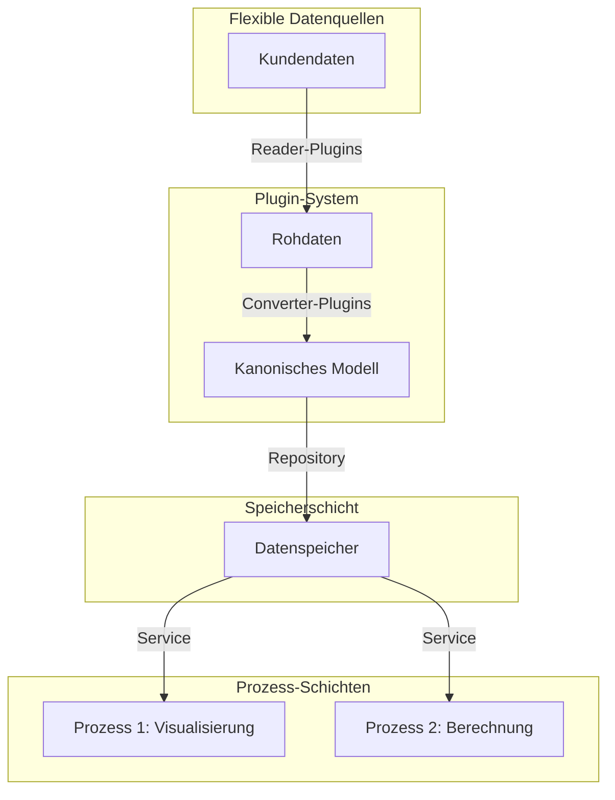

# PyArm: Python Architecture Restructuring Model

PyArm ist ein flexibles, plugin-basiertes System zur Modellierung von Infrastrukturelementen aus verschiedenen Datenquellen und Formaten. Das System bietet ein kanonisches Datenmodell mit standardisierten Parametern, das eine nahtlose Integration verschiedener Kundendaten ermöglicht.

## Überblick

PyArm ist darauf ausgelegt, Infrastrukturdaten (Fundamente, Masten, Gleise usw.) aus verschiedenen Kundenformaten einzulesen, in ein einheitliches kanonisches Modell zu konvertieren und für unterschiedliche Prozesse wie Visualisierung und Berechnung bereitzustellen.



## Architektur

PyArm basiert auf einer mehrschichtigen Architektur mit klaren Verantwortlichkeiten und Trennung der Zuständigkeiten.

### Plugin-System

Der Kern von PyArm ist eine plugin-basierte Architektur, bei der jedes Plugin das `PluginInterface` implementiert:

```python
class PluginInterface(ABC):
    @property
    @abstractmethod
    def name(self) -> str:
        """Name des Plugins."""
        pass
        
    @property
    @abstractmethod
    def version(self) -> str:
        """Version des Plugins."""
        pass
        
    @abstractmethod
    def initialize(self, config: Dict[str, Any]) -> bool:
        """Initialisiert das Plugin mit Konfiguration."""
        pass
        
    @abstractmethod
    def get_supported_element_types(self) -> List[str]:
        """Gibt unterstützte Elementtypen zurück."""
        pass
        
    @abstractmethod
    def convert_element(self, data: Dict[str, Any], element_type: str) -> Optional[Dict[str, Any]]:
        """Konvertiert Daten in ein Element des angegebenen Typs."""
        pass
```

Plugins werden aus folgenden Quellen erkannt:
1. Eingebaute Plugins in `pyarm.plugins`
2. Benutzerdefinierte Verzeichnisse, die in der Konfiguration angegeben sind
3. Installierte Pakete mit Entry Points

### Kanonisches Datenmodell

Das zentrale Datenmodell repräsentiert Infrastrukturelemente durch einen flexiblen komponentenbasierten Ansatz:

```python
class InfrastructureElement[TDimension: Dimension]:
    # Grundlegende Attribute
    name: str
    element_type: ElementType
    uuid: UUID
    
    # Parameter-Speicherung
    parameters: list[Parameter]
    known_params: dict[ProcessEnum, Parameter]
    
    # Komponenten-Speicherung
    components: dict[str, Component]
```

Dieses Modell ermöglicht:
- Flexible Parameterspeicherung durch ein einheitliches Parametermodell
- Schnellen Parameterzugriff durch Enum-basierte Lookups
- Erweiterbarkeit durch ein Komponentensystem
- Typsicherheit mit generischen Parametertypen

### Komponenten-System

Anstatt Vererbung für verschiedene Elementfähigkeiten zu verwenden, nutzt PyArm ein flexibles Komponentensystem:

```python
class Component:
    """Basisklasse für alle Komponenten."""
    def __init__(self, name: str, component_type: ComponentType):
        self.name = name
        self.component_type = component_type
```

Wichtige Komponententypen sind:
- `LOCATION` - Position im Raum
- `DIMENSION` - Physische Abmessungen
- `REFERENCE` - Verweise auf andere Elemente
- `METADATA` - Zusätzliche Informationen

Dieser Ansatz ermöglicht es Elementen, gemeinsame Funktionalität zu haben, ohne komplexe Vererbungshierarchien.

### Repository-Pattern

Die Datenspeicherung verwendet ein Repository-Pattern für eine saubere Trennung von der Domänenlogik:

```python
class IElementRepository(Protocol):
    def get_all(self) -> list[InfrastructureElement]: ...
    def get_by_id(self, uuid: UUID | str) -> InfrastructureElement | None: ...
    def get_by_type(self, element_type: ElementType) -> list[InfrastructureElement]: ...
    def save(self, element: InfrastructureElement) -> None: ...
    def save_all(self, elements: list[InfrastructureElement]) -> None: ...
    def delete(self, uuid: UUID | str) -> None: ...
```

Die Standardimplementierung verwendet JSON-Dateien für die Speicherung mit In-Memory-Caching.

### Element-Verknüpfungssystem

PyArm verfügt über ein ausgeklügeltes Element-Verknüpfungssystem, das:
- Elemente auf Basis von Attributen statt UUIDs verknüpft
- Verknüpfungen während der Importphase erstellt
- Bidirektionale Referenzen unterstützt
- Flexible Konfiguration durch Plugins bietet

```python
class ElementLinker:
    """
    Verwaltet Element-Verknüpfungen während der Importphase.
    Ermöglicht die Verknüpfung von Elementen basierend auf beliebigen Attributen, nicht nur UUIDs.
    """
    
    def register_link_definition(self, link_definition: LinkDefinition) -> None: ...
    def register_element(self, element: InfrastructureElement) -> None: ...
    def process_element_links(self, element: InfrastructureElement) -> None: ...
```

### Validierungssystem

Das Validierungssystem bietet schema-basierte Validierung von Elementen:

```python
class SchemaDefinition:
    """
    Schema zur Definition von Validierungsregeln für Elementtypen.
    """
    element_type: ElementType
    required_params: Set[ProcessEnum]
    param_types: Dict[ProcessEnum, DataType]
    param_units: Dict[ProcessEnum, UnitEnum]
    constraints: Dict[ProcessEnum, List[Constraint]]
```

Die Validierung kann durch einen Wrapper in Plugins integriert werden:

```python
class ValidatedPlugin(PluginInterface):
    """
    Wrapper-Klasse für Plugins, die Validierung vor der Konvertierung durchführt.
    """
```

## Beispiel-Implementierung: Client A Plugin

PyArm demonstriert seine Flexibilität durch kundenspezifische Plugins. Zum Beispiel verarbeitet das Client A Plugin verschiedene Datenformate und Projektversionen:

```python
# Lesen verschiedener Formate
class ClientAJsonReader:
    def can_handle(self, file_path: str) -> bool:
        path = Path(file_path)
        return (
            path.suffix.lower() == ".json" and
            ("clientA" in str(path))
        )

class ClientACsvReader:
    def can_handle(self, file_path: str) -> bool:
        path = Path(file_path)
        return (
            path.suffix.lower() == ".csv" and
            ("clientA" in str(path))
        )

# Umgang mit verschiedenen Projektversionen
class ClientAConverter:
    def convert(self, data: Dict[str, Any]) -> List[InfrastructureElement]:
        project_id = data.get("project_id", "unknown")
        
        if project_id == "project1":
            return self._convert_project1(data)
        elif project_id == "project2":
            return self._convert_project2(data)
```

Das Plugin bildet kundenspezifische Parameter auf das kanonische Modell ab:

```python
# Projekt 1: "Breite" -> ProcessEnum.FOUNDATION_WIDTH
Parameter(
    name="Breite", 
    value=float(item.get("Breite", 0)), 
    process=ProcessEnum.FOUNDATION_WIDTH, 
    unit=UnitEnum.METER
)

# Projekt 2: "Width" -> ProcessEnum.FOUNDATION_WIDTH
Parameter(
    name="Width", 
    value=float(item.get("Width", 0)), 
    process=ProcessEnum.FOUNDATION_WIDTH, 
    unit=UnitEnum.METER
)
```

## Unterstützte Kundenformate

PyArm unterstützt derzeit mehrere Kunden mit unterschiedlichen Datenformaten:

### Client A
- **Formate**: JSON, CSV
- **Eigenschaften**:
  - Verschiedene Projektversionen mit unterschiedlichen Feldnamen
  - Deutsche Parameternamen
  - Dateierweiterungen: .json, .csv

### Client B
- **Formate**: CSV, Excel
- **Eigenschaften**:
  - Semikolon-getrennte Werte
  - Einheiten im Feldnamen (z.B. "breite_m")
  - Dateierweiterungen: .csv, .excel

### Client C
- **Formate**: SQL
- **Eigenschaften**:
  - Daten als SQL INSERT-Anweisungen
  - Millimeter als Standardeinheit
  - Englische Feldnamen mit Unterstrichen
  - Dateierweiterungen: .sql

### SBB DFA
- **Formate**: Excel, JSON
- **Eigenschaften**:
  - Spezialisiertes Datenformat für Bahninfrastruktur
  - Komplexe Datenstruktur
  - Dateierweiterungen: .xlsx, .json

## Entwicklungsumgebung einrichten

### Voraussetzungen

- Python 3.8 oder höher
- Virtuelle Umgebung (venv, conda, etc.)

### Installation

```bash
# Repository klonen
git clone https://github.com/username/pyarm.git
cd pyarm

# Virtuelle Umgebung erstellen und aktivieren
python -m venv venv
source venv/bin/activate  # Unter Windows: venv\Scripts\activate

# Paket im Entwicklungsmodus mit Entwicklungsabhängigkeiten installieren
uv pip install -e ".[dev]"
```

## Häufige Befehle

### Tests ausführen

```bash
# Alle Tests ausführen
python -m pytest

# Bestimmte Testmodule ausführen
python -m pytest tests/common/test_element_models.py

# Tests mit bestimmten Markierungen ausführen
python -m pytest -m "not integration"

# Tests mit ausführlicher Ausgabe ausführen
python -m pytest -v
```

### Linting und Codequalität

```bash
# Ruff Linter ausführen
ruff check

# Linting-Probleme automatisch beheben
ruff check --fix
```

### Anwendung ausführen

Die Anwendung ist darauf ausgelegt, Daten aus verschiedenen Kundenformaten über ein Plugin-System zu importieren. Beispielskripte werden bereitgestellt:

```bash
# Client A Daten importieren 
python import_client_a.py --input_dir examples/clients --project project1 --output_dir tests/output/client-a

# Client B Daten importieren
python import_client_b.py --input_dir examples/clients --output_dir tests/output/client-b

# Client C Daten importieren
python import_client_c.py --input_dir examples/clients --output_dir tests/output/client-c

# SBB DFA Daten importieren
python import_sbb_dfa.py --input_file examples/sbb/dfa_export.xlsx --output_dir tests/output/sbb
```

## Plugins erstellen

Um ein neues Plugin zu erstellen:

1. Erstellen Sie ein neues Verzeichnis in `plugins/` oder ein separates Paket
2. Implementieren Sie die `PluginInterface`-Klasse in der `__init__.py`-Datei
3. Registrieren Sie das Plugin in der Konfiguration oder verlassen Sie sich auf die automatische Erkennung

Beispiel-Plugin-Struktur:
```
plugins/
└── my_plugin/
    └── __init__.py  # Enthält die Plugin-Klasse
```

## Vorteile der Architektur

1. **Erweiterbarkeit**: Neue Kunden können durch Hinzufügen neuer Plugins einfach integriert werden
2. **Wartbarkeit**: Klare Trennung der Zuständigkeiten, leicht verständliche Komponenten
3. **Testbarkeit**: Jede Komponente kann isoliert getestet werden
4. **Flexibilität**: Unterstützung für verschiedene Datenformate, Versionen und Prozesse
5. **Wiederverwendbarkeit**: Gemeinsame Komponenten wie das Repository können von verschiedenen Prozessen genutzt werden

## Zusätzliche Dokumentation

Detailliertere Dokumentation finden Sie in den spezialisierten Dokumenten:

- [Plugin-System](docs/plugin_system.md) - Details zur Plugin-Architektur
- [Architektur](docs/architecture.md) - Umfassende Dokumentation der Systemarchitektur
- [Komponenten-System](docs/component_system.md) - Detaillierte Erklärung des Komponenten-basierten Designs
- [Element-Verknüpfung](docs/element_linking.md) - Wie Elemente während des Imports verknüpft werden
- [Plugin-Konfiguration](docs/plugin_configuration.md) - Konfigurationsoptionen für Plugins
- [Setup-Anleitung](docs/setup.md) - Installations- und Konfigurationsanleitung