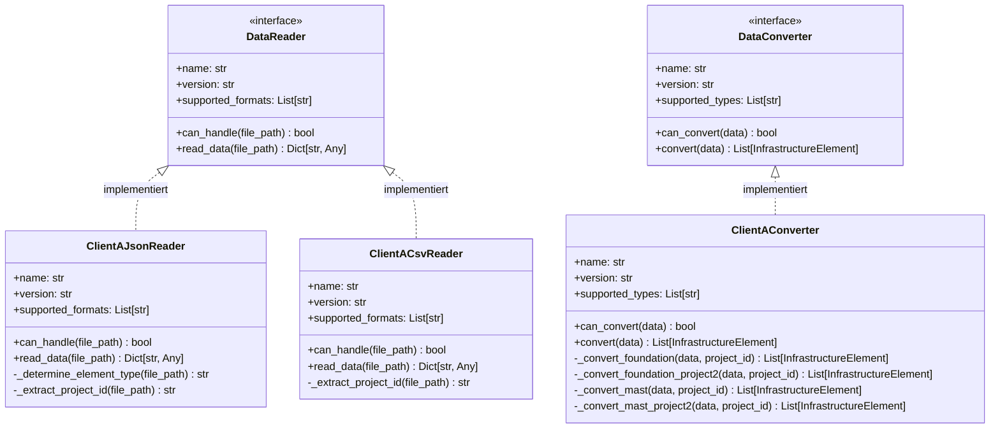

# Client A Plugin-Implementierung

Dieses Modul implementiert die Client A-spezifischen Komponenten für das Plugin-System. Es umfasst Reader für verschiedene Dateiformat- und Projektversionen sowie einen spezialisierten Converter.

## Plugin-Struktur

Die Client A-Implementierung folgt dem Plugin-Pattern:



Die Hauptkomponenten sind:

1. **Reader**: Implementieren das DataReader-Protokoll für verschiedene Dateiformate
2. **Converter**: Implementiert das DataConverter-Protokoll für die Konvertierung der Client A-Daten in das kanonische Format

## Reader-Implementierungen

### ClientAJsonReader

Diese Klasse liest JSON-Dateien des Clients A ein:

```python
class ClientAJsonReader:
    """Leser für JSON-Dateien des Clients A."""
    
    @property
    def name(self) -> str:
        return "ClientAJsonReader"
    
    @property
    def version(self) -> str:
        return "1.0.0"
    
    @property
    def supported_formats(self) -> List[str]:
        return ["json"]
    
    def can_handle(self, file_path: str) -> bool:
        path = Path(file_path)
        return (
            path.suffix.lower() == ".json" and
            ("clientA" in str(path))
        )
    
    def read_data(self, file_path: str) -> Dict[str, Any]:
        """Liest JSON-Daten aus der angegebenen Datei."""
        ...
```

### ClientACsvReader

Diese Klasse liest CSV-Dateien des Clients A ein:

```python
class ClientACsvReader:
    """Leser für CSV-Dateien des Clients A."""
    
    @property
    def name(self) -> str:
        return "ClientACsvReader"
    
    def can_handle(self, file_path: str) -> bool:
        path = Path(file_path)
        return (
            path.suffix.lower() == ".csv" and
            ("clientA" in str(path))
        )
    
    def read_data(self, file_path: str) -> Dict[str, Any]:
        """Liest CSV-Daten aus der angegebenen Datei."""
        ...
```

## Converter-Implementierung

Der `ClientAConverter` konvertiert die Client A-spezifischen Daten in das kanonische Format:

```python
class ClientAConverter:
    """Konverter für Daten des Clients A."""
    
    @property
    def name(self) -> str:
        return "ClientAConverter"
    
    @property
    def version(self) -> str:
        return "1.0.0"
    
    @property
    def supported_types(self) -> List[str]:
        return ["foundation", "mast", "joch", "track", "curved_track", "drainage"]
    
    def can_convert(self, data: Dict[str, Any]) -> bool:
        element_type = data.get("element_type", "").lower()
        return element_type in self.supported_types
    
    def convert(self, data: Dict[str, Any]) -> List[InfrastructureElement]:
        """Konvertiert die angegebenen Daten in InfrastructureElement-Objekte."""
        ...
```

## Projektspezifische Konvertierung

Eine Besonderheit der Client A-Implementierung ist die Unterstützung verschiedener Projektversionen mit unterschiedlichen Datenstrukturen:

```python
def _convert_foundation(self, data: List[Dict[str, Any]], project_id: str) -> List[InfrastructureElement]:
    """Konvertiert Fundament-Daten des Clients A (Projekt 1)."""
    ...

def _convert_foundation_project2(self, data: List[Dict[str, Any]], project_id: str) -> List[InfrastructureElement]:
    """Konvertiert Fundament-Daten des Clients A (Projekt 2)."""
    ...
```

Diese Methode ermöglicht es, verschiedene Projektversionen mit unterschiedlichen Datenstrukturen zu unterstützen, ohne mehrere Converter implementieren zu müssen.

## Beispiel: Unterschiede zwischen Projektversionen

### Projekt 1

```json
{
  "ID": "F001",
  "Typ": "Typ A",
  "Bezeichnung": "Fundament Mast 1",
  "E": 2600000.0,
  "N": 1200000.0,
  "Z": 456.78,
  "Breite": 1.5,
  "Tiefe": 2.0,
  "Höhe": 1.0,
  "Material": "Beton",
  "MastID": "M001"
}
```

### Projekt 2

```json
{
  "UUID": "F001",
  "FoundationType": "Typ A",
  "Name": "Fundament Mast 1",
  "East": 2600000.0,
  "North": 1200000.0,
  "Height": 456.78,
  "Width": 1.5,
  "Depth": 2.0,
  "HeightFoundation": 1.0,
  "Material": "Beton",
  "MastReference": "M001"
}
```

Der Converter unterstützt beide Versionen durch unterschiedliche Konvertierungsmethoden, die zur Laufzeit basierend auf der Projekt-ID ausgewählt werden.

## Parameter-Mapping mit ProcessEnum

Ein zentrales Konzept der Konvertierung ist das Mapping von Client-spezifischen Parametern zu den ProcessEnum-Werten des kanonischen Modells:

```python
Parameter(name="E", value=float(item.get("E", 0)), process=ProcessEnum.X_COORDINATE, unit=UnitEnum.METER)
Parameter(name="Breite", value=float(item.get("Breite", 0)), process=ProcessEnum.FOUNDATION_WIDTH, unit=UnitEnum.METER)
```

Oder für Projekt 2:

```python
Parameter(name="East", value=float(item.get("East", 0)), process=ProcessEnum.X_COORDINATE, unit=UnitEnum.METER)
Parameter(name="Width", value=float(item.get("Width", 0)), process=ProcessEnum.FOUNDATION_WIDTH, unit=UnitEnum.METER)
```

Durch dieses Mapping werden kundenspezifische Bezeichnungen auf ein einheitliches Modell abgebildet, was die Verarbeitung in nachgelagerten Prozessen vereinfacht.

## Verwendung der Plugins

```python
# Reader und Converter erstellen
reader = ClientAJsonReader()
converter = ClientAConverter()

# Datei lesen, wenn geeignet
if reader.can_handle(file_path):
    data = reader.read_data(file_path)
    
    # Daten konvertieren, wenn möglich
    if converter.can_convert(data):
        elements = converter.convert(data)
        
        # Elemente verarbeiten...
```

## Erweiterung für neue Projektversionen

Um eine neue Projektversion zu unterstützen, müssen lediglich neue Konvertierungsmethoden hinzugefügt werden:

```python
def _convert_foundation_project3(self, data: List[Dict[str, Any]], project_id: str) -> List[InfrastructureElement]:
    """Konvertiert Fundament-Daten des Clients A (Projekt 3)."""
    ...
```

Und in der `convert`-Methode eine entsprechende Prüfung hinzugefügt werden:

```python
def convert(self, data: Dict[str, Any]) -> List[InfrastructureElement]:
    """Konvertiert die angegebenen Daten in InfrastructureElement-Objekte."""
    element_type = data.get("element_type", "").lower()
    project_id = data.get("project_id", "unknown")
    raw_data = data.get("data", [])
    
    converter_method = getattr(self, f"_convert_{element_type}", None)
    if converter_method:
        if project_id == "project1":
            return converter_method(raw_data, project_id)
        elif project_id == "project2":
            # Für Projekt 2 verwenden wir die Project2-Konverter
            converter_method = getattr(self, f"_convert_{element_type}_project2", None)
            if converter_method:
                return converter_method(raw_data, project_id)
        elif project_id == "project3":
            # Für Projekt 3 verwenden wir die Project3-Konverter
            converter_method = getattr(self, f"_convert_{element_type}_project3", None)
            if converter_method:
                return converter_method(raw_data, project_id)
    
    # Fallback auf generischen Konverter
    return self._convert_generic(raw_data, element_type)
```

## Zusammenfassung

Die Client A-Implementierung demonstriert die Flexibilität des Plugin-Systems:

1. **Formatunabhängigkeit**: Unterstützung verschiedener Dateiformate (JSON, CSV)
2. **Versionierung**: Unterstützung verschiedener Projektversionen mit unterschiedlichen Datenstrukturen
3. **Erweiterbarkeit**: Einfache Erweiterung für neue Formate und Versionen
4. **Konsistente Ausgabe**: Konvertierung in ein einheitliches kanonisches Format