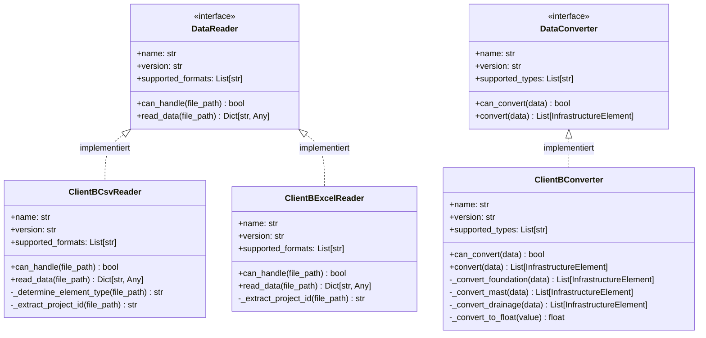

# Client B Plugin-Implementierung

Dieses Modul implementiert die Client B-spezifischen Komponenten für das Plugin-System. Es umfasst Reader für CSV- und Excel-Dateiformate sowie einen spezialisierten Converter für die Datenstrukturen von Client B.

## Plugin-Struktur

Die Client B-Implementierung folgt dem Plugin-Pattern:



Die Hauptkomponenten sind:

1. **Reader**: Implementieren das DataReader-Protokoll für CSV- und Excel-Dateiformate
2. **Converter**: Implementiert das DataConverter-Protokoll für die Konvertierung der Client B-Daten in das kanonische Format

## Reader-Implementierungen

### ClientBCsvReader

Diese Klasse liest CSV-Dateien des Clients B ein:

```python
class ClientBCsvReader:
    """Leser für CSV-Dateien des Clients B."""
    
    @property
    def name(self) -> str:
        return "ClientBCsvReader"
    
    @property
    def version(self) -> str:
        return "1.0.0"
    
    @property
    def supported_formats(self) -> List[str]:
        return ["csv"]
    
    def can_handle(self, file_path: str) -> bool:
        path = Path(file_path)
        return (
            path.suffix.lower() == ".csv" and
            ("clientB" in str(path))
        )
    
    def read_data(self, file_path: str) -> Dict[str, Any]:
        """Liest CSV-Daten aus der angegebenen Datei."""
        # Implementierungsdetails für das Lesen von CSV-Dateien
        # Die CSV-Dateien von Client B haben spezielle Trennzeichen und Kopfzeilen
        with open(file_path, 'r', encoding='utf-8') as f:
            # CSV-Daten einlesen mit korrekten Trennzeichen (z.B. Semikolon)
            # und Berücksichtigung von Client B-spezifischen Formaten
            ...
            
        return {
            "element_type": self._determine_element_type(file_path),
            "data": data_rows,
            "project_id": self._extract_project_id(file_path)
        }
        
    def _determine_element_type(self, file_path: str) -> str:
        """Bestimmt den Elementtyp basierend auf dem Dateinamen."""
        filename = Path(file_path).stem.lower()
        if "foundation" in filename:
            return "foundation"
        elif "mast" in filename:
            return "mast"
        # Weitere Elementtypen
        return "unknown"
        
    def _extract_project_id(self, file_path: str) -> str:
        """Extrahiert die Projekt-ID aus dem Dateipfad."""
        # Implementierung zur Extraktion der Projekt-ID
        ...
```

### ClientBExcelReader

Diese Klasse liest Excel-Dateien des Clients B ein:

```python
class ClientBExcelReader:
    """Leser für Excel-Dateien des Clients B."""
    
    @property
    def name(self) -> str:
        return "ClientBExcelReader"
    
    @property
    def version(self) -> str:
        return "1.0.0"
    
    @property
    def supported_formats(self) -> List[str]:
        return ["excel", "xlsx", "xls"]
    
    def can_handle(self, file_path: str) -> bool:
        path = Path(file_path)
        return (
            path.suffix.lower() in [".xlsx", ".xls", ".excel"] and
            ("clientB" in str(path))
        )
    
    def read_data(self, file_path: str) -> Dict[str, Any]:
        """Liest Excel-Daten aus der angegebenen Datei."""
        # Implementierungsdetails für das Lesen von Excel-Dateien
        # Diese Methode verwendet pandas oder openpyxl zur Verarbeitung
        ...
```

## Converter-Implementierung

Der `ClientBConverter` konvertiert die Client B-spezifischen Daten in das kanonische Format:

```python
class ClientBConverter:
    """Konverter für Daten des Clients B."""
    
    @property
    def name(self) -> str:
        return "ClientBConverter"
    
    @property
    def version(self) -> str:
        return "1.0.0"
    
    @property
    def supported_types(self) -> List[str]:
        return ["foundation", "mast", "drainage"]
    
    def can_convert(self, data: Dict[str, Any]) -> bool:
        element_type = data.get("element_type", "").lower()
        return element_type in self.supported_types
    
    def convert(self, data: Dict[str, Any]) -> List[InfrastructureElement]:
        """Konvertiert die angegebenen Daten in InfrastructureElement-Objekte."""
        element_type = data.get("element_type", "").lower()
        raw_data = data.get("data", [])
        
        converter_method = getattr(self, f"_convert_{element_type}", None)
        if converter_method:
            return converter_method(raw_data)
        
        # Fallback auf generischen Konverter
        return self._convert_generic(raw_data, element_type)
```

## CSV-Datenformat-Besonderheiten

Client B verwendet ein spezifisches CSV-Format mit folgenden Besonderheiten:

1. **Semikolon als Trennzeichen**: Statt Komma wird ein Semikolon verwendet
2. **Spezielle Kopfzeilen**: Die erste Zeile enthält spezifische Spaltenbezeichnungen
3. **Dezimaltrennzeichen**: Komma statt Punkt für Dezimalzahlen
4. **Koordinatensystem**: Verwendung eines lokalen Koordinatensystems, das transformiert werden muss

### Beispiel: foundation.csv

```
ID;TYP;BEZEICHNUNG;X;Y;Z;BREITE;TIEFE;HOEHE;MATERIAL;MAST_REF
F001;Standard;Fundament 1;2600000,0;1200000,0;456,78;1,5;2,0;1,0;Beton;M001
F002;Tief;Fundament 2;2600010,0;1200020,0;455,67;2,0;3,0;1,2;Stahlbeton;M002
```

### Beispiel: mast.csv

```
ID;TYP;BEZEICHNUNG;X;Y;Z;HOEHE;MATERIAL;TRAGFAEHIGKEIT
M001;Standard;Mast 1;2600000,0;1200000,0;456,78;15,0;Stahl;5000
M002;Schwer;Mast 2;2600010,0;1200020,0;455,67;18,0;Stahl;8000
```

## Konvertierungsmethoden

Die spezifischen Konvertierungsmethoden für jeden Elementtyp implementieren die Logik zur Transformation der Client B-Daten in das kanonische Format:

```python
def _convert_foundation(self, data: List[Dict[str, Any]]) -> List[InfrastructureElement]:
    """Konvertiert Fundament-Daten des Clients B."""
    elements = []
    
    for item in data:
        # CSV-Daten haben spezifische Spaltenbezeichnungen
        element = InfrastructureElement(
            id=item.get("ID", ""),
            element_type="foundation",
            name=item.get("BEZEICHNUNG", ""),
            parameters=[
                # Beachte: Kommas in Dezimalzahlen müssen in Punkte umgewandelt werden
                Parameter(name="X", value=float(item.get("X", "0").replace(",", ".")), 
                          process=ProcessEnum.X_COORDINATE, unit=UnitEnum.METER),
                Parameter(name="Y", value=float(item.get("Y", "0").replace(",", ".")), 
                          process=ProcessEnum.Y_COORDINATE, unit=UnitEnum.METER),
                Parameter(name="Z", value=float(item.get("Z", "0").replace(",", ".")), 
                          process=ProcessEnum.Z_COORDINATE, unit=UnitEnum.METER),
                Parameter(name="BREITE", value=float(item.get("BREITE", "0").replace(",", ".")), 
                          process=ProcessEnum.FOUNDATION_WIDTH, unit=UnitEnum.METER),
                Parameter(name="TIEFE", value=float(item.get("TIEFE", "0").replace(",", ".")), 
                          process=ProcessEnum.FOUNDATION_DEPTH, unit=UnitEnum.METER),
                Parameter(name="HOEHE", value=float(item.get("HOEHE", "0").replace(",", ".")), 
                          process=ProcessEnum.FOUNDATION_HEIGHT, unit=UnitEnum.METER),
                Parameter(name="MATERIAL", value=item.get("MATERIAL", ""), 
                          process=ProcessEnum.MATERIAL, unit=UnitEnum.TEXT),
                Parameter(name="MAST_REF", value=item.get("MAST_REF", ""), 
                          process=ProcessEnum.REFERENCE, unit=UnitEnum.TEXT)
            ]
        )
        elements.append(element)
    
    return elements
```

## Parameter-Mapping mit ProcessEnum

Ein zentrales Konzept der Konvertierung ist das Mapping von Client-spezifischen Parametern zu den ProcessEnum-Werten des kanonischen Modells:

```python
# CSV-Spaltenbezeichnungen werden auf kanonische ProcessEnum-Werte gemappt
Parameter(name="X", value=float(item.get("X", "0").replace(",", ".")), 
          process=ProcessEnum.X_COORDINATE, unit=UnitEnum.METER)
Parameter(name="BREITE", value=float(item.get("BREITE", "0").replace(",", ".")), 
          process=ProcessEnum.FOUNDATION_WIDTH, unit=UnitEnum.METER)
```

Durch dieses Mapping werden die kundenspezifischen Bezeichnungen (in Großbuchstaben bei Client B) auf ein einheitliches Modell abgebildet.

## Besonderheiten bei der Excel-Verarbeitung

Für die Verarbeitung der Excel-Dateien (drainage.excel) werden spezielle Bibliotheken wie pandas oder openpyxl verwendet:

```python
def read_data(self, file_path: str) -> Dict[str, Any]:
    """Liest Excel-Daten aus der angegebenen Datei."""
    import pandas as pd
    
    # Excel-Datei mit pandas einlesen
    df = pd.read_excel(file_path)
    
    # Konvertierung des DataFrame in eine Liste von Dictionaries
    data_rows = df.to_dict('records')
    
    return {
        "element_type": "drainage",
        "data": data_rows,
        "project_id": self._extract_project_id(file_path)
    }
```

## Verwendung der Plugins

```python
# Reader und Converter erstellen
csv_reader = ClientBCsvReader()
excel_reader = ClientBExcelReader()
converter = ClientBConverter()

# Datei prüfen und geeigneten Reader auswählen
def process_file(file_path: str):
    reader = None
    if csv_reader.can_handle(file_path):
        reader = csv_reader
    elif excel_reader.can_handle(file_path):
        reader = excel_reader
        
    if reader:
        data = reader.read_data(file_path)
        
        # Daten konvertieren, wenn möglich
        if converter.can_convert(data):
            elements = converter.convert(data)
            
            # Elemente verarbeiten...
            return elements
    
    return None
```

## Umgang mit Dezimaltrennzeichen

Eine Besonderheit bei Client B ist die Verwendung von Kommas als Dezimaltrennzeichen. Der Konverter muss diese in Punkte umwandeln:

```python
def _convert_to_float(self, value: str) -> float:
    """Konvertiert einen String mit Komma als Dezimaltrennzeichen in float."""
    if isinstance(value, str):
        return float(value.replace(",", "."))
    return float(value or 0)
```

## Zusammenfassung

Die Client B-Implementierung demonstriert die Flexibilität des Plugin-Systems für spezifische Dateiformate:

1. **CSV-Spezialisierung**: Verarbeitung von CSV-Dateien mit besonderen Formaten (Semikolon als Trennzeichen, Komma als Dezimaltrennzeichen)
2. **Excel-Unterstützung**: Spezifische Verarbeitung von Excel-Dateien
3. **Formatkonvertierung**: Umwandlung lokaler Formate (Dezimaltrennzeichen) in ein einheitliches Format
4. **Konsistente Ausgabe**: Konvertierung in ein einheitliches kanonisches Format für die nachgelagerte Verarbeitung