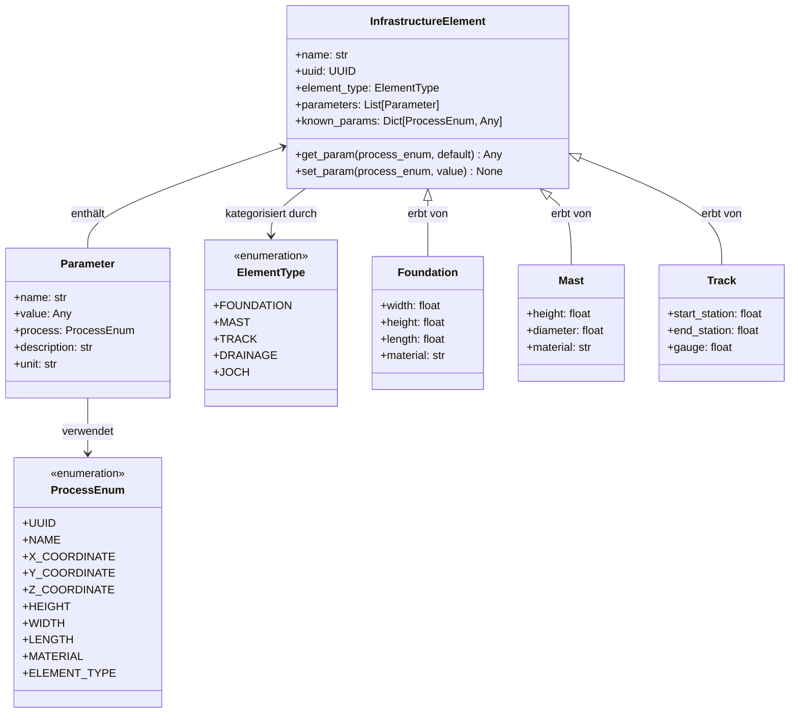

# Common Module - Das Herzstück der Architektur

Dieses Modul enthält die gemeinsamen Komponenten, die das Fundament des Plugin-Systems bilden. Es definiert das kanonische Datenmodell, die Schnittstellen für Plugins und die Utilities für die Typsicherheit.

## Kernkonzepte

### Kanonisches Datenmodell

Das kanonische Datenmodell ist das Herzstück der Architektur und bietet eine einheitliche Darstellung aller Infrastrukturelemente, unabhängig von ihrer Quelle.



Das Modell besteht aus:

1. **InfrastructureElement**: Basisklasse für alle Infrastrukturelemente
2. **Parameter**: Klasse für einzelne Parameter mit Prozessrelevanz
3. **Spezialisierte Elementklassen**: Foundation, Mast, Track, etc.

Besonderheiten:
- **Dual Storage**: Parameter werden sowohl in einer Liste (`parameters`) für Vollständigkeit als auch in einem Dictionary (`known_params`) für schnellen Zugriff gespeichert
- **Prozess-Enums**: Parameter werden mit ProcessEnum-Werten markiert, um ihre Bedeutung zu kennzeichnen
- **Vererbungshierarchie**: Spezialisierte Elementklassen erben von der Basisklasse und fügen spezifische Properties hinzu

### Enum-basierte Parametrisierung

```python
class ProcessEnum(str, Enum):
    """Zentrale Enum für die Prozessrelevanz von Parametern."""
    UUID = "uuid"
    NAME = "name"
    # ...

class Element:
    # ...
    def get_param(self, process_enum: ProcessEnum, default: Any = None) -> Any:
        return self.known_params.get(process_enum, default)
    
    def set_param(self, process_enum: ProcessEnum, value: Any) -> None:
        self.known_params[process_enum] = value
        # ...
```

**Vorteile dieses Ansatzes:**

1. **Einheitliche Semantik**: ProcessEnum stellt sicher, dass Parameter über alle Kunden hinweg konsistent interpretiert werden
2. **Schneller Zugriff**: `known_params` ermöglicht O(1) Zugriff über ProcessEnum
3. **IDE-Unterstützung**: Enums bieten Autocomplete und Typchecking
4. **Erweiterbarkeit**: Neue Parameter können einfach zur Enum hinzugefügt werden

### Protokoll-basierte Plugin-Schnittstellen

```python
@runtime_checkable
class DataReader(Protocol):
    """Protokoll für Komponenten, die Daten lesen können."""
    @property
    def name(self) -> str: ...
    @property
    def version(self) -> str: ...
    @property
    def supported_formats(self) -> List[str]: ...
    def can_handle(self, file_path: str) -> bool: ...
    def read_data(self, file_path: str) -> Dict[str, Any]: ...
```

**Vorteile von Protokollen:**

1. **Lose Kopplung**: Plugins müssen nur das Protokoll implementieren, nicht von einer Basisklasse erben
2. **Runtime-Checks**: Mit `@runtime_checkable` können Objekte zur Laufzeit auf Protokoll-Kompatibilität geprüft werden
3. **Explizite Verträge**: Protokolle definieren klar, welche Methoden implementiert werden müssen
4. **Keine Abhängigkeiten**: Plugins können unabhängig entwickelt werden

### TypeGuards für bessere Typsicherheit

```python
def is_foundation(obj: Any) -> TypeGuard[Foundation]:
    """Prüft, ob ein Objekt ein Foundation ist."""
    return isinstance(obj, Foundation) or (
        isinstance(obj, InfrastructureElement) and
        obj.element_type == ElementType.FOUNDATION
    )

# Verwendung
if is_foundation(element):
    # TypeChecker weiß jetzt, dass element ein Foundation ist
    width = element.width
```

**Vorteile von TypeGuards:**

1. **Bessere Typsicherheit**: TypeGuards ermöglichen präzise Typeinschränkungen für den TypeChecker
2. **Funktionalitätsprüfung**: Prüfung kann sowohl Vererbung als auch Protokoll-Konformität berücksichtigen
3. **Lesbarer Code**: Aussagekräftige Namen für Typprüfungen
4. **Keine unnötigen Casts**: Vermeidung von expliziten Typecasts

### Factory Pattern für die Elementerzeugung

```python
def create_element(element_data: Dict[str, Any]) -> InfrastructureElement:
    """Erstellt ein Element basierend auf dem ElementType."""
    element_type = element_data.get("element_type")
    # ...
    if element_type == ElementType.FOUNDATION:
        return Foundation(...)
    elif element_type == ElementType.MAST:
        return Mast(...)
    # ...
```

**Vorteile der Factory:**

1. **Zentralisierung**: Elementerzeugung an einem Ort
2. **Komplexitätsreduktion**: Komplexe Erzeugungslogik wird gekapselt
3. **Flexibilität**: Leicht erweiterbar für neue Elementtypen
4. **Abstraktion**: Client-Code muss nicht wissen, wie Elemente erstellt werden

## Praktische Beispiele

### Zugriff auf Parameter

```python
# Direct property access (type-safe, checked by IDE)
x = element.x
y = element.y
height = element.height

# Dynamic parameter access
diameter = element.get_param(ProcessEnum.PIPE_DIAMETER)
material = element.get_param(ProcessEnum.MATERIAL)
```

### Typprüfung und -einschränkung

```python
# TypeGuard-basierte Prüfung
if is_track(element) and has_clothoid_capability(element):
    # TypeChecker weiß, dass element ein Track mit Clothoid-Fähigkeiten ist
    a = element.clothoid_parameter
    r1 = element.start_radius
    r2 = element.end_radius
```

### Erstellen eines neuen Elements

```python
foundation = Foundation(
    name="Neues Fundament",
    parameters=[
        Parameter(name="E", value=2600000.0, process=ProcessEnum.X_COORDINATE),
        Parameter(name="N", value=1200000.0, process=ProcessEnum.Y_COORDINATE),
        Parameter(name="Z", value=456.78, process=ProcessEnum.Z_COORDINATE),
        Parameter(name="Breite", value=1.5, process=ProcessEnum.FOUNDATION_WIDTH),
        Parameter(name="Typ", value="Typ A", process=ProcessEnum.FOUNDATION_TYPE),
    ]
)
```

## Zusammenfassung

Das Common-Modul bildet das Herzstück der Architektur und ermöglicht:

1. **Flexible Datenmodellierung**: Durch das kanonische Datenmodell mit Enum-basierten Parametern
2. **Lose gekoppelte Plugins**: Durch Protokoll-basierte Schnittstellen
3. **Typsicherheit**: Durch TypeGuards und starke Typisierung
4. **Erweiterbarkeit**: Durch Factories und modularen Aufbau

Diese Kombination von Techniken ermöglicht ein System, das gleichzeitig flexibel und typsicher ist - das Beste aus beiden Welten.