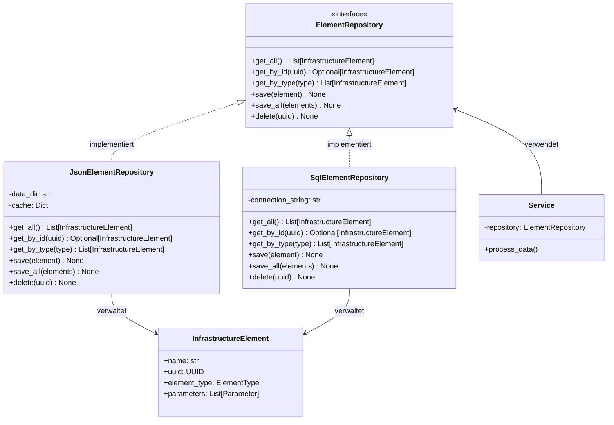

# Repository-Modul

Das Repository-Modul implementiert das Repository-Pattern und ist verantwortlich für die persistente Speicherung der Infrastrukturelemente.

## Repository-Pattern

Das Repository-Pattern ist ein Entwurfsmuster, das eine Abstraktionsschicht zwischen der Datenzugriffslogik und der Geschäftslogik bietet.



Hauptvorteile:

1. **Trennung der Belange**: Das Repository kapselt die Datenzugriffslogik
2. **Austauschbarkeit**: Die Implementierung kann leicht ausgetauscht werden
3. **Testbarkeit**: Services können mit Mock-Repositories getestet werden
4. **Zentraler Zugriffspunkt**: Einheitlicher Zugriff auf die Daten

## JsonElementRepository

Die `JsonElementRepository`-Klasse implementiert das Repository für die Speicherung von Infrastrukturelementen in JSON-Dateien.

### Kernfunktionalitäten

```python
class JsonElementRepository:
    """Repository für die Speicherung von Infrastrukturelementen in JSON-Dateien."""
    
    def get_all(self) -> List[InfrastructureElement]:
        """Ruft alle Elemente ab."""
        ...
    
    def get_by_id(self, uuid: Union[UUID, str]) -> Optional[InfrastructureElement]:
        """Ruft ein Element anhand seiner UUID ab."""
        ...
    
    def get_by_type(self, element_type: ElementType) -> List[InfrastructureElement]:
        """Ruft Elemente eines bestimmten Typs ab."""
        ...
    
    def save(self, element: InfrastructureElement) -> None:
        """Speichert ein Element."""
        ...
    
    def save_all(self, elements: List[InfrastructureElement]) -> None:
        """Speichert mehrere Elemente."""
        ...
    
    def delete(self, uuid: Union[UUID, str]) -> None:
        """Löscht ein Element."""
        ...
```

### Implementierungsdetails

1. **In-Memory-Cache**: Für bessere Performance werden die Elemente im Speicher gecacht
2. **Persistenz**: Die Elemente werden in JSON-Dateien gespeichert, gruppiert nach ElementType
3. **Lazy Loading**: Die Elemente werden erst geladen, wenn sie benötigt werden
4. **Thread-Safety**: Die Implementierung ist nicht thread-safe, kann aber leicht angepasst werden

## Verwendung des Repositories

```python
# Repository initialisieren
repository = JsonElementRepository("./repository/data")

# Elemente abrufen
all_elements = repository.get_all()
masts = repository.get_by_type(ElementType.MAST)
specific_element = repository.get_by_id("M001")

# Elemente speichern
new_element = Foundation(name="Neues Fundament", ...)
repository.save(new_element)

# Mehrere Elemente speichern
repository.save_all([element1, element2, element3])

# Element löschen
repository.delete("M001")
```

## Erweiterung des Repositories

Da das Repository auf einem klar definierten Protokoll basiert, kann es leicht durch andere Implementierungen ersetzt werden, z.B.:

```python
class SqlElementRepository:
    """Repository für die Speicherung von Infrastrukturelementen in einer SQL-Datenbank."""
    
    def __init__(self, connection_string: str):
        self.connection_string = connection_string
        # ...
    
    def get_all(self) -> List[InfrastructureElement]:
        # SQL-Implementierung
        ...
```

Oder für MongoDB:

```python
class MongoElementRepository:
    """Repository für die Speicherung von Infrastrukturelementen in MongoDB."""
    
    def __init__(self, connection_string: str, database: str, collection: str):
        self.client = MongoClient(connection_string)
        self.db = self.client[database]
        self.collection = self.db[collection]
        # ...
    
    def get_all(self) -> List[InfrastructureElement]:
        # MongoDB-Implementierung
        ...
```

## Zusammenfassung

Das Repository-Modul bietet eine flexible, erweiterbare Lösung für die persistente Speicherung von Infrastrukturelementen. Es kapselt die Datenzugriffslogik und bietet eine einheitliche Schnittstelle für alle anderen Komponenten des Systems.