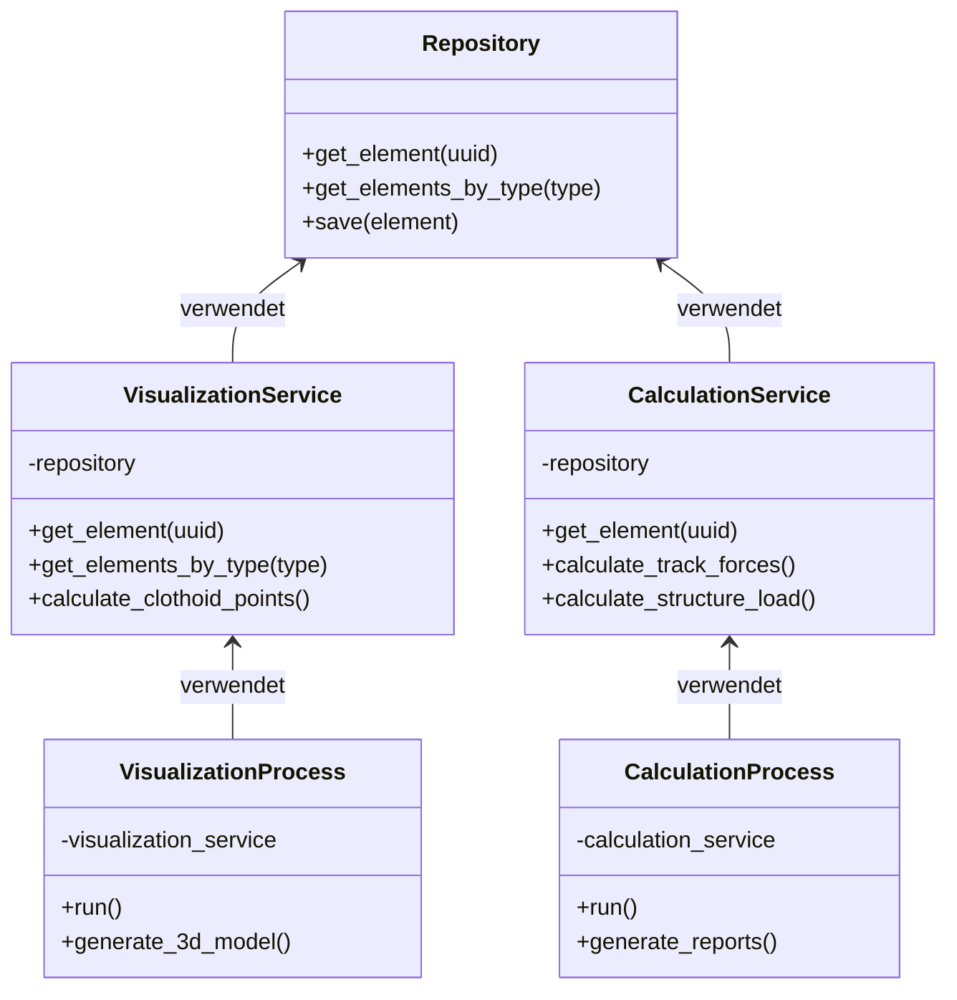
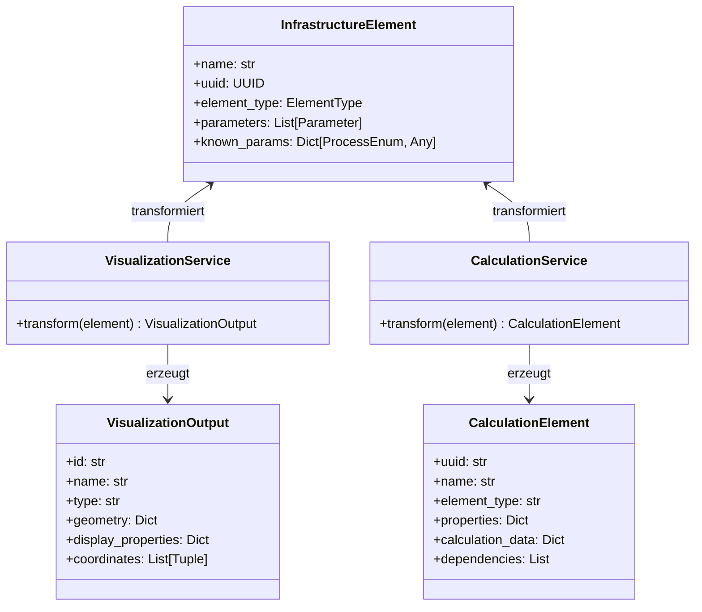

# Services-Modul

Das Services-Modul implementiert die Geschäftslogik für verschiedene Prozesse und dient als Vermittler zwischen dem Repository und den Prozessen.

## Service-Schicht

Die Service-Schicht ist eine wichtige Abstraktionsebene in der Anwendung, die mehrere Zwecke erfüllt:



Hauptaufgaben:

1. **Prozessspezifische Datenaufbereitung**: Bereitet die Daten für spezifische Prozesse auf
2. **Geschäftslogik**: Implementiert komplexe Berechnungen und Transformationen
3. **Abstraktion des Repositories**: Kapselt den Zugriff auf das Repository
4. **Fehlerbehandlung**: Behandelt Fehler und Ausnahmen

## Implementierte Services

### VisualizationService

Der `VisualizationService` bereitet Daten für den Visualisierungsprozess auf.

```python
class VisualizationService:
    """Service für die Visualisierung von Infrastrukturelementen."""
    
    def __init__(self, repository):
        self.repository = repository
    
    def get_element(self, uuid: Union[UUID, str]) -> Optional[Dict[str, Any]]:
        """Ruft ein Element für die Visualisierung ab."""
        ...
    
    def get_elements_by_type(self, element_type: ElementType) -> List[Dict[str, Any]]:
        """Ruft Elemente eines bestimmten Typs für die Visualisierung ab."""
        ...
    
    def calculate_clothoid_points(self, element_id: Union[UUID, str], 
                                 start_station: float, end_station: float, 
                                 step: float) -> List[Tuple[float, float, float]]:
        """Berechnet Punkte entlang einer Klothoide."""
        ...
```

Der Service transformiert die Infrastrukturelemente in ein für die Visualisierung geeignetes Format, indem er:

1. Die relevanten Attribute extrahiert
2. Die Daten in ein einfach zu verarbeitendes Format umwandelt
3. Zusätzliche Berechnungen für die Visualisierung durchführt

### CalculationService

Der `CalculationService` bereitet Daten für den Berechnungsprozess auf und führt komplexe Berechnungen durch.

```python
class CalculationService:
    """Service für die Berechnung von Infrastrukturelementen."""
    
    def __init__(self, repository):
        self.repository = repository
    
    def get_element(self, uuid: Union[UUID, str]) -> Optional[CalculationElement]:
        """Ruft ein Element für die Berechnung ab."""
        ...
    
    def calculate_track_forces(self, element_id: Union[UUID, str], 
                              speed: float, load: float) -> Dict[str, Any]:
        """Berechnet Kräfte auf einem Gleis."""
        ...
    
    def calculate_structure_load(self, element_id: Union[UUID, str]) -> Dict[str, Any]:
        """Berechnet die Strukturlast einer Tragstruktur."""
        ...
```

Der Service führt komplexe Berechnungen durch, wie:

1. Kraftberechnung für Gleise
2. Lastberechnung für Tragstrukturen
3. Volumens- und Gewichtsberechnung
4. Berücksichtigung von Abhängigkeiten zwischen Elementen

## Das CalculationElement-Modell

Für den Berechnungsprozess verwendet der `CalculationService` ein spezielles Datenmodell:

```python
class CalculationElement:
    """Berechnungselement mit spezifischen Attributen für den Berechnungsprozess."""
    
    def __init__(self, uuid: Union[UUID, str], name: str, element_type: str):
        self.uuid = str(uuid)
        self.name = name
        self.element_type = element_type
        self.properties = {}           # Elementeigenschaften
        self.calculation_data = {}     # Berechnungsdaten
        self.dependencies = []         # Abhängigkeiten zu anderen Elementen
```

Dieses Modell:

1. Speichert prozessspezifische Daten getrennt von den Basisdaten
2. Ermöglicht die Verfolgung von Abhängigkeiten zwischen Elementen
3. Bietet eine einheitliche Struktur für alle Berechnungen

## Prozessspezifische Datenmodelle

Ein wichtiger Aspekt des Service-Patterns ist die Verwendung prozessspezifischer Datenmodelle:



Das System verwendet unterschiedliche Modelle für verschiedene Prozesse:

1. **InfrastructureElement**: Das kanonische Modell im Repository
2. **VisualizationOutput**: Ein vereinfachtes Modell für die Visualisierung
3. **CalculationElement**: Ein erweitertes Modell für Berechnungen

Diese Trennung ermöglicht:

1. **Prozessoptimierung**: Jedes Modell ist für seinen Prozess optimiert
2. **Unabhängige Entwicklung**: Prozesse können unabhängig voneinander entwickelt werden
3. **Klare Verantwortlichkeiten**: Jeder Service ist für seine Datenaufbereitung verantwortlich

## Verwendung der Services

```python
# Visualisierungsservice
vis_service = VisualizationService(repository)
element_data = vis_service.get_element("M001")
clothoid_points = vis_service.calculate_clothoid_points("CT001", 0, 100, 1)

# Berechnungsservice
calc_service = CalculationService(repository)
calc_element = calc_service.get_element("F001")
track_forces = calc_service.calculate_track_forces("T001", 15.0, 20.0)
structure_load = calc_service.calculate_structure_load("M001")
```

## Erweiterung für neue Prozesse

Da jeder Prozess einen eigenen Service hat, können neue Prozesse einfach hinzugefügt werden:

```python
class ReportingService:
    """Service für die Erstellung von Berichten."""
    
    def __init__(self, repository):
        self.repository = repository
    
    def generate_report(self, element_id: Union[UUID, str]) -> Dict[str, Any]:
        """Generiert einen Bericht für ein Element."""
        ...
    
    def generate_summary_report(self) -> Dict[str, Any]:
        """Generiert einen Zusammenfassungsbericht."""
        ...
```

## Zusammenfassung

Die Service-Schicht ist ein zentraler Bestandteil der Architektur, der:

1. Prozessspezifische Datenaufbereitung ermöglicht
2. Komplexe Geschäftslogik implementiert
3. Den Zugriff auf das Repository abstrahiert
4. Fehlerbehandlung zentralisiert

Diese Trennung der Belange führt zu einem modulareren, flexibleren und wartbareren System.