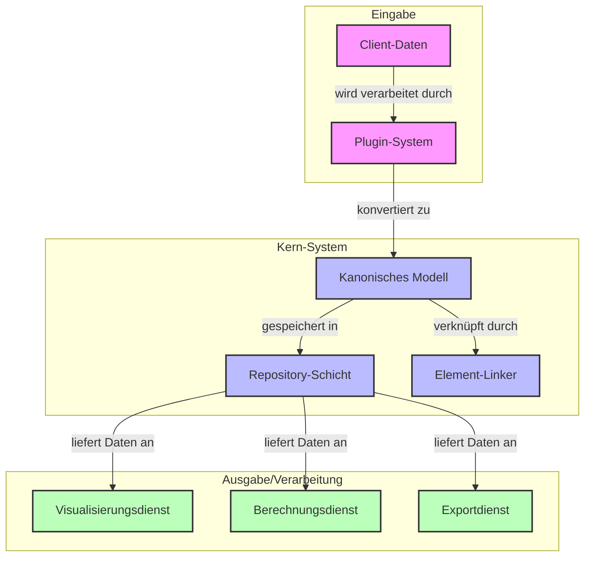

# PyArm Architektur-Übersicht

Dieses Dokument bietet eine detaillierte Erläuterung der PyArm-Architektur, mit Fokus auf die grundlegenden Designprinzipien, Muster und Implementierungsdetails.

## Architekturübersicht

Hier ist eine visuelle Darstellung der Gesamtarchitektur von PyArm:



## Kern-Architekturprinzipien

PyArm basiert auf mehreren zentralen Architekturprinzipien:

1. **Plugin-basierte Erweiterbarkeit**: Das System verwendet eine Plugin-Architektur, um neue Datenformate und Elementtypen hinzuzufügen, ohne den Kerncode zu ändern (siehe Diagramm: Plugin-System).
2. **Komponenten-basiertes Design**: Elemente verwenden einen kompositionsbasierten Ansatz anstelle tiefer Vererbungshierarchien.
3. **Protokoll-gesteuerte Schnittstellen**: Schnittstellen werden als Protokolle definiert, wobei der Fokus auf dem Verhalten und nicht auf der Implementierung liegt.
4. **Repository-Muster**: Der Datenzugriff wird durch Repositories gekapselt, was eine saubere Trennung von der Domänenlogik ermöglicht (siehe Diagramm: Repository-Schicht).
5. **Service-Schicht**: Prozessspezifische Operationen werden in Service-Schichten implementiert (siehe Diagramm: Visualisierungsdienst, Berechnungsdienst).
6. **Kanonisches Datenmodell**: Ein einheitliches Datenmodell dient als zentrale Darstellung für alle Infrastrukturelemente (siehe Diagramm: Kanonisches Modell).

## Komponenten-Muster

### Motivation

Traditionelle vererbungsbasierte Designs führen oft zu:
- Tiefen und instabilen Vererbungshierarchien
- Schwierigkeiten beim Hinzufügen neuer Funktionen ohne Änderung bestehenden Codes
- Unflexiblen Implementierungen, die sich nicht gut an variierende Anforderungen anpassen

PyArm adressiert diese Probleme durch das Komponenten-Muster, bei dem:
- Elemente wiederverwendbare Komponenten für spezifische Funktionalitäten enthalten
- Neue Funktionen hinzugefügt werden können, ohne bestehende Klassen zu ändern
- Elemente zur Laufzeit mit genau den benötigten Fähigkeiten zusammengesetzt werden können

### Implementierung in PyArm

Das Komponenten-Muster wird durch die `Component`-Basisklasse und verschiedene spezialisierte Komponenten implementiert:

```python
class Component:
    """Basisklasse für alle Komponenten."""
    def __init__(self, name: str, component_type: ComponentType):
        self.name = name
        self.component_type = component_type
```

Wichtige Komponententypen sind:

1. **Ortskomponenten**: Behandeln die Positionierung im Raum
   ```python
   class PointLocation(Component):
       def __init__(self, x: float, y: float, z: float):
           super().__init__("location", ComponentType.LOCATION)
           self.x = x
           self.y = y
           self.z = z
   
   class LineLocation(Component):
       def __init__(self, points: List[Tuple[float, float, float]]):
           super().__init__("linear_location", ComponentType.LOCATION)
           self.points = points
   ```

2. **Maßkomponenten**: Behandeln physische Abmessungen
   ```python
   class RectangularDimension(Component):
       def __init__(self, width: float, depth: float, height: float):
           super().__init__("rectangular_dimension", ComponentType.DIMENSION)
           self.width = width
           self.depth = depth
           self.height = height
   ```

3. **Referenzkomponenten**: Behandeln Beziehungen zwischen Elementen
   ```python
   class ElementReference(Component):
       def __init__(self, reference_type: str, referenced_uuid: UUID, bidirectional: bool = False):
           super().__init__(f"reference_to_{reference_type}", ComponentType.REFERENCE)
           self.reference_type = reference_type
           self.referenced_uuid = referenced_uuid
           self.bidirectional = bidirectional
   ```

### Integration im Element-Modell

Die `InfrastructureElement`-Klasse integriert diese Komponenten:

```python
@dataclass
class InfrastructureElement[TDimension: Dimension](IComponentModel):
    # Grundlegende Attribute
    name: str
    element_type: ElementType
    uuid: UUID = field(default_factory=uuid4)
    
    # Parameter-Speicherung
    parameters: list[Parameter] = field(default_factory=list)
    known_params: dict[ProcessEnum, Parameter] = field(default_factory=dict)
    
    # Komponenten-Speicherung
    components: dict[str, Component] = field(default_factory=dict)
    
    def get_component(self, component_name: str) -> Optional[Component]: ...
    def get_components_by_type(self, component_type: ComponentType) -> list[Component]: ...
    def add_component(self, component: Component) -> None: ...
    def remove_component(self, component_name: str) -> bool: ...
```

### Factory für Komponenten

Ein Factory-Muster wird verwendet, um Komponenten zu erstellen:

```python
class ComponentFactory:
    @staticmethod
    def create_location(element: InfrastructureElement) -> Location:
        # Erzeugt Ortskomponente aus Elementparametern
        ...
        
    @staticmethod
    def create_dimension(element: InfrastructureElement) -> Dimension:
        # Erzeugt Maßkomponente aus Elementparametern
        ...
        
    @staticmethod
    def create_reference(
        reference_type: Type[InfrastructureElement], 
        referenced_uuid: UUID,
        bidirectional: bool = False
    ) -> ElementReference:
        # Erzeugt Referenzkomponente
        ...
```

### Komponenten in der Praxis verwenden

Ein typisches Element integriert mehrere Komponenten:

```python
# Fundamentelement erstellen
foundation = Foundation(name="Fundament 1")

# Standardkomponenten hinzufügen (wird automatisch in __post_init__ erledigt)
# - Ortskomponente
# - Maßkomponente

# Benutzerdefinierte Komponenten hinzufügen
foundation.add_component(
    CustomComponent("my_custom_component", ComponentType.CUSTOM)
)

# Referenz zu einem anderen Element hinzufügen
foundation.add_reference(reference_type=Mast, referenced_uuid=mast_uuid)

# Zugriff auf Komponenten nach Typ
location = foundation.location  # Eigenschaft, die die Ortskomponente zurückgibt
dimension = foundation.dimension  # Eigenschaft, die die Maßkomponente zurückgibt
references = foundation.get_components_by_type(ComponentType.REFERENCE)
```

## Plugin-System

### Plugin-Schnittstelle

Das Plugin-System basiert auf der abstrakten `PluginInterface`-Klasse:

```python
class PluginInterface(ABC):
    @property
    @abstractmethod
    def name(self) -> str:
        """Name des Plugins."""
        pass
        
    @property
    @abstractmethod
    def version(self) -> str:
        """Version des Plugins."""
        pass
        
    @abstractmethod
    def initialize(self, config: Dict[str, Any]) -> bool:
        """Initialisiert das Plugin mit Konfiguration."""
        pass
        
    @abstractmethod
    def get_supported_element_types(self) -> List[str]:
        """Gibt unterstützte Elementtypen zurück."""
        pass
        
    @abstractmethod
    def convert_element(self, element_type: ElementType) -> Optional[ConversionResult]:
        """Konvertiert Daten in ein Element des angegebenen Typs."""
        pass
```

### Plugin-Erkennung

Plugins werden aus mehreren Quellen erkannt:

```python
def discover_plugins() -> Dict[str, Type[PluginInterface]]:
    """Erkennt verfügbare Plugins."""
    plugins = {}
    
    # 1. Eingebaute Plugins
    for plugin_class in _discover_builtin_plugins():
        plugins[plugin_class.__name__] = plugin_class
    
    # 2. Plugins aus benutzerdefinierten Verzeichnissen
    for plugin_class in _discover_custom_dir_plugins():
        plugins[plugin_class.__name__] = plugin_class
    
    # 3. Plugins aus Entry Points
    for plugin_class in _discover_entry_point_plugins():
        plugins[plugin_class.__name__] = plugin_class
        
    return plugins
```

### Plugin-Integration

Plugins werden über die Application-Klasse integriert:

```python
class Application:
    def __init__(self):
        self.plugins: dict[str, PluginInterface] = {}
        self.plugin_classes = discover_plugins()

    def load_plugins(self, config: dict[str, dict[str, Any]] | None = None) -> None:
        # Plugins laden und initialisieren
        ...

    def get_plugin(self, name: str) -> PluginInterface | None:
        # Plugin nach Namen abrufen
        ...

    def get_plugins_for_element_type(self, element_type: str) -> list[PluginInterface]:
        # Plugins abrufen, die einen bestimmten Elementtyp unterstützen
        ...

    def convert_element(
        self, element_type: ElementType, plugin_name: str | None = None
    ) -> Optional[ConversionResult]:
        # Daten mit einem bestimmten Plugin oder dem ersten passenden Plugin konvertieren
        ...
```

## Einheitliches Parametermodell mit ProcessEnum

### Herausforderung

Verschiedene Kunden verwenden unterschiedliche Namenskonventionen und Einheiten für die gleichen konzeptionellen Parameter:

- Client A: "Breite" in Metern
- Client B: "breite_m" in Metern
- Client C: "width_mm" in Millimetern

### Lösung: ProcessEnum-basiertes Parameter-Mapping

PyArm verwendet ein zentrales ProcessEnum, um kundenspezifische Parameter auf ein einheitliches Modell abzubilden:

```python
class ProcessEnum(str, Enum):
    """Prozessspezifische Parameter-Enums."""
    UUID = "uuid"
    NAME = "name"
    ELEMENT_TYPE = "element_type"
    
    # Koordinatenparameter
    X_COORDINATE = "x_coordinate"
    Y_COORDINATE = "y_coordinate"
    Z_COORDINATE = "z_coordinate"
    
    # Fundamentparameter
    FOUNDATION_WIDTH = "foundation_width"
    FOUNDATION_DEPTH = "foundation_depth"
    FOUNDATION_HEIGHT = "foundation_height"
    
    # Mastparameter
    MAST_HEIGHT = "mast_height"
    MAST_DIAMETER = "mast_diameter"
    
    # Referenzparameter
    FOUNDATION_TO_MAST = "foundation_to_mast"
    MAST_TO_FOUNDATION = "mast_to_foundation"
    MAST_TO_CANTILEVER = "mast_to_cantilever"
    CANTILEVER_TO_MAST = "cantilever_to_mast"
```

Während der Konvertierung werden kundenspezifische Parameter auf diese standardisierten Enums abgebildet:

```python
# Client A
Parameter(
    name="Breite", 
    value=float(item.get("Breite", 0)), 
    process=ProcessEnum.FOUNDATION_WIDTH, 
    unit=UnitEnum.METER
)

# Client B
Parameter(
    name="breite_m", 
    value=float(item.get("breite_m", 0)), 
    process=ProcessEnum.FOUNDATION_WIDTH, 
    unit=UnitEnum.METER
)

# Client C
Parameter(
    name="width_mm", 
    value=float(item.get("width_mm", 0))/1000,  # Konvertierung von mm in m
    process=ProcessEnum.FOUNDATION_WIDTH, 
    unit=UnitEnum.METER
)
```

### Parameter-Zugriff

Elemente können auf Parameter über ihre ProcessEnum zugreifen:

```python
# Prüfen, ob Parameter existiert
if element.has_param(ProcessEnum.FOUNDATION_WIDTH):
    # Parameter abrufen
    width_param = element.get_param(ProcessEnum.FOUNDATION_WIDTH)
    width_value = width_param.value
```

Dieser Ansatz bietet:
1. Einheitlichen Parameterzugriff unabhängig vom ursprünglichen Kundenformat
2. Standardisierte Einheiten für alle Parameter
3. Typsicherheit durch das Enum-System
4. Einfaches Hinzufügen neuer Parametertypen

## Repository-Muster

### Implementierung

Das Repository-Muster wird durch das `IElementRepository`-Protokoll implementiert:

```python
@runtime_checkable
class IElementRepository(Protocol):
    def get_all(self) -> list[InfrastructureElement]:
        """Ruft alle Elemente ab."""
        ...

    def get_by_id(self, uuid: UUID | str) -> InfrastructureElement | None:
        """Ruft ein Element anhand seiner UUID ab."""
        ...

    def get_by_type(self, element_type: ElementType) -> list[InfrastructureElement]:
        """Ruft Elemente eines bestimmten Typs ab."""
        ...

    def save(self, element: InfrastructureElement) -> None:
        """Speichert ein Element."""
        ...

    def save_all(self, elements: list[InfrastructureElement]) -> None:
        """Speichert mehrere Elemente."""
        ...

    def delete(self, uuid: UUID | str) -> None:
        """Löscht ein Element."""
        ...
```

Die Standardimplementierung, `JsonElementRepository`, speichert Elemente in JSON-Dateien mit In-Memory-Caching:

```python
class JsonElementRepository:
    def __init__(self, repository_path: str):
        self.repository_path = Path(repository_path)
        self._elements_cache: dict[str, InfrastructureElement] = {}
        self._cache_loaded = False

    def _load_cache(self) -> None:
        # Elemente aus JSON-Dateien in den Speicher laden
        ...

    def _save_cache(self) -> None:
        # Elemente aus dem Speicher in JSON-Dateien speichern
        ...

    # Implementierung der IElementRepository-Methoden
    ...
```

## Element-Verknüpfungssystem

### Link-Definition

Verknüpfungen zwischen Elementen werden durch `LinkDefinition` definiert:

```python
class LinkDefinition:
    def __init__(
        self,
        source_type: Type[InfrastructureElement],
        target_type: Type[InfrastructureElement],
        source_param_name: str,
        target_param_name: str,
        source_uuid_param: Optional[ProcessEnum] = None,
        target_uuid_param: Optional[ProcessEnum] = ProcessEnum.UUID,
        bidirectional: bool = True,
    ):
        # Link-Definition initialisieren
        ...
```

### Element-Linker

Der `ElementLinker` verwaltet Elementbeziehungen während des Imports:

```python
class ElementLinker:
    def __init__(self):
        self.link_definitions: List[LinkDefinition] = []
        self.element_cache: Dict[str, Dict[str, List[InfrastructureElement]]] = {}
        self.uuid_cache: Dict[str, InfrastructureElement] = {}
        self.processed_elements: Set[UUID] = set()
        self.links_created = 0

    def register_link_definition(self, link_definition: LinkDefinition) -> None:
        # Link-Definition registrieren
        ...

    def register_element(self, element: InfrastructureElement) -> None:
        # Element im Cache registrieren
        ...

    def process_element_links(self, element: InfrastructureElement) -> None:
        # Verknüpfungen für ein Element verarbeiten
        ...

    def _create_reference(
        self, source: InfrastructureElement, target: InfrastructureElement, link_def: LinkDefinition
    ) -> None:
        # Referenz zwischen Elementen erstellen
        ...
```

## Spezialisierte Element-Modelle

PyArm enthält spezialisierte Modelle für verschiedene Infrastrukturelemente:

```python
@dataclass
class Foundation(InfrastructureElement[RectangularDimension]):
    """Fundament-Element."""
    element_type: ElementType = ElementType.FOUNDATION

@dataclass
class Mast(InfrastructureElement):
    """Mast-Element mit optionaler Referenz zum Fundament."""
    element_type: ElementType = ElementType.MAST

@dataclass
class Cantilever(InfrastructureElement):
    """Ausleger-Element mit Referenz zum Mast."""
    element_type: ElementType = ElementType.CANTILEVER

@dataclass
class Track(InfrastructureElement):
    """Gleis-Element."""
    element_type: ElementType = ElementType.TRACK

@dataclass
class CurvedTrack(Track):
    """Kurvengleis-Element mit Klothoidenparametern."""
    element_type: ElementType = ElementType.TRACK
```

Diese Modelle erben von `InfrastructureElement` und bieten spezifische Elementtypen und Funktionalitäten.

## Datenfluss

Der vollständige Datenfluss durch das System ist:

1. **Daten lesen**: Kundenspezifische Reader lesen Rohdaten aus Dateien
2. **Datenkonvertierung**: Converter transformieren Rohdaten in kanonische Elemente
3. **Element-Verknüpfung**: Elemente werden auf Basis von Attributen verknüpft
4. **Speicherung**: Elemente werden in einem Repository gespeichert
5. **Verarbeitung**: Elemente werden abgerufen und von Services verarbeitet

## Einheitenkonvertierung

PyArm unterstützt die Konvertierung zwischen verschiedenen Maßeinheiten, um die Integration von Daten aus verschiedenen Quellen zu erleichtern:

```python
class UnitCategory(str, Enum):
    """Kategorien für Maßeinheiten"""
    
    LENGTH = "length"
    AREA = "area"
    VOLUME = "volume"
    MASS = "mass"
    FORCE = "force"
    ANGLE = "angle"
    RATIO = "ratio"
    TIME = "time"
    TEMPERATURE = "temperature"
    PRESSURE = "pressure"
    VELOCITY = "velocity"
    UNKNOWN = "unknown"
```

Die Einheitenkonvertierung wird durch spezialisierte Funktionen unterstützt:

```python
def convert_unit(value: int | float, from_unit: UnitEnum, to_unit: UnitEnum) -> float:
    """Konvertiert einen Wert von einer Einheit in eine andere."""
    # Wenn Einheiten gleich sind, keine Konvertierung notwendig
    if from_unit == to_unit:
        return float(value)
    
    # Prüfen, ob Einheiten aus derselben Kategorie stammen
    from_category = get_unit_category(from_unit)
    to_category = get_unit_category(to_unit)
    
    if from_category != to_category:
        raise ValueError(
            f"Konvertierung zwischen verschiedenen Einheitskategorien nicht möglich: "
            f"{from_category.value} und {to_category.value}"
        )
    
    # Jede Kategorie mit spezifischer Konvertierungslogik behandeln
    if from_category == UnitCategory.LENGTH:
        return _convert_length(value, from_unit, to_unit)
    # ... andere Kategorien ...
```

Die Parameter-Klasse bietet Methoden für die direkte Einheitenkonvertierung:

```python
class Parameter:
    # ...
    
    def convert_to(self, target_unit: UnitEnum) -> "Parameter":
        """Konvertiert diesen Parameter in eine andere Einheit."""
        from pyarm.models import units
        return units.convert_parameter_unit(self, target_unit)
    
    def with_standard_unit(self) -> "Parameter":
        """Konvertiert diesen Parameter in die Standard-SI-Einheit für seine Einheitskategorie."""
        from pyarm.models import units
        # ...
```

## Fazit

Die Architektur von PyArm demonstriert mehrere Best Practices:

1. **Trennung der Zuständigkeiten**: Jede Komponente hat eine klare, fokussierte Verantwortung
2. **Open-Closed-Prinzip**: Das System ist offen für Erweiterungen, aber geschlossen für Änderungen
3. **Dependency Inversion**: Module höherer Ebene hängen von Abstraktionen ab, nicht von konkreten Implementierungen
4. **Interface Segregation**: Schnittstellen sind fokussiert und spezifisch
5. **Komposition statt Vererbung**: Funktionalität wird durch Komponenten zusammengesetzt statt vererbt

Diese Architektur bietet eine flexible, wartbare Grundlage für die Modellierung von Infrastrukturelementen aus verschiedenen Datenquellen.