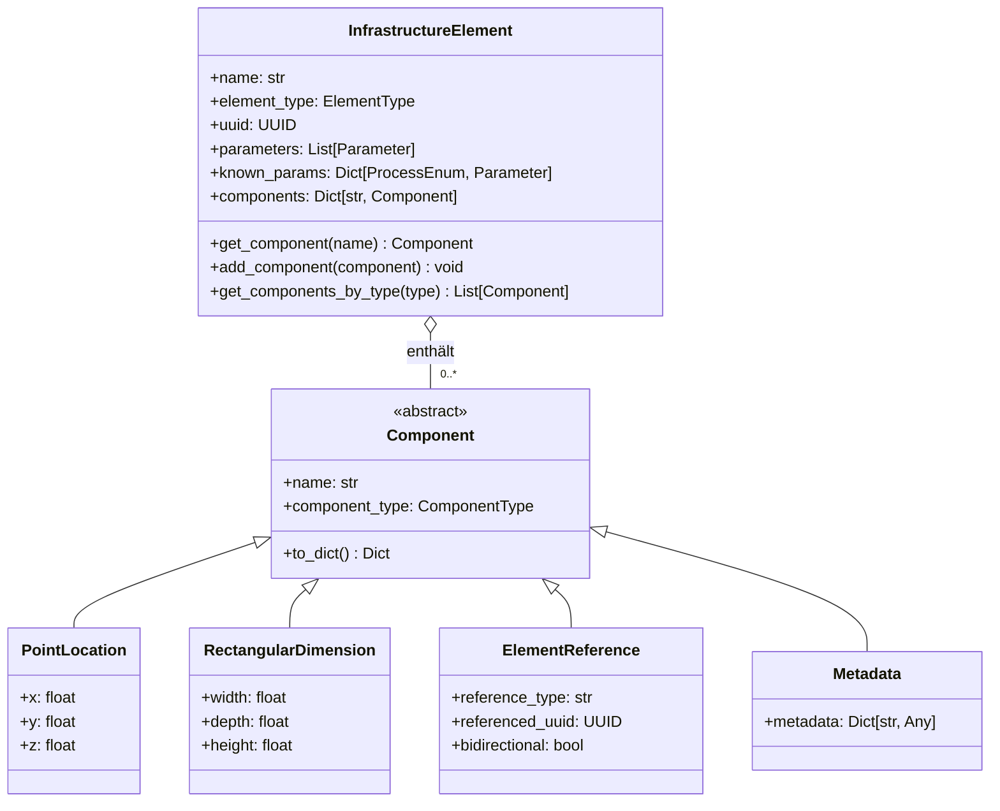

# PyArm Komponenten-System

Das Komponenten-System ist ein zentrales Architekturmuster in PyArm, das die Flexibilität und Erweiterbarkeit des Systems maßgeblich verbessert. Dieses Dokument beschreibt die Konzepte, Implementierung und Anwendung des Komponenten-Systems.

## Einführung

Das Komponenten-System in PyArm verwendet ein Kompositions-Muster anstelle einer tiefen Vererbungshierarchie. Dies ermöglicht es, Elemente mit genau den Fähigkeiten auszustatten, die sie benötigen, ohne die Nachteile einer starren Klassenhierarchie.



Grundprinzipien:
- **Komposition statt Vererbung**: Funktionalität wird durch das Hinzufügen von Komponenten erreicht, nicht durch Vererbung (wie im Diagramm dargestellt)
- **Erweiterbarkeit**: Neue Fähigkeiten können hinzugefügt werden, ohne bestehenden Code zu ändern
- **Wiederverwendbarkeit**: Komponenten können von verschiedenen Elementtypen verwendet werden
- **Flexibilität**: Elemente können zur Laufzeit mit Komponenten konfiguriert werden

## Komponenten-Architektur

### 1. Component-Basisklasse

```python
class Component:
    """Basisklasse für alle Komponenten."""
    
    def __init__(self, name: str, component_type: ComponentType):
        self.name = name
        self.component_type = component_type
        
    def to_dict(self):
        """Konvertiert die Komponente in ein Dictionary für die Serialisierung."""
        return {
            "name": self.name,
            "component_type": self.component_type.value
        }
```

### 2. ComponentType-Enum

```python
class ComponentType(str, Enum):
    """Typen von Komponenten, die an Elementen angehängt werden können."""
    
    UNKNWOWN = "UNKNWOWN"  # Unbekannter Typ
    LOCATION = "location"   # Position im Raum
    DIMENSION = "dimension" # Abmessungen
    MATERIAL = "material"   # Materialeigenschaften
    REFERENCE = "reference" # Referenz zu einem anderen Element
    PHYSICAL = "physical"   # Physikalische Eigenschaften (Gewicht, Dichte, etc.)
    VISUAL = "visual"       # Visuelle Eigenschaften (Farbe, Textur, etc.)
    CUSTOM = "custom"       # Benutzerdefinierte Komponente
    METADATA = "metadata"   # Metadaten
    BUILDING_PHASE = "building_phase"  # Bauphasen
    IFC_CONFIG = "ifc_config"  # IFC-Konfiguration
```

### 3. Spezifische Komponenten-Implementierungen

#### Ortskomponenten

```python
class PointLocation(Component):
    """Punktposition im 3D-Raum."""
    
    def __init__(self, x: float, y: float, z: float):
        super().__init__("location", ComponentType.LOCATION)
        self.x = x
        self.y = y
        self.z = z
        
    def to_dict(self):
        base_dict = super().to_dict()
        base_dict.update({
            "x": self.x,
            "y": self.y,
            "z": self.z
        })
        return base_dict

class LineLocation(Component):
    """Linienposition im 3D-Raum, definiert durch mehrere Punkte."""
    
    def __init__(self, points: List[Tuple[float, float, float]]):
        super().__init__("linear_location", ComponentType.LOCATION)
        self.points = points
        
    def to_dict(self):
        base_dict = super().to_dict()
        base_dict.update({
            "points": self.points
        })
        return base_dict
```

#### Abmessungskomponenten

```python
class RectangularDimension(Component):
    """Rechteckige Abmessungen."""
    
    def __init__(self, width: float, depth: float, height: float):
        super().__init__("rectangular_dimension", ComponentType.DIMENSION)
        self.width = width
        self.depth = depth
        self.height = height
        
    def to_dict(self):
        base_dict = super().to_dict()
        base_dict.update({
            "width": self.width,
            "depth": self.depth,
            "height": self.height
        })
        return base_dict

class CylindricalDimension(Component):
    """Zylindrische Abmessungen."""
    
    def __init__(self, diameter: float, height: float):
        super().__init__("cylindrical_dimension", ComponentType.DIMENSION)
        self.diameter = diameter
        self.height = height
        
    def to_dict(self):
        base_dict = super().to_dict()
        base_dict.update({
            "diameter": self.diameter,
            "height": self.height
        })
        return base_dict
```

#### Referenzkomponenten

```python
class ElementReference(Component):
    """Referenz zu einem anderen Element."""
    
    def __init__(self, reference_type: str, referenced_uuid: UUID, bidirectional: bool = False):
        super().__init__(f"reference_to_{reference_type}", ComponentType.REFERENCE)
        self.reference_type = reference_type
        self.referenced_uuid = referenced_uuid
        self.bidirectional = bidirectional
        
    def to_dict(self):
        base_dict = super().to_dict()
        base_dict.update({
            "reference_type": self.reference_type,
            "referenced_uuid": str(self.referenced_uuid),
            "bidirectional": self.bidirectional
        })
        return base_dict
```

#### Metadaten-Komponenten

```python
class Metadata(Component):
    """Metadaten für ein Element."""
    
    def __init__(self, metadata: Dict[str, Any]):
        super().__init__("metadata", ComponentType.METADATA)
        self.metadata = metadata
        
    def to_dict(self):
        base_dict = super().to_dict()
        base_dict.update({
            "metadata": self.metadata
        })
        return base_dict
```

### 4. ComponentFactory

Die ComponentFactory stellt Methoden bereit, um Komponenten aus Element-Parametern zu erstellen:

```python
class ComponentFactory:
    """Factory für die Erstellung von Komponenten aus Element-Parametern."""
    
    @staticmethod
    def create_location(element: InfrastructureElement) -> Location:
        """Erstellt eine Ortskomponente aus den Koordinatenparametern eines Elements."""
        try:
            x = element.get_param(ProcessEnum.X_COORDINATE).value
            y = element.get_param(ProcessEnum.Y_COORDINATE).value
            z = element.get_param(ProcessEnum.Z_COORDINATE).value
            return PointLocation(x, y, z)
        except PyArmParameterError:
            # Fallback für Elemente ohne Koordinaten
            return PointLocation(0, 0, 0)
    
    @staticmethod
    def create_dimension(element: InfrastructureElement) -> Dimension:
        """Erstellt eine Abmessungskomponente aus den Abmessungsparametern eines Elements."""
        if element.element_type == ElementType.FOUNDATION:
            try:
                width = element.get_param(ProcessEnum.FOUNDATION_WIDTH).value
                depth = element.get_param(ProcessEnum.FOUNDATION_DEPTH).value
                height = element.get_param(ProcessEnum.FOUNDATION_HEIGHT).value
                return RectangularDimension(width, depth, height)
            except PyArmParameterError:
                # Fallback für Fundamente ohne Abmessungen
                return RectangularDimension(1.0, 1.0, 1.0)
        elif element.element_type == ElementType.MAST:
            try:
                diameter = element.get_param(ProcessEnum.MAST_DIAMETER).value
                height = element.get_param(ProcessEnum.MAST_HEIGHT).value
                return CylindricalDimension(diameter, height)
            except PyArmParameterError:
                # Fallback für Masten ohne Abmessungen
                return CylindricalDimension(0.5, 5.0)
        # Weitere Elementtypen...
        
        # Generischer Fallback
        return RectangularDimension(1.0, 1.0, 1.0)
    
    @staticmethod
    def create_reference(
        reference_type: Type[InfrastructureElement], 
        referenced_uuid: UUID,
        bidirectional: bool = False
    ) -> ElementReference:
        """Erstellt eine Referenzkomponente zu einem anderen Element."""
        type_name = reference_type.__name__.lower()
        return ElementReference(type_name, referenced_uuid, bidirectional)
```

## Integration in InfrastructureElement

Die `InfrastructureElement`-Klasse ist die Basis für alle Infrastrukturelemente und integriert das Komponenten-System:

```python
@dataclass
class InfrastructureElement[TDimension: Dimension]:
    """
    Basisklasse für alle Infrastrukturelemente.
    Verwendet das flexible Parametermodell mit Prozess-Enums und Komponenten.
    """
    
    # Grundlegende Attribute
    name: str
    element_type: ElementType
    uuid: UUID = field(default_factory=uuid4)
    
    # Parameter-Speicherung
    parameters: list[Parameter] = field(default_factory=list)
    known_params: dict[ProcessEnum, Parameter] = field(default_factory=dict)
    
    # Komponenten-Speicherung
    components: dict[str, Component] = field(default_factory=dict)
    
    def __post_init__(self):
        """Nach der Initialisierung: Parameter analysieren und Standardkomponenten erstellen."""
        self._update_known_params()
        # Standardparameter hinzufügen, falls sie fehlen
        if ProcessEnum.UUID not in self.known_params:
            self.parameters.append(
                Parameter(
                    name="UUID",
                    value=str(self.uuid),
                    process=ProcessEnum.UUID,
                    datatype=DataType.STRING,
                    unit=UnitEnum.NONE,
                )
            )
        # Weitere Standardparameter...
        
        # Standardkomponenten initialisieren
        self._initialize_components()
    
    def _initialize_components(self):
        """Initialisiert die Standardkomponenten basierend auf den Parametern."""
        # Ortskomponente erstellen und hinzufügen
        component = ComponentFactory.create_location(self)
        self.components[component.name] = component
        
        # Abmessungskomponente erstellen und hinzufügen
        component = ComponentFactory.create_dimension(self)
        self.components[component.name] = component
    
    def get_component(self, component_name: str) -> Optional[Component]:
        """Gibt eine Komponente anhand ihres Namens zurück."""
        return self.components.get(component_name)
    
    def get_components_by_type(self, component_type: ComponentType) -> list[Component]:
        """Gibt alle Komponenten eines bestimmten Typs zurück."""
        return [
            comp for comp in self.components.values() 
            if comp.component_type == component_type
        ]
    
    def add_component(self, component: Component) -> None:
        """Fügt eine Komponente hinzu oder ersetzt eine vorhandene mit dem gleichen Namen."""
        self.components[component.name] = component
    
    def remove_component(self, component_name: str) -> bool:
        """Entfernt eine Komponente anhand ihres Namens."""
        if component_name in self.components:
            del self.components[component_name]
            return True
        return False
    
    @property
    def location(self) -> Location:
        """Gibt die Ortskomponente des Elements zurück."""
        components = self.get_components_by_type(ComponentType.LOCATION)
        for comp in components:
            if isinstance(comp, (PointLocation, LineLocation)):
                return comp
        # Fallback, wenn keine Ortskomponente gefunden wurde
        raise PyArmComponentError(self, ComponentType.LOCATION)
    
    @property
    def dimension(self) -> TDimension:
        """Gibt die Abmessungskomponente des Elements zurück."""
        components = self.get_components_by_type(ComponentType.DIMENSION)
        for comp in components:
            if isinstance(comp, (RectangularDimension, CylindricalDimension)):
                return cast(TDimension, comp)
        # Fallback, wenn keine Abmessungskomponente gefunden wurde
        raise PyArmComponentError(self, ComponentType.DIMENSION)
```

## Praktische Anwendungsbeispiele

### 1. Grundlegende Komponenten-Verwendung

```python
# Fundament mit Standardkomponenten erstellen
foundation = Foundation(name="Fundament 1")

# Auf Komponenten zugreifen
location = foundation.location
print(f"Position: x={location.x}, y={location.y}, z={location.z}")

dimension = foundation.dimension
print(f"Abmessungen: {dimension.width}x{dimension.depth}x{dimension.height}")

# Komponenten nach Typ abrufen
all_dimensions = foundation.get_components_by_type(ComponentType.DIMENSION)
for dim in all_dimensions:
    print(f"Dimension: {dim.name}")
```

### 2. Benutzerdefinierte Komponenten hinzufügen

```python
# Metadata-Komponente erstellen und hinzufügen
metadata = Metadata({
    "installation_date": "2023-05-15",
    "manufacturer": "ACME Corp",
    "project_id": "P12345",
    "inspector": "Max Mustermann"
})
foundation.add_component(metadata)

# Material-Komponente erstellen und hinzufügen
class Material(Component):
    def __init__(self, material_type: str, density: float):
        super().__init__("material", ComponentType.MATERIAL)
        self.material_type = material_type
        self.density = density

material = Material("Beton C25/30", 2.5)  # 2.5 t/m³
foundation.add_component(material)

# Auf die benutzerdefinierten Komponenten zugreifen
material_comp = foundation.get_component("material")
if material_comp and isinstance(material_comp, Material):
    print(f"Material: {material_comp.material_type}, Dichte: {material_comp.density} t/m³")

metadata_comp = foundation.get_components_by_type(ComponentType.METADATA)
if metadata_comp:
    print(f"Installationsdatum: {metadata_comp[0].metadata.get('installation_date')}")
```

### 3. Elementreferenzen mit Komponenten

```python
# Fundament und Mast erstellen
foundation = Foundation(name="Fundament 1")
mast = Mast(name="Mast 1")

# Bidirektionale Verknüpfung erstellen
foundation.add_reference(reference_type=Mast, referenced_uuid=mast.uuid, bidirectional=True)

# Bei bidirektionaler Verknüpfung würde der ElementLinker auch die umgekehrte Referenz erstellen
# mast.add_reference(reference_type=Foundation, referenced_uuid=foundation.uuid)

# Referenzen abfragen
foundation_references = foundation.get_components_by_type(ComponentType.REFERENCE)
for ref in foundation_references:
    if isinstance(ref, ElementReference) and ref.reference_type == "mast":
        print(f"Fundament {foundation.name} referenziert Mast mit UUID {ref.referenced_uuid}")

mast_references = mast.get_components_by_type(ComponentType.REFERENCE)
for ref in mast_references:
    if isinstance(ref, ElementReference) and ref.reference_type == "foundation":
        print(f"Mast {mast.name} referenziert Fundament mit UUID {ref.referenced_uuid}")
```

### 4. Erweiterte Komponenten für spezifische Anforderungen

```python
# Bauphasen-Komponente für die Bauplanung
class BuildingPhase(Component):
    def __init__(self, 
                 phase_name: str, 
                 start_date: datetime, 
                 end_date: datetime,
                 responsible: str):
        super().__init__("building_phase", ComponentType.BUILDING_PHASE)
        self.phase_name = phase_name
        self.start_date = start_date
        self.end_date = end_date
        self.responsible = responsible
        self.completed = False
        
    def mark_completed(self, completion_date: datetime = None):
        self.completed = True
        if completion_date:
            self.end_date = completion_date

# Fundament mit Bauphase
foundation = Foundation(name="Fundament 2")
phase = BuildingPhase(
    phase_name="Grundarbeiten",
    start_date=datetime(2023, 6, 1),
    end_date=datetime(2023, 6, 15),
    responsible="Baufirma XYZ"
)
foundation.add_component(phase)

# Visualisierungskomponente für 3D-Darstellung
class VisualProperties(Component):
    def __init__(self, color: str, texture: str = None, opacity: float = 1.0):
        super().__init__("visual", ComponentType.VISUAL)
        self.color = color
        self.texture = texture
        self.opacity = opacity

# Visuelles Erscheinungsbild für das Fundament
visual = VisualProperties(color="#CCCCCC", opacity=0.8)
foundation.add_component(visual)

# Verwendung der Komponenten für die Visualisierung
building_phases = foundation.get_components_by_type(ComponentType.BUILDING_PHASE)
if building_phases:
    phase = building_phases[0]
    print(f"Bauphase: {phase.phase_name}, Abschluss bis: {phase.end_date}")
    if not phase.completed:
        print(f"Status: Noch nicht abgeschlossen, verantwortlich: {phase.responsible}")

visuals = foundation.get_components_by_type(ComponentType.VISUAL)
if visuals:
    visual = visuals[0]
    print(f"Visuell: Farbe {visual.color}, Transparenz: {1 - visual.opacity}")
```

## Vorteile des Komponenten-Systems

### 1. Flexibilität durch Komposition

Das Komponenten-System ermöglicht die Erstellung von Elementen mit genau den Fähigkeiten, die sie benötigen, ohne eine komplexe Vererbungshierarchie aufzubauen. Ein Element kann dynamisch mit beliebigen Komponenten ausgestattet werden.

### 2. Wiederverwendbarkeit

Komponenten können in verschiedenen Elementtypen verwendet werden. Zum Beispiel kann die PointLocation-Komponente sowohl für Fundamente, Masten als auch andere Elementtypen verwendet werden.

### 3. Erweiterbarkeit

Neue Komponententypen können hinzugefügt werden, ohne bestehenden Code zu ändern. Dies ermöglicht eine einfache Erweiterung des Systems für neue Anforderungen.

### 4. Bessere Wartbarkeit

Durch die klare Trennung von Verantwortlichkeiten in verschiedenen Komponenten wird der Code leichter wartbar. Jede Komponente hat eine einzige, klar definierte Aufgabe.

### 5. Typsicherheit

Durch die Verwendung von generischen Typen wie `InfrastructureElement[TDimension: Dimension]` kann sichergestellt werden, dass ein Element den richtigen Typ von Abmessungskomponente hat.

## Fazit

Das Komponenten-System ist ein leistungsfähiges Architekturmuster in PyArm, das die Flexibilität, Erweiterbarkeit und Wartbarkeit des Systems verbessert. Durch die Verwendung von Komposition statt Vererbung können Elemente mit beliebigen Fähigkeiten ausgestattet werden, ohne eine komplexe Klassenhierarchie zu erstellen.

Dieses Muster eignet sich besonders gut für Domänen wie die Infrastrukturmodellierung, in denen verschiedene Elementtypen unterschiedliche, aber teilweise überlappende Fähigkeiten haben. Durch die dynamische Zusammenstellung von Komponenten können Elemente genau die Funktionalität erhalten, die sie benötigen.