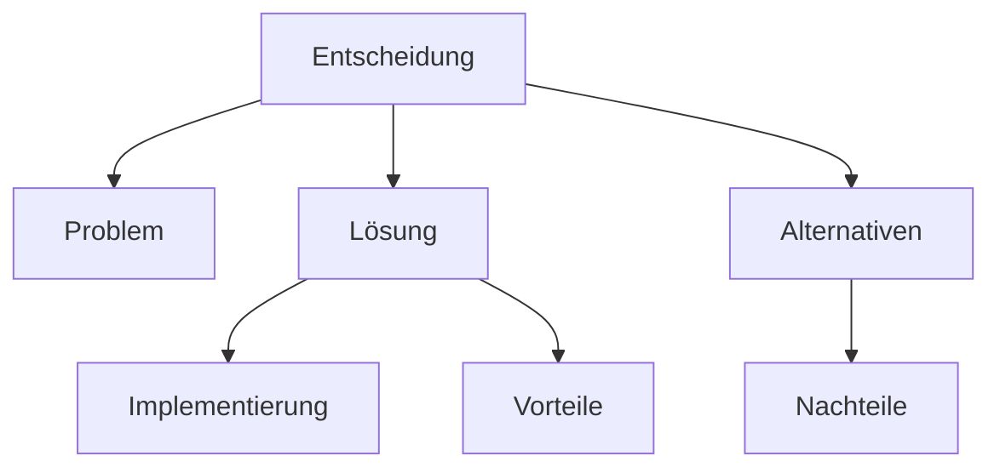

# Design-Entscheidungen

Dieses Verzeichnis enthält Dokumentationen zu wichtigen Design-Entscheidungen im PyArm-Projekt. Die Dokumente folgen einem standardisierten Format und beinhalten Mermaid-Diagramme zur Visualisierung der Architekturkonzepte.

## Struktur der Entscheidungsdokumente

Jedes Entscheidungsdokument enthält:

- **Problem Statement**: Beschreibung des Problems, das gelöst werden musste
- **Chosen Approach**: Der gewählte Ansatz mit Begründung
- **Diagramme**: Visuelle Darstellung der Architektur oder des Musters mit Mermaid
- **Implementierung**: Konkrete Implementierungsbeispiele mit Code
- **Alternativen**: Betrachtete alternative Ansätze mit ihren Vor- und Nachteilen
- **Reasoning**: Begründung für die getroffene Entscheidung
- **Limitations/Future Considerations**: Bekannte Einschränkungen und zukünftige Erweiterungsmöglichkeiten

## Mermaid-Diagramme

Die Dokumentation verwendet Mermaid-Syntax für Diagramme, die direkt in Markdown eingebettet sind:

Diese Diagramme werden automatisch von GitHub und vielen anderen Markdown-Viewern gerendert.

## Liste der Entscheidungsdokumente

- [component_pattern.md](component_pattern.md) - Dokumentation zum Component Pattern
- [element_linking_strategy.md](element_linking_strategy.md) - Element-Linking-Strategie