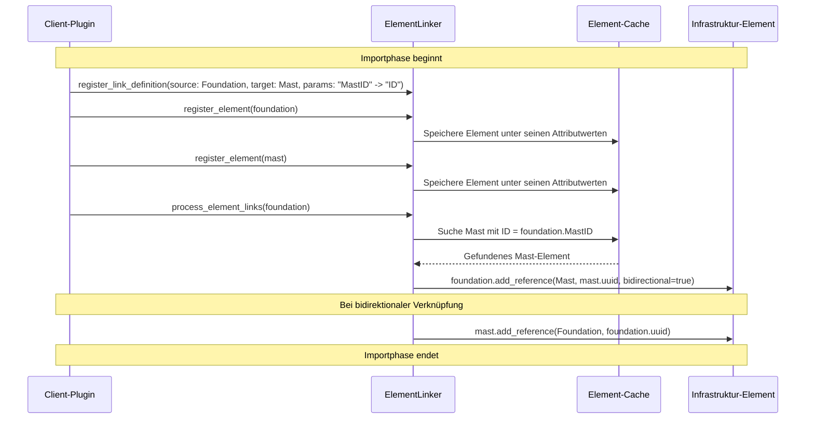
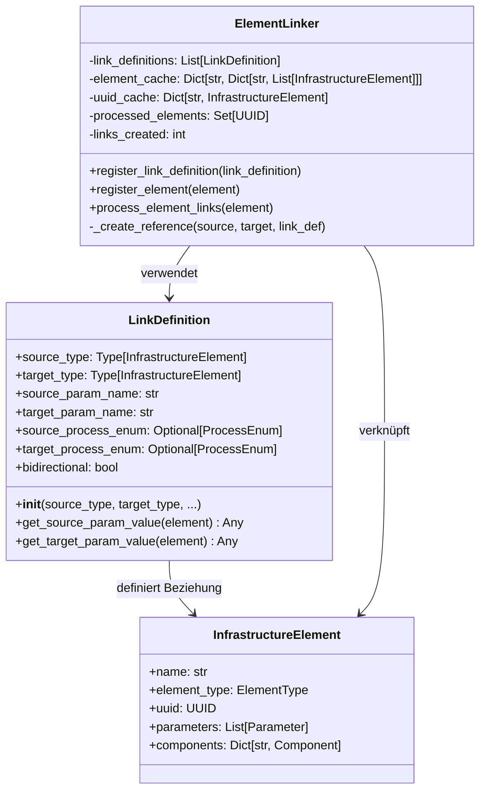
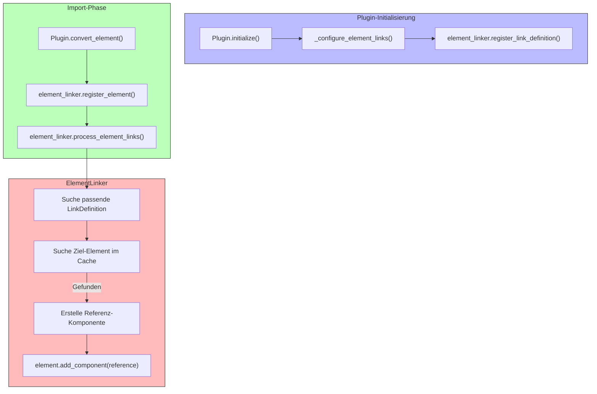

# Element Linking Strategy mit Component Pattern

- **Datum**: 2023-05-13
- **Autor**: PyArm Team
- **Status**: Implementiert

## Problem Statement

Fundamente und Masten sind in den Client-Daten oft nicht über UUIDs miteinander verbunden, sondern über proprietäre IDs oder andere Attribute. Ein Mechanismus wurde benötigt, um diese Verbindungen während des Imports herzustellen und danach die UUIDs für die Referenzen zu verwenden.

## Prozessübersicht

Der Element-Linking-Prozess läuft wie folgt ab:



## Chosen Approach: ElementLinker mit LinkDefinitions und Component Pattern

Der bestehende Plugin-Mechanismus wurde erweitert, um eine flexible Verbindung zwischen Elementen basierend auf beliebigen Client-Attributen zu ermöglichen. Dabei wird das Component Pattern genutzt, um Referenzen als Komponenten zu modellieren:

- Ein `ElementLinker` verwaltet Verknüpfungen zwischen Elementen
- `LinkDefinition`-Objekte definieren, welche Parameter für die Verknüpfung verwendet werden
- Die Verknüpfung erfolgt während der Importphase innerhalb des Plugin-Bereichs
- Nach dem Finden einer Verknüpfung werden `ElementReference`-Komponenten erstellt
- Diese Komponenten werden den Elementen hinzugefügt und verwenden die UUIDs als stabile Referenzen

Das Component Pattern ermöglicht eine klare Trennung zwischen:
1. Der Identität eines Elements (UUID)
2. Den Attributen eines Elements (Parameter)
3. Den Beziehungen eines Elements zu anderen Elementen (Reference-Komponenten)

## Implementation

### Component Pattern für Referenzen

Im Kern des Designs steht die `ElementReference`-Komponente, die das Component Pattern implementiert:

```python
class ElementReference(Component):
    """Komponente für die Referenz zu einem anderen Element."""

    def __init__(
        self,
        name: str,
        referenced_uuid: UUID,
        reference_type: Type["InfrastructureElement"],
        bidirectional: bool = False,
        component_type: ComponentType = ComponentType.REFERENCE,
    ):
        """Initialisiert eine ElementReference-Komponente."""
        super().__init__(name=name, component_type=component_type)
        self.referenced_uuid = referenced_uuid
        self.reference_type = reference_type
        self.bidirectional = bidirectional
```

Diese Komponente wird den Elementen hinzugefügt, wenn eine Verknüpfung gefunden wird:

```python
def add_reference(
    self,
    reference_type: Type["InfrastructureElement"],
    referenced_uuid: UUID,
    bidirectional: bool = False,
) -> None:
    """Fügt eine Referenz zu einem anderen Element hinzu."""
    reference = ComponentFactory.create_reference(
        reference_type, referenced_uuid, bidirectional
    )
    self.add_component(reference)
```

### Link Definition

Die LinkDefinition definiert, wie Elemente verknüpft werden sollen:



### ElementLinker Integration

Der ElementLinker wird im Plugin während der Initialisierung eingerichtet:

```python
def initialize(self, config: Dict[str, Any]) -> bool:
    """Initialisiert das Plugin mit der Konfiguration."""
    log.info(f"Initialisiere {self.name} v{self.version}")
    log.debug(f"Konfiguration: {config}")
    
    try:
        from pyarm.linking.element_linker import ElementLinker
        self._element_linker = ElementLinker()
        
        # Link-Definitionen basierend auf der Konfiguration registrieren
        self._configure_element_links(config)
        log.info("ElementLinker wurde erfolgreich initialisiert")
    except ImportError:
        log.warning("ElementLinker konnte nicht importiert werden.")
        self._element_linker = None
    
    return True
```

Während der Konvertierung werden Elemente im Linker registriert und Verknüpfungen hergestellt:

```python
# Konvertierte Elemente zum ElementLinker hinzufügen für die spätere Verknüpfung
if self._element_linker:
    # Elemente im Linker registrieren
    for element in converted_elements:
        self._element_linker.register_element(element)
        
    # Verarbeite Verknüpfungen für die neuen Elemente
    for element in converted_elements:
        self._element_linker.process_element_links(element)
```

Der ElementLinker selbst verarbeitet die Verknüpfungen und erstellt Reference-Komponenten:



## Konfiguration der Verknüpfungen

Die Verknüpfungsdefinitionen können in der Plugin-Konfiguration angegeben werden:

```json
{
  "plugin_config": {
    "ClientA Plugin": {
      "element_links": {
        "project1": {
          "foundation_mast": {
            "source_type": "foundation",
            "target_type": "mast",
            "source_param": "MastID",
            "target_param": "ID"
          }
        }
      }
    }
  }
}
```

## Alternatives Considered

### 1. Nachträgliche Verknüpfung außerhalb des Plugins

Eine Alternative wäre, die Verknüpfung nach dem Import in einem separaten Prozess durchzuführen. Dies hätte jedoch mehrere Nachteile:
- Getrennte Verantwortlichkeiten führen zu höherem Integrationsaufwand
- Client-spezifisches Wissen müsste an zwei Stellen verwaltet werden
- Kein direkter Zugriff auf die internen Strukturen der Client-Daten

### 2. Festes Attribut-Mapping mit UUID-Konvertierung

Eine einfachere Lösung wäre, bei der Konvertierung direkt UUIDs basierend auf einem festen Attribut-Mapping zuzuweisen. Diese Lösung wäre jedoch weniger flexibel:
- Keine Unterstützung für unterschiedliche Projekte mit unterschiedlichen Attributnamen
- Schwieriger zu konfigurieren und zu erweitern
- Keine Möglichkeit, komplexere Verknüpfungslogik zu implementieren

## Reasoning

Die gewählte Lösung bietet mehrere Vorteile:

1. **Flexibilität**: Die Lösung kann mit verschiedenen Client-Daten-Formaten und Attributnamen umgehen
2. **Projektkonfiguration**: Spezifische Verknüpfungsregeln können pro Projekt definiert werden
3. **Plugin-Integration**: Die Verknüpfung erfolgt während der Importphase, was die Datenintegrität verbessert
4. **Bidirektionalität**: Unterstützt bidirektionale Referenzen für konsistente Datenmodelle
5. **Erweiterbarkeit**: Der Mechanismus kann leicht um weitere Elementtypen erweitert werden

### Vorteile des Component Patterns im Kontext der Referenzen

Das Component Pattern bietet spezifische Vorteile für die Verwaltung von Elementbeziehungen:

1. **Separation of Concerns**: Die Kernidentität eines Elements bleibt unabhängig von seinen Beziehungen
2. **Flexibles Hinzufügen/Entfernen**: Referenzen können dynamisch hinzugefügt oder entfernt werden, ohne das Element selbst zu ändern
3. **Typ-Sicherheit**: Referenzen enthalten Typinformationen über das referenzierte Element
4. **Zugriffskontrolle**: Komponenten bieten eine einheitliche Schnittstelle für den Zugriff auf Referenzen
5. **Selbstbeschreibend**: Die Komponenten-Struktur macht Referenzen explizit und dokumentiert

## Code Example

LinkDefinition-Registrierung für projektspezifische Verknüpfungen:

```python
# Für Projekt 1: Fundament -> Mast über "MastID" -> "ID"
self._element_linker.register_link_definition(
    LinkDefinition(
        source_type=Foundation,
        target_type=Mast,
        source_param_name="MastID",
        target_param_name="ID",
        source_process_enum=ProcessEnum.FOUNDATION_TO_MAST_UUID,
        target_process_enum=ProcessEnum.UUID,
        bidirectional=True,
    )
)

# Für Projekt 2: Joch -> Mast über "MastAnschlussID" -> "MastID"
self._element_linker.register_link_definition(
    LinkDefinition(
        source_type=Joch,
        target_type=Mast,
        source_param_name="MastAnschlussID",
        target_param_name="MastID",
        bidirectional=True,
    )
)
```

## Limitations and Future Considerations

- **Performance**: Bei sehr großen Datenmengen könnte die Cache-Verwaltung Optimierungen benötigen
- **Validierung**: Zusätzliche Validierungsmechanismen könnten eingebaut werden, um fehlerhafte Verknüpfungen zu erkennen
- **Konflikterkennung**: Derzeit werden Konflikte bei mehreren möglichen Verknüpfungen nicht explizit behandelt
- **Konfiguration**: Ein schema-basierter Konfigurationsmechanismus könnte die Definition von Verknüpfungsregeln vereinfachen

### Component Pattern Erweiterungen

Das Component Pattern könnte in Zukunft weiter ausgebaut werden:

- **Composite-Komponenten**: Komponenten könnten selbst wieder Komponenten enthalten, was komplexere Strukturen ermöglicht
- **Bedingte Komponenten**: Komponenten könnten basierend auf bestimmten Bedingungen aktiviert oder deaktiviert werden
- **Ereignisgesteuerte Komponenten**: Komponenten könnten auf Änderungen in anderen Komponenten reagieren
- **Shared Components**: Komponenten könnten zwischen mehreren Elementen geteilt werden, um gemeinsame Eigenschaften zu modellieren
- **Lazy Loading**: Referenzierte Elemente könnten bei Bedarf geladen werden, statt alle Referenzen sofort aufzulösen