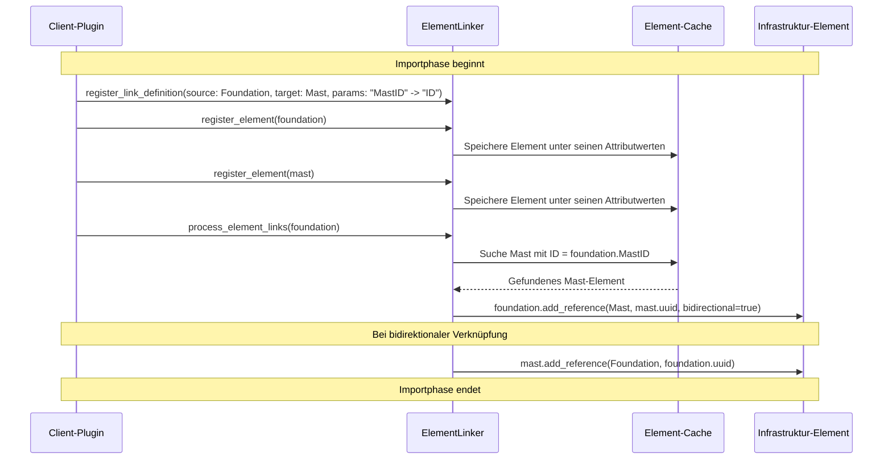

# Element Linking während der Import-Phase

Diese Funktionalität ermöglicht die Verknüpfung von Infrastrukturelementen (wie Fundamente und Masten) während der Import-Phase innerhalb der Client-Plugins, basierend auf beliebigen Attributen anstatt UUIDs.

## Prozessübersicht

Der Element-Linking-Prozess läuft wie folgt ab:



## Kernfunktionen

- **Flexible Verknüpfung**: Verbindung von Elementen basierend auf beliebigen Attributen (z.B. "MastID", "MastName", "StationNr") (siehe Diagramm: Attribute "MastID" und "ID")
- **Frühzeitige Verknüpfung**: Verknüpfungen werden während der Import-Phase im Plugin erstellt, nicht erst danach (siehe Diagramm: "Importphase")
- **Bidirektionale Referenzen**: Nach der Verknüpfung werden bidirektionale Referenzen mit den tatsächlichen UUIDs erstellt (siehe Diagramm: bidirektionale Verknüpfung)
- **Erweiterbarkeit**: Die Lösung lässt sich auf beliebige Elementtypen erweitern

## Verwendung

### 1. Konfiguration der Verknüpfungen

Die Verknüpfungsdefinitionen können in der Plugin-Konfiguration angegeben werden:

```json
{
  "plugin_config": {
    "ClientA Plugin": {
      "element_links": {
        "project1": {
          "foundation_mast": {
            "source_type": "foundation",
            "target_type": "mast",
            "source_param": "MastID",
            "target_param": "ID"
          }
        }
      }
    }
  }
}
```

### 2. Integration in eigene Plugins

Um den ElementLinker in eigenen Plugins zu verwenden:

1. Importieren Sie den ElementLinker:
```python
from pyarm.linking.element_linker import ElementLinker
```

2. Erstellen Sie eine Instanz des ElementLinkers in der `initialize`-Methode:
```python
def initialize(self, config: Dict[str, Any]) -> bool:
    self._element_linker = ElementLinker()
    self._configure_element_links(config)
    return True
```

3. Registrieren Sie die Verknüpfungsdefinitionen:
```python
def _configure_element_links(self, config: Dict[str, Any]) -> None:
    # Hier Link-Definitionen registrieren
    self._element_linker.register_link_definition(
        source_type=ElementType.FOUNDATION,
        target_type=ElementType.MAST,
        source_param="MastID",
        target_param="ID"
    )
```

4. Fügen Sie die konvertierten Elemente zum ElementLinker hinzu:
```python
def convert_element(self, data: Dict[str, Any], element_type: str) -> Optional[Dict[str, Any]]:
    # ... [Konvertierung Ihrer Elemente] ...
    
    # Elemente zum ElementLinker hinzufügen
    self._element_linker.add_elements(converted_elements)
    
    # Verknüpfungen erstellen
    self._element_linker.create_element_links()
    
    # ... [Weiterer Code] ...
```

## Erweiterung für andere Elementtypen

Um weitere Elementtypen zu unterstützen:

1. Registrieren Sie zusätzliche Verknüpfungsdefinitionen für die neuen Elementtypen:
```python
self._element_linker.register_link_definition(
    source_type=ElementType.JOCH,
    target_type=ElementType.MAST,
    source_param="MastAnschlussID",
    target_param="ID"
)
```

2. Passen Sie die `_create_bidirectional_reference` Methode des ElementLinkers an, um spezifische Verknüpfungslogik für die neuen Elementtypen zu implementieren:
```python
# In einer angepassten ElementLinker-Klasse
def _create_bidirectional_reference(self, source, target):
    if isinstance(source, Joch) and isinstance(target, Mast):
        # Spezifische Implementierung für Joch <-> Mast
        # ...
    else:
        # Fallback zur Standard-Implementierung
        super()._create_bidirectional_reference(source, target)
```

## Beispiel-Implementierung

Siehe:
- `/src/pyarm/linking/element_linker.py` - Die Hauptklasse für die Elementverknüpfung
- `/plugins/client_a/__init__.py` - Beispiel-Integration im ClientA-Plugin
- `/config/client_a_element_links.json` - Beispiel-Konfigurationsdatei