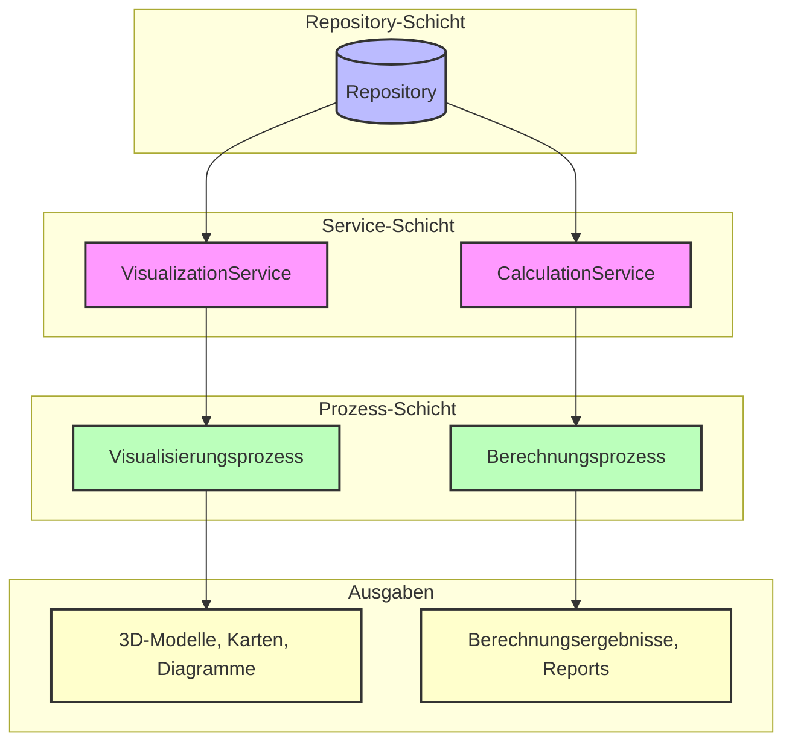
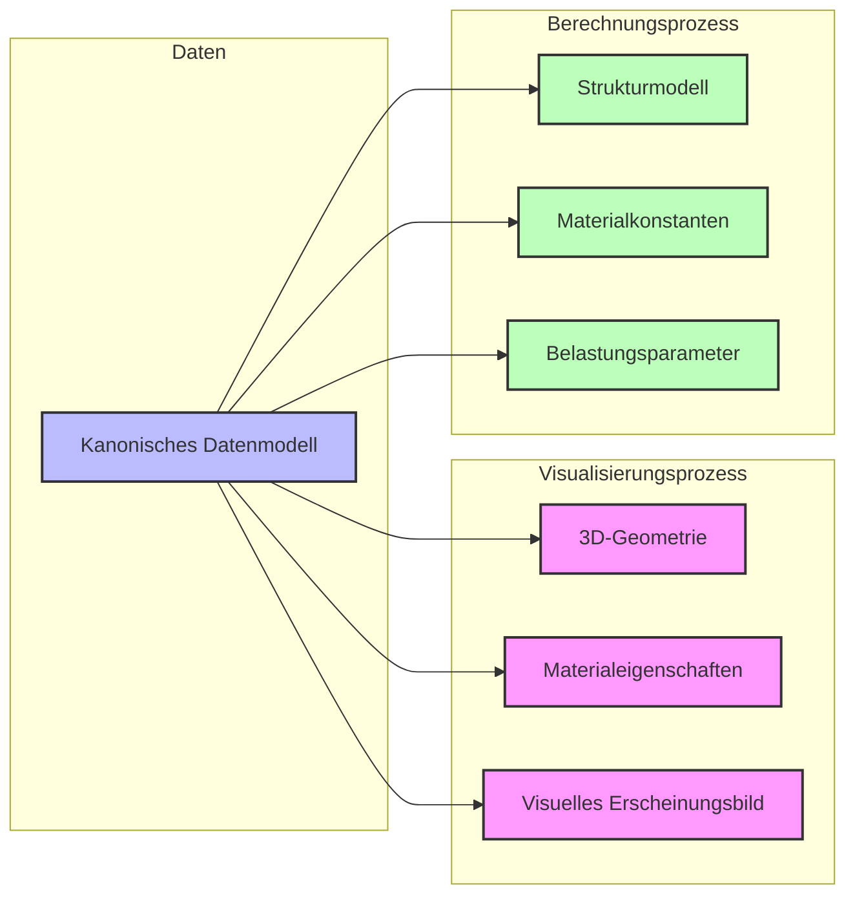

# Prozesse: Visualisierung und Berechnung

Die Prozess-Schicht stellt die Anwendungslogik bereit, die auf den Daten aus dem Repository ausgeführt wird. Dieses Projekt implementiert zwei unterschiedliche Prozesse, die mit denselben Daten arbeiten, aber verschiedene Ziele verfolgen.

## Prozessarchitektur



## Gemeinsame Daten, unterschiedliche Ansichten

Ein Schlüsselkonzept in der Architektur ist die Verwendung eines gemeinsamen Datenmodells für verschiedene Anwendungsfälle:



## Prozess 1: Visualisierung

Der Visualisierungsprozess bereitet die Daten für die grafische Darstellung auf:

```python
class VisualizationProcess:
    """
    Prozess zur Visualisierung von Infrastrukturelementen.
    """
    
    def __init__(self, repository_path: str, output_path: str):
        self.service = VisualizationService(repository_path)
        self.output_path = output_path
    
    def run(self) -> None:
        """Führt den Visualisierungsprozess aus."""
        # Elemente nach Typ abrufen
        foundations = self.service.get_elements_by_type(ElementType.FOUNDATION)
        masts = self.service.get_elements_by_type(ElementType.MAST)
        tracks = self.service.get_elements_by_type(ElementType.TRACK)
        
        # Visualisierungsdaten generieren
        scene_data = self._generate_scene_data(foundations, masts, tracks)
        
        # Output speichern
        self._save_output(scene_data)
    
    def _generate_scene_data(self, foundations, masts, tracks) -> Dict[str, Any]:
        """Generiert die Szenengeometrie für die Visualisierung."""
        # Implementierung...
    
    def _save_output(self, scene_data: Dict[str, Any]) -> None:
        """Speichert die Visualisierungsdaten."""
        # Implementierung...
```

### Besonderheiten des Visualisierungsprozesses

1. **Geometrische Transformation**: Konvertierung des kanonischen Modells in visuelle Geometrie
2. **Materialzuordnung**: Zuordnung von visuellen Eigenschaften basierend auf Materialparametern
3. **Szenenaufbau**: Strukturierung der Elemente in einer hierarchischen Szene
4. **Exportformate**: Unterstützung verschiedener Ausgabeformate (JSON, GLTF, usw.)

### Beispielausgabe: 3D-Szene

```json
{
  "scene": {
    "name": "Infrastrukturszene",
    "elements": [
      {
        "type": "foundation",
        "geometry": {
          "type": "box",
          "dimensions": [1.5, 2.0, 1.0],
          "position": [2600000.0, 1200000.0, 456.78]
        },
        "material": {
          "name": "Beton",
          "color": [0.7, 0.7, 0.7],
          "roughness": 0.8
        }
      },
      {
        "type": "mast",
        "geometry": {
          "type": "cylinder",
          "radius": 0.25,
          "height": 8.5,
          "position": [2600000.0, 1200000.0, 457.78]
        },
        "material": {
          "name": "Stahl",
          "color": [0.5, 0.5, 0.5],
          "roughness": 0.3
        }
      }
      // Weitere Elemente...
    ]
  }
}
```

## Prozess 2: Berechnung

Der Berechnungsprozess führt statische und dynamische Analysen durch:

```python
class CalculationProcess:
    """
    Prozess zur Berechnung von Kräften und Lasten in Infrastrukturelementen.
    """
    
    def __init__(self, repository_path: str, output_path: str):
        self.service = CalculationService(repository_path)
        self.output_path = output_path
        self.calculation_params = {
            "speed": 160.0,  # km/h
            "load": 25.0,    # t/m
            "safety_factor": 1.5
        }
    
    def run(self) -> None:
        """Führt den Berechnungsprozess aus."""
        # Masten abrufen und Kräfte berechnen
        masts = self.service.get_elements_by_type(ElementType.MAST)
        mast_forces = self._calculate_mast_forces(masts)
        
        # Gleise abrufen und Kräfte berechnen
        tracks = self.service.get_elements_by_type(ElementType.TRACK)
        track_forces = self._calculate_track_forces(tracks)
        
        # Ergebnisse kombinieren
        results = {
            "mast_forces": mast_forces,
            "track_forces": track_forces,
            "parameters": self.calculation_params
        }
        
        # Output speichern
        self._save_output(results)
    
    def _calculate_mast_forces(self, masts) -> Dict[str, Dict[str, float]]:
        """Berechnet Kräfte auf Masten."""
        # Implementierung...
    
    def _calculate_track_forces(self, tracks) -> Dict[str, Dict[str, float]]:
        """Berechnet Kräfte auf Gleisen."""
        # Implementierung...
    
    def _save_output(self, results: Dict[str, Any]) -> None:
        """Speichert die Berechnungsergebnisse."""
        # Implementierung...
```

### Besonderheiten des Berechnungsprozesses

1. **Physikalisches Modell**: Erstellung eines Berechnungsmodells aus dem kanonischen Datenmodell
2. **Parameter-Extraktion**: Gezielte Extraktion relevanter Parameter für die Berechnung
3. **Statische Analyse**: Berechnung von Kräften und Momenten im Ruhezustand
4. **Dynamische Analyse**: Berechnung von Kräften und Vibrationen unter Last

### Beispielausgabe: Berechnungsergebnisse

```json
{
  "results": {
    "mast_forces": {
      "M001": {
        "axial_force": 25000.0,
        "shear_force": 5000.0,
        "bending_moment": 42500.0,
        "safety_margin": 2.3
      },
      "M002": {
        "axial_force": 27500.0,
        "shear_force": 5500.0,
        "bending_moment": 46750.0,
        "safety_margin": 2.1
      }
    },
    "track_forces": {
      "T001": {
        "vertical_force": 250000.0,
        "lateral_force": 30000.0,
        "longitudinal_force": 15000.0,
        "deformation": 2.3
      }
    },
    "parameters": {
      "speed": 160.0,
      "load": 25.0,
      "safety_factor": 1.5
    }
  }
}
```

## Unterschiede in der Datennutzung

Der Hauptunterschied zwischen den beiden Prozessen liegt in der Art, wie sie die Daten aus dem kanonischen Modell nutzen:

### Visualisierungsprozess
- **Fokus**: Visuelles Erscheinungsbild und räumliche Anordnung
- **Relevante Parameter**: Geometrie, Position, Farbe, Textur
- **Verarbeitung**: Transformation in visuelle Darstellung
- **Ausgabe**: 3D-Modelle, Karten, Diagramme

### Berechnungsprozess
- **Fokus**: Strukturelles Verhalten und Belastbarkeit
- **Relevante Parameter**: Materialstärke, Belastungsgrenzen, physikalische Eigenschaften
- **Verarbeitung**: Mathematische Modellierung und Simulation
- **Ausgabe**: Numerische Ergebnisse, Berichte, Analyseprotokolle

## Erweiterung des Prozess-Systems

Neue Prozesse können einfach hinzugefügt werden:

```python
class NewProcess:
    """Ein neuer Prozess für eine spezifische Anwendung."""
    
    def __init__(self, repository_path: str, output_path: str):
        self.service = SpecializedService(repository_path)
        self.output_path = output_path
    
    def run(self) -> None:
        """Führt den Prozess aus."""
        # Implementierung...
```

Um einen neuen Prozess hinzuzufügen:
1. Erstellen Sie eine neue Prozessklasse
2. Verwenden Sie eine bestehende oder erstellen Sie eine neue Service-Klasse
3. Implementieren Sie die anwendungsspezifische Logik
4. Registrieren Sie den Prozess in der Prozesssteuerung (`main.py`)