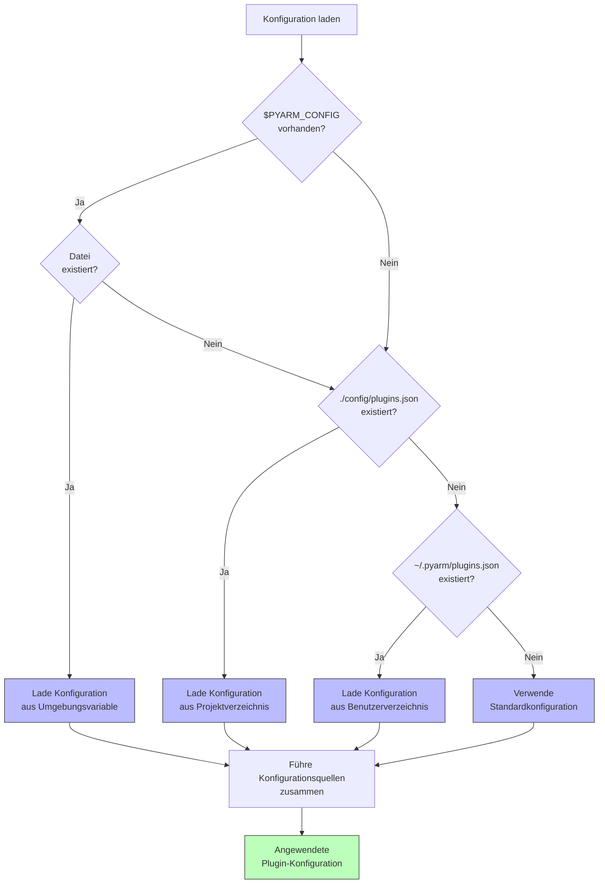
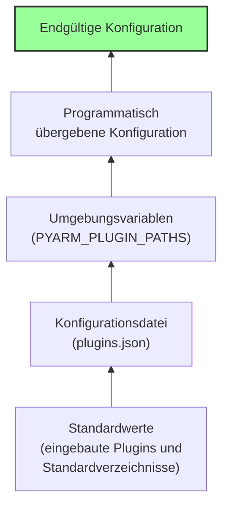

# PyArm Plugin-Konfiguration

Die Plugin-Konfiguration in PyArm ist flexibel gestaltet und ermöglicht es, Plugins von verschiedenen Orten zu laden und individuell zu konfigurieren.

## Konfigurationsdateien

PyArm sucht in der folgenden Reihenfolge nach Konfigurationsdateien:



1. `$PYARM_CONFIG` (Umgebungsvariable)
2. `./config/plugins.json` (Projektverzeichnis)
3. `~/.pyarm/plugins.json` (Benutzerverzeichnis)

Die erste gefundene Datei wird verwendet.

## Struktur der Konfigurationsdatei

Die Konfigurationsdatei hat folgende Struktur:

```json
{
  "plugin_paths": [
    {
      "name": "Core Plugins",
      "path": "./src/pyarm/plugins",
      "enabled": true
    },
    {
      "name": "Client Plugins",
      "path": "./clients",
      "enabled": true
    }
  ],
  "external_plugin_paths": [
    {
      "name": "External Client Plugins",
      "path": "/home/user/external_plugins/clients",
      "enabled": true
    },
    {
      "name": "Network Plugins",
      "path": "//server/shared/plugins",
      "enabled": false
    }
  ],
  "disabled_plugins": [
    "Legacy Plugin"
  ],
  "plugin_settings": {
    "Example Plugin": {
      "option1": "value1",
      "option2": true
    },
    "ClientA Plugin": {
      "database_path": "C:/Data/clienta.db",
      "log_level": "info"
    }
  }
}
```

## Konfigurationsoptionen

### Plugin-Pfade

- **plugin_paths**: Relative Pfade im Verhältnis zum Projektverzeichnis
  - `name`: Beschreibender Name des Pfads
  - `path`: Relativer Pfad zum Verzeichnis
  - `enabled`: Ob Plugins aus diesem Pfad geladen werden sollen

- **external_plugin_paths**: Absolute Pfade zu externen Plugin-Verzeichnissen
  - `name`: Beschreibender Name des Pfads
  - `path`: Absoluter Pfad zum Verzeichnis
  - `enabled`: Ob Plugins aus diesem Pfad geladen werden sollen

### Plugin-Kontrolle

- **disabled_plugins**: Liste von Plugin-Namen, die nicht geladen werden sollen
  - Nützlich, um Plugins temporär zu deaktivieren, ohne sie zu entfernen

### Plugin-Einstellungen

- **plugin_settings**: Konfiguration für einzelne Plugins
  - Der Schlüssel ist der Plugin-Name
  - Der Wert ist ein Dictionary mit plugin-spezifischen Einstellungen
  - Diese Einstellungen werden an die `initialize`-Methode des Plugins übergeben

## Umgebungsvariablen

Zusätzlich zur Konfigurationsdatei werden folgende Umgebungsvariablen unterstützt:

- `PYARM_CONFIG`: Pfad zu einer benutzerdefinierten Konfigurationsdatei
- `PYARM_PLUGIN_PATHS`: Durch Pfadtrennzeichen getrennte Liste von Plugin-Verzeichnissen

Beispiel:
```bash
# Linux/macOS
export PYARM_PLUGIN_PATHS="/path/to/plugins:/another/path"

# Windows
set PYARM_PLUGIN_PATHS=C:\path\to\plugins;D:\another\path
```

## Priorität der Konfiguration

Die Konfiguration wird in der folgenden Reihenfolge angewendet:



1. Standardwerte (eingebaute Plugins und Standardverzeichnisse)
2. Konfigurationsdatei (plugins.json)
3. Umgebungsvariablen
4. Programmatisch übergebene Konfiguration

Dies ermöglicht eine flexible Konfiguration für verschiedene Einsatzszenarien.

## Beispiele

### Entwicklungsumgebung

```json
{
  "plugin_paths": [
    {
      "name": "Core Plugins",
      "path": "./src/pyarm/plugins",
      "enabled": true
    },
    {
      "name": "Client Plugins",
      "path": "./clients",
      "enabled": true
    }
  ],
  "plugin_settings": {
    "Example Plugin": {
      "debug": true,
      "use_test_data": true
    }
  }
}
```

### Produktionsumgebung

```json
{
  "plugin_paths": [
    {
      "name": "Core Plugins",
      "path": "./plugins/core_plugins",
      "enabled": true
    }
  ],
  "external_plugin_paths": [
    {
      "name": "Company Plugins",
      "path": "//server/company/plugins",
      "enabled": true
    }
  ],
  "disabled_plugins": [
    "Experimental Plugin",
    "Debug Plugin"
  ],
  "plugin_settings": {
    "Production Plugin": {
      "database": "production_db",
      "workers": 4,
      "log_level": "warning"
    }
  }
}
```

### Kundenspezifische Konfiguration

```json
{
  "plugin_paths": [
    {
      "name": "Core Plugins",
      "path": "./plugins/core_plugins",
      "enabled": true
    }
  ],
  "external_plugin_paths": [
    {
      "name": "Customer Plugins",
      "path": "C:/CustomerData/Plugins",
      "enabled": true
    }
  ],
  "plugin_settings": {
    "Customer Plugin": {
      "customer_id": "ABC123",
      "license_key": "XXX-YYY-ZZZ",
      "custom_templates": "C:/CustomerData/Templates"
    }
  }
}
```

Diese flexible Konfiguration ermöglicht es, PyArm in verschiedenen Umgebungen einzusetzen, ohne den Code ändern zu müssen. Kunden können ihre eigenen Plugins an beliebigen Orten speichern und PyArm so konfigurieren, dass es diese findet und lädt.