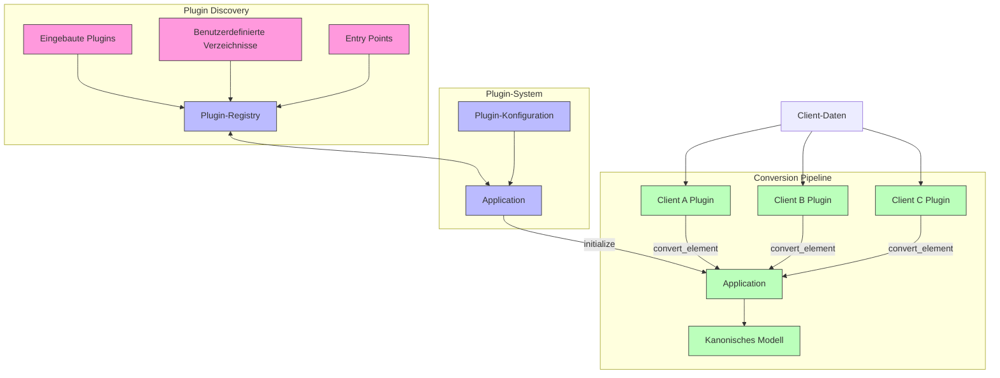

# PyArm Plugin-System

Das Plugin-System ist eine zentrale Architekturkomponente von PyArm, die Erweiterbarkeit und Flexibilität ermöglicht. Dieses Dokument beschreibt das Design, die Implementierung und die Verwendung des Plugin-Systems.

## Übersicht der Plugin-Architektur



## Kernkonzepte

Das Plugin-System basiert auf mehreren Kernkonzepten:

1. **Plugin-Schnittstelle**: Eine gemeinsame Schnittstelle, die alle Plugins implementieren müssen (siehe Diagramm: Client-Plugins)
2. **Plugin-Erkennung**: Mechanismen zum Finden und Laden von Plugins (siehe Diagramm: Plugin Discovery)
3. **Plugin-Konfiguration**: Umgang mit plugin-spezifischen Konfigurationen (siehe Diagramm: Plugin-Konfiguration)
4. **Plugin-Integration**: Wie Plugins mit dem Rest des Systems integriert werden (siehe Diagramm: Application)

## Plugin-Schnittstelle

Alle Plugins müssen die abstrakte Basisklasse `PluginInterface` implementieren:

```python
class PluginInterface(ABC):
    @property
    @abstractmethod
    def name(self) -> str:
        """Name des Plugins."""
        pass
        
    @property
    @abstractmethod
    def version(self) -> str:
        """Version des Plugins."""
        pass
        
    @abstractmethod
    def initialize(self, config: Dict[str, Any]) -> bool:
        """Initialisiert das Plugin mit Konfiguration."""
        pass
        
    @abstractmethod
    def get_supported_element_types(self) -> List[str]:
        """Gibt unterstützte Elementtypen zurück."""
        pass
        
    @abstractmethod
    def convert_element(self, data: Dict[str, Any], element_type: str) -> Optional[Dict[str, Any]]:
        """Konvertiert Daten in ein Element des angegebenen Typs."""
        pass
```

### Implementierungen

Eine typische Plugin-Implementierung könnte so aussehen:

```python
class ClientAPlugin(PluginInterface):
    @property
    def name(self) -> str:
        return "ClientAPlugin"
        
    @property
    def version(self) -> str:
        return "1.0.0"
        
    def initialize(self, config: Dict[str, Any]) -> bool:
        self.config = config
        
        # Reader und Converter initialisieren
        self.readers = [ClientAJsonReader(), ClientACsvReader()]
        self.converter = ClientAConverter()
        
        # Element-Linker initialisieren
        self.element_linker = ElementLinker()
        self._configure_element_links(config)
        
        return True
        
    def get_supported_element_types(self) -> List[str]:
        return ["foundation", "mast", "joch", "track"]
        
    def convert_element(self, data: Dict[str, Any], element_type: str) -> Optional[Dict[str, Any]]:
        # Daten in Elemente konvertieren
        # ...
```

## Plugin-Erkennung

Plugins werden aus mehreren Quellen erkannt:

```python
def discover_plugins() -> Dict[str, Type[PluginInterface]]:
    """Erkennt verfügbare Plugins."""
    plugins = {}
    
    # 1. Eingebaute Plugins aus pyarm.plugins
    for plugin_class in _discover_builtin_plugins():
        plugins[plugin_class.__name__] = plugin_class
    
    # 2. Plugins aus benutzerdefinierten Verzeichnissen in der Konfiguration
    for plugin_class in _discover_custom_dir_plugins():
        plugins[plugin_class.__name__] = plugin_class
    
    # 3. Plugins aus Entry Points
    for plugin_class in _discover_entry_point_plugins():
        plugins[plugin_class.__name__] = plugin_class
        
    return plugins
```

### Eingebaute Plugins

Eingebaute Plugins werden aus dem `pyarm.plugins`-Paket erkannt:

```python
def _discover_builtin_plugins() -> List[Type[PluginInterface]]:
    """Erkennt eingebaute Plugins."""
    import importlib
    import pkgutil
    
    import pyarm.plugins
    
    plugins = []
    
    # Über alle Module in pyarm.plugins iterieren
    for _, name, _ in pkgutil.iter_modules(pyarm.plugins.__path__):
        try:
            # Modul importieren
            module = importlib.import_module(f"pyarm.plugins.{name}")
            
            # Klassen finden, die PluginInterface implementieren
            for attr_name in dir(module):
                attr = getattr(module, attr_name)
                
                if (
                    isinstance(attr, type) 
                    and issubclass(attr, PluginInterface) 
                    and attr != PluginInterface
                ):
                    plugins.append(attr)
        except Exception as e:
            logging.warning(f"Fehler beim Laden des Plugins {name}: {e}")
            
    return plugins
```

### Plugins aus benutzerdefinierten Verzeichnissen

Benutzerdefinierte Verzeichnisse können in der Konfiguration angegeben werden:

```python
def _discover_custom_dir_plugins() -> List[Type[PluginInterface]]:
    """Erkennt Plugins aus benutzerdefinierten Verzeichnissen."""
    import importlib.util
    import os
    
    plugins = []
    
    # Plugin-Verzeichnisse aus der Konfiguration abrufen
    plugin_dirs = get_plugin_dirs()
    
    for plugin_dir in plugin_dirs:
        # Über alle Python-Dateien im Verzeichnis iterieren
        for file in os.listdir(plugin_dir):
            if not file.endswith(".py") or file == "__init__.py":
                continue
                
            path = os.path.join(plugin_dir, file)
            
            try:
                # Modul laden
                spec = importlib.util.spec_from_file_location(file[:-3], path)
                module = importlib.util.module_from_spec(spec)
                spec.loader.exec_module(module)
                
                # Klassen finden, die PluginInterface implementieren
                for attr_name in dir(module):
                    attr = getattr(module, attr_name)
                    
                    if (
                        isinstance(attr, type) 
                        and issubclass(attr, PluginInterface) 
                        and attr != PluginInterface
                    ):
                        plugins.append(attr)
            except Exception as e:
                logging.warning(f"Fehler beim Laden des Plugins aus {path}: {e}")
                
    return plugins
```

### Entry Point Plugins

Plugins können auch über Entry Points erkannt werden:

```python
def _discover_entry_point_plugins() -> List[Type[PluginInterface]]:
    """Erkennt Plugins über Entry Points."""
    import importlib.metadata
    
    plugins = []
    
    try:
        # Alle Entry Points mit der Gruppe "pyarm.plugins" abrufen
        for entry_point in importlib.metadata.entry_points(group="pyarm.plugins"):
            try:
                # Entry Point laden
                plugin_class = entry_point.load()
                
                if (
                    isinstance(plugin_class, type) 
                    and issubclass(plugin_class, PluginInterface) 
                    and plugin_class != PluginInterface
                ):
                    plugins.append(plugin_class)
            except Exception as e:
                logging.warning(f"Fehler beim Laden des Plugins aus Entry Point {entry_point.name}: {e}")
    except Exception as e:
        logging.warning(f"Fehler beim Erkennen von Entry Point Plugins: {e}")
        
    return plugins
```

## Plugin-Konfiguration

Die Plugin-Konfiguration wird über JSON- oder YAML-Dateien verwaltet:

```python
def get_plugin_settings(plugin_name: str) -> Dict[str, Any]:
    """Holt Einstellungen für ein bestimmtes Plugin."""
    # Versuch, aus Umgebungsvariable zu laden
    config_path = os.environ.get("PYARM_CONFIG")
    
    if config_path and os.path.exists(config_path):
        return _load_plugin_settings_from_file(config_path, plugin_name)
        
    # Versuch, aus Projektverzeichnis zu laden
    project_config = os.path.join(os.getcwd(), "config", "plugins.json")
    
    if os.path.exists(project_config):
        return _load_plugin_settings_from_file(project_config, plugin_name)
        
    # Versuch, aus Benutzer-Home-Verzeichnis zu laden
    user_config = os.path.join(os.path.expanduser("~"), ".pyarm", "plugins.json")
    
    if os.path.exists(user_config):
        return _load_plugin_settings_from_file(user_config, plugin_name)
        
    return {}
```

Eine typische Plugin-Konfiguration könnte so aussehen:

```json
{
  "plugins": {
    "ClientAPlugin": {
      "enabled": true,
      "element_links": {
        "project1": {
          "foundation_mast": {
            "source_type": "foundation",
            "target_type": "mast",
            "source_param": "MastID",
            "target_param": "ID"
          }
        }
      },
      "validation": {
        "strict_mode": false,
        "ignore_warnings": true
      }
    }
  }
}
```

## Plugin-Integration

Die `Application`-Klasse integriert Plugins mit dem Rest des Systems:

```python
class Application:
    """
    Hauptanwendungsklasse für PyArm.
    Verwaltet Plugins und bietet Zugriff auf Kernfunktionalität.
    """

    def __init__(self):
        """Initialisiert eine neue Application-Instanz."""
        self.plugins: dict[str, PluginInterface] = {}
        self.plugin_classes = discover_plugins()

    def load_plugins(self, config: dict[str, dict[str, Any]] | None = None) -> None:
        """Lädt und initialisiert alle verfügbaren Plugins."""
        if config is None:
            config = {}

        for name, plugin_class in self.plugin_classes.items():
            try:
                plugin_instance = plugin_class()

                # Konfiguration laden
                plugin_config = config.get(name, {})

                # Wenn keine Konfiguration übergeben wurde, aus Konfigurationsdatei laden
                if not plugin_config:
                    plugin_config = get_plugin_settings(name)

                # Plugin initialisieren
                if plugin_instance.initialize(plugin_config):
                    self.plugins[name] = plugin_instance
                    logger.info(f"Plugin {plugin_instance.name} v{plugin_instance.version} initialisiert")
                else:
                    logger.warning(f"Plugin {name} konnte nicht initialisiert werden")
            except Exception as e:
                logger.error(f"Fehler bei der Initialisierung des Plugins {name}: {e}")

    def get_plugin(self, name: str) -> PluginInterface | None:
        """Gibt ein Plugin anhand seines Namens zurück."""
        return self.plugins.get(name)

    def get_plugins_for_element_type(self, element_type: str) -> list[PluginInterface]:
        """Gibt alle Plugins zurück, die einen bestimmten Elementtyp unterstützen."""
        return [
            plugin
            for plugin in self.plugins.values()
            if element_type in plugin.get_supported_element_types()
        ]

    def convert_element(
        self, data: dict[str, Any], element_type: str, plugin_name: str | None = None
    ) -> dict[str, Any] | None:
        """Konvertiert Daten in ein Element mit einem bestimmten Plugin."""
        if plugin_name:
            # Bestimmtes Plugin verwenden
            plugin = self.get_plugin(plugin_name)
            if plugin and element_type in plugin.get_supported_element_types():
                return plugin.convert_element(data, element_type)
            return None
        else:
            # Erstes passendes Plugin verwenden
            for plugin in self.get_plugins_for_element_type(element_type):
                result = plugin.convert_element(data, element_type)
                if result:
                    return result
            return None
```

## Validierungsintegration

Das Validierungssystem kann über einen Wrapper in Plugins integriert werden:

```python
class ValidatedPlugin(PluginInterface):
    """
    Wrapper-Klasse für Plugins, die Validierung vor der Konvertierung durchführt.
    """

    def __init__(self, plugin: PluginInterface, validation_service: IValidationService):
        """
        Initialisiert das ValidatedPlugin.
        """
        self._plugin = plugin
        self._validation_service = validation_service
        self._validation_enabled = True

        # Konfigurationsoptionen für die Validierung
        self._validation_config = {
            "strict_mode": False,  # Bei True werden Elemente mit Fehlern abgelehnt
            "ignore_warnings": True,  # Bei True werden Warnungen ignoriert
            "log_level": "WARNING",  # Logging-Level für Validierungsfehler
        }

    # Implementierung der PluginInterface-Methoden mit Validierung
    ...
```

Der Wrapper kann auf jedes Plugin angewendet werden:

```python
class ValidationPluginWrapper:
    """
    Factory-Klasse zum Erstellen von validierten Plugin-Wrappern.
    """

    @staticmethod
    def wrap_plugin(
        plugin: PluginInterface, validation_service: IValidationService
    ) -> 'ValidatedPlugin':
        """
        Umhüllt ein Plugin mit einem ValidatedPlugin.
        """
        validated_plugin = ValidatedPlugin(plugin, validation_service)
        log.info(f"Plugin {plugin.name} mit Validierung umhüllt")
        return validated_plugin
```

## Erstellen eines Plugins

Um ein neues Plugin zu erstellen, müssen Sie:

1. Ein neues Modul oder Paket erstellen
2. Die `PluginInterface`-Klasse implementieren
3. Passende Reader- und Converter-Klassen implementieren

Hier ist eine Schritt-für-Schritt-Anleitung:

### 1. Plugin-Klasse erstellen

```python
from typing import Any, Dict, List, Optional
from pyarm.interfaces.plugin import PluginInterface
from pyarm.interfaces.protocols import IDataReader, IDataConverter

class MeinPlugin(PluginInterface):
    @property
    def name(self) -> str:
        return "MeinPlugin"
        
    @property
    def version(self) -> str:
        return "1.0.0"
        
    def initialize(self, config: Dict[str, Any]) -> bool:
        # Plugin initialisieren
        self.config = config
        self.readers = [MeinJsonReader(), MeinCsvReader()]
        self.converter = MeinConverter()
        return True
        
    def get_supported_element_types(self) -> List[str]:
        return ["foundation", "mast", "track"]
        
    def convert_element(self, data: Dict[str, Any], element_type: str) -> Optional[Dict[str, Any]]:
        # Prüfen, ob Daten gültig sind
        if not data or not data.get("data"):
            return None
            
        # Passenden Reader für die Daten finden
        element_data = data.get("data", [])
        project_id = data.get("project_id", "unknown")
        
        # Daten konvertieren
        converted_elements = []
        
        if element_type == "foundation":
            converted_elements = self.converter.convert_foundation(element_data, project_id)
        elif element_type == "mast":
            converted_elements = self.converter.convert_mast(element_data, project_id)
        elif element_type == "track":
            converted_elements = self.converter.convert_track(element_data, project_id)
            
        if not converted_elements:
            return None
            
        return {
            "elements": converted_elements,
            "project_id": project_id,
            "element_type": element_type
        }
```

### 2. Reader implementieren

```python
from pathlib import Path
from typing import Any, Dict, List
from pyarm.interfaces.protocols import IDataReader

class MeinJsonReader:
    @property
    def name(self) -> str:
        return "MeinJsonReader"
        
    @property
    def version(self) -> str:
        return "1.0.0"
        
    @property
    def supported_formats(self) -> List[str]:
        return ["json"]
        
    def can_handle(self, file_path: str) -> bool:
        path = Path(file_path)
        return (
            path.suffix.lower() == ".json" and
            ("meine_daten" in str(path))
        )
        
    def read_data(self, file_path: str) -> Dict[str, Any]:
        import json
        
        # JSON-Datei lesen
        with open(file_path, "r", encoding="utf-8") as f:
            data = json.load(f)
            
        # Elementtyp und Projekt-ID extrahieren
        path = Path(file_path)
        element_type = path.stem.lower()
        project_id = self._extract_project_id(file_path)
        
        return {
            "element_type": element_type,
            "project_id": project_id,
            "data": data
        }
        
    def _extract_project_id(self, file_path: str) -> str:
        # Projekt-ID aus dem Dateipfad extrahieren
        path = Path(file_path)
        for parent in path.parents:
            if parent.name.startswith("project"):
                return parent.name
        return "unknown"
```

### 3. Converter implementieren

```python
from typing import Any, Dict, List
from pyarm.interfaces.protocols import IDataConverter
from pyarm.models.base_models import InfrastructureElement
from pyarm.models.element_models import Foundation, Mast, Track
from pyarm.models.parameter import Parameter, UnitEnum, DataType
from pyarm.models.process_enums import ProcessEnum

class MeinConverter:
    @property
    def name(self) -> str:
        return "MeinConverter"
        
    @property
    def version(self) -> str:
        return "1.0.0"
        
    @property
    def supported_types(self) -> List[str]:
        return ["foundation", "mast", "track"]
        
    def can_convert(self, data: Dict[str, Any]) -> bool:
        element_type = data.get("element_type", "").lower()
        return element_type in self.supported_types
        
    def convert_foundation(
        self, data: List[Dict[str, Any]], project_id: str
    ) -> List[InfrastructureElement]:
        foundations = []
        
        for item in data:
            # Fundament erstellen
            foundation = Foundation(
                name=item.get("Name", f"Fundament {len(foundations) + 1}")
            )
            
            # Parameter hinzufügen
            foundation.parameters.extend([
                Parameter(
                    name="E", 
                    value=float(item.get("E", 0)), 
                    process=ProcessEnum.X_COORDINATE, 
                    datatype=DataType.FLOAT,
                    unit=UnitEnum.METER
                ),
                Parameter(
                    name="N", 
                    value=float(item.get("N", 0)), 
                    process=ProcessEnum.Y_COORDINATE, 
                    datatype=DataType.FLOAT,
                    unit=UnitEnum.METER
                ),
                Parameter(
                    name="Z", 
                    value=float(item.get("Z", 0)), 
                    process=ProcessEnum.Z_COORDINATE, 
                    datatype=DataType.FLOAT,
                    unit=UnitEnum.METER
                ),
                Parameter(
                    name="Breite", 
                    value=float(item.get("Breite", 0)), 
                    process=ProcessEnum.FOUNDATION_WIDTH, 
                    datatype=DataType.FLOAT,
                    unit=UnitEnum.METER
                ),
                Parameter(
                    name="Tiefe", 
                    value=float(item.get("Tiefe", 0)), 
                    process=ProcessEnum.FOUNDATION_DEPTH, 
                    datatype=DataType.FLOAT,
                    unit=UnitEnum.METER
                ),
                Parameter(
                    name="Höhe", 
                    value=float(item.get("Höhe", 0)), 
                    process=ProcessEnum.FOUNDATION_HEIGHT, 
                    datatype=DataType.FLOAT,
                    unit=UnitEnum.METER
                ),
                Parameter(
                    name="MastID", 
                    value=item.get("MastID", ""), 
                    process=ProcessEnum.FOUNDATION_TO_MAST, 
                    datatype=DataType.STRING,
                    unit=UnitEnum.NONE
                )
            ])
            
            # known_params aktualisieren
            foundation._update_known_params()
            
            foundations.append(foundation)
            
        return foundations
        
    # convert_mast und convert_track ähnlich implementieren
```

### 4. Plugin auffindbar machen

#### Option 1: In `pyarm.plugins` einfügen

Kopieren Sie Ihr Plugin-Modul in das `pyarm/plugins`-Verzeichnis.

#### Option 2: Benutzerdefiniertes Verzeichnis verwenden

1. Erstellen Sie ein Verzeichnis für Ihr Plugin
2. Fügen Sie das Verzeichnis zur Plugin-Konfiguration hinzu:

```json
{
  "plugin_paths": [
    "pfad/zu/meinen/plugins"
  ]
}
```

#### Option 3: Entry Points verwenden

In Ihrer `setup.py` oder `pyproject.toml`:

```python
# setup.py
setup(
    name="mein-pyarm-plugin",
    ...
    entry_points={
        "pyarm.plugins": [
            "mein_plugin=mein_paket.plugin:MeinPlugin",
        ],
    },
)
```

Oder:

```toml
# pyproject.toml
[project.entry-points."pyarm.plugins"]
mein_plugin = "mein_paket.plugin:MeinPlugin"
```

## Fazit

Das PyArm Plugin-System bietet eine flexible, erweiterbare Architektur zur Integration verschiedener Datenquellen und Formate. Durch die Implementierung des `PluginInterface` können Entwickler benutzerdefinierte Plugins für spezifische Kundendatenformate erstellen und dabei die gemeinsame Infrastruktur nutzen, die vom PyArm-Framework bereitgestellt wird.

Die Kombination aus einer gut definierten Schnittstelle, flexiblen Erkennungsmechanismen und einer zentralen Anwendungsklasse macht es einfach, das System zu erweitern, ohne den Kerncode zu ändern.