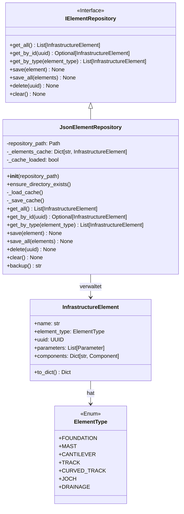
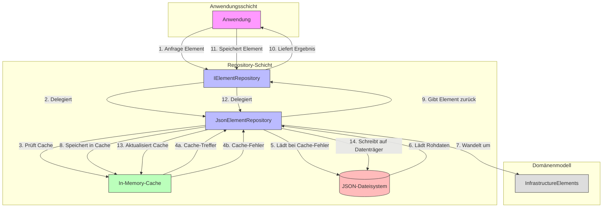
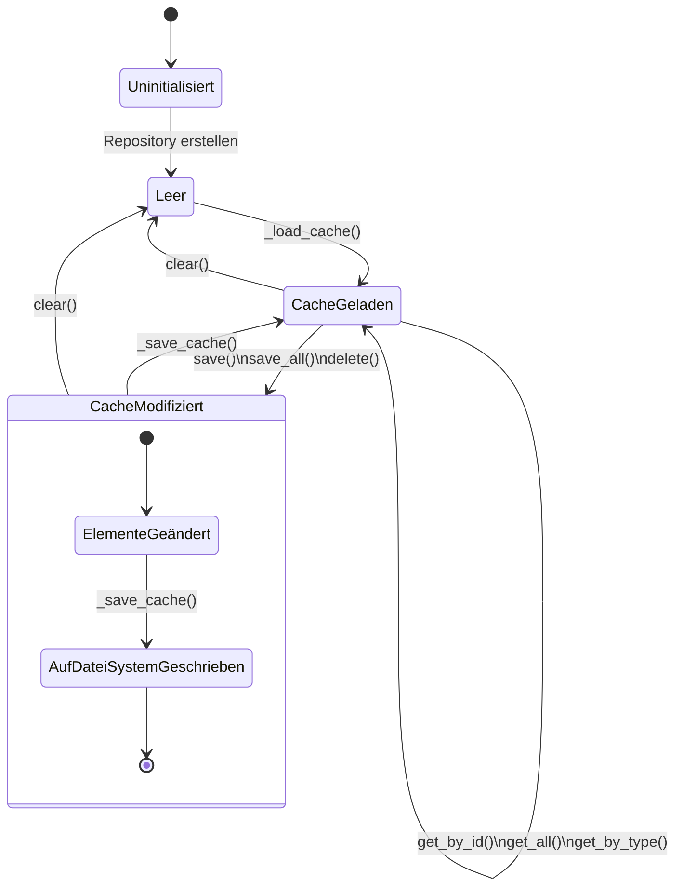
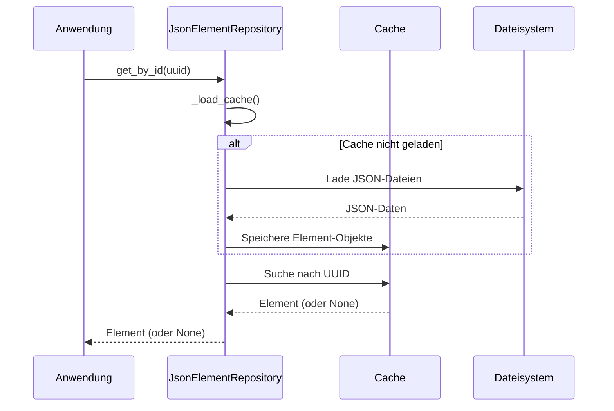
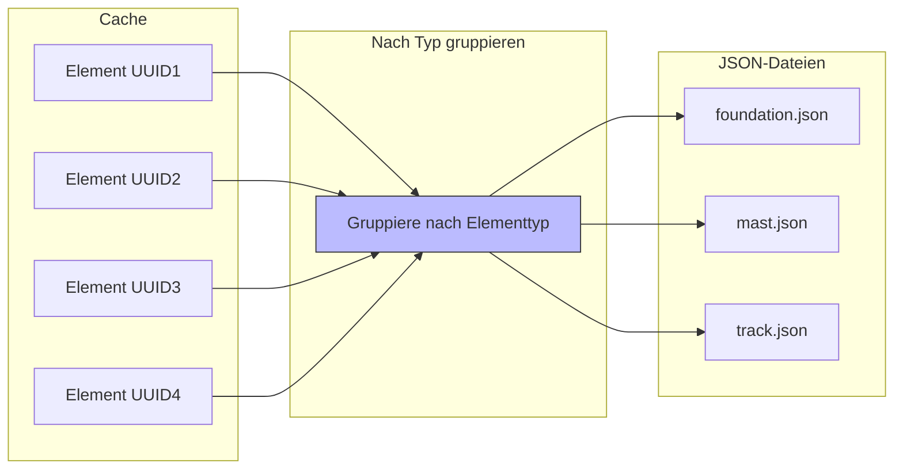

# Repository-System in PyArm

Das Repository-System in PyArm bietet eine abstrakte Schicht zum Speichern und Abrufen von Infrastrukturelementen, wobei ein datenträgerbezogenes Caching-System für optimale Leistung verwendet wird.

## Architektur des Repository-Systems



## Kernkonzepte

Das Repository-System basiert auf mehreren Kernkonzepten:

1. **Abstrakte Repository-Schnittstelle**: Eine gemeinsame Schnittstelle für alle Repositorys
2. **In-Memory-Caching**: Zwischenspeicherung für effiziente Abfragen
3. **Typsichere Operationen**: Abfragen nach UUID oder Elementtyp
4. **Persistenz**: Dauerhafte Speicherung von Daten in verschiedenen Formaten

## Datenflussmuster



## Hauptkomponenten

### IElementRepository-Schnittstelle

```python
@runtime_checkable
class IElementRepository(Protocol):
    def get_all(self) -> list[InfrastructureElement]:
        """Ruft alle Elemente ab."""
        ...

    def get_by_id(self, uuid: UUID | str) -> InfrastructureElement | None:
        """Ruft ein Element anhand seiner UUID ab."""
        ...

    def get_by_type(self, element_type: ElementType) -> list[InfrastructureElement]:
        """Ruft Elemente eines bestimmten Typs ab."""
        ...

    def save(self, element: InfrastructureElement) -> None:
        """Speichert ein Element."""
        ...

    def save_all(self, elements: list[InfrastructureElement]) -> None:
        """Speichert mehrere Elemente."""
        ...

    def delete(self, uuid: UUID | str) -> None:
        """Löscht ein Element."""
        ...
```

### JsonElementRepository

Die `JsonElementRepository`-Klasse implementiert die `IElementRepository`-Schnittstelle und bietet JSON-basierte Persistenz:

```python
class JsonElementRepository:
    def __init__(self, repository_path: str):
        self.repository_path = Path(repository_path)
        self._elements_cache: dict[str, InfrastructureElement] = {}
        self._cache_loaded = False
        
    def _load_cache(self) -> None:
        # Elemente aus JSON-Dateien in den Speicher laden
        if self._cache_loaded:
            return
            
        self._elements_cache.clear()
        
        for file_path in self.repository_path.glob("*.json"):
            with open(file_path, "r", encoding="utf-8") as f:
                elements_data = json.load(f)
                
            for element_data in elements_data:
                element = factory.create_element(element_data)
                uuid_str = str(element.uuid)
                self._elements_cache[uuid_str] = element
                
        self._cache_loaded = True
```

## Cache-Management-Muster



## Besondere Merkmale

### Lazy Loading

Das Repository verwendet Lazy Loading, um die Leistung zu optimieren:

1. Der Cache wird erst bei der ersten Anfrage geladen
2. Alle weiteren Anfragen verwenden den Cache



### Gruppierung nach Elementtyp

Bei der Speicherung werden Elemente nach Typ gruppiert:



## Integration in die Anwendung

```python
# Repository erstellen
repository = JsonElementRepository("./data/repository")

# Elemente speichern
foundation = Foundation(name="Fundament 1")
repository.save(foundation)

# Element abrufen
retrieved_foundation = repository.get_by_id(foundation.uuid)

# Elemente nach Typ abrufen
masts = repository.get_by_type(ElementType.MAST)

# Backup erstellen
backup_path = repository.backup()
print(f"Backup wurde erstellt unter: {backup_path}")
```

## Vorteile

1. **Abstraktion**: Die Repository-Schnittstelle abstrahiert die Datenpersistenz
2. **Leistung**: In-Memory-Caching für schnelle Abfragen
3. **Typsicherheit**: Typisierte Methoden für sichere Operationen
4. **Sicherheit**: Automatische Backups und Fehlervermeidung
5. **Erweiterbarkeit**: Leicht um neue Repository-Implementierungen erweiterbar