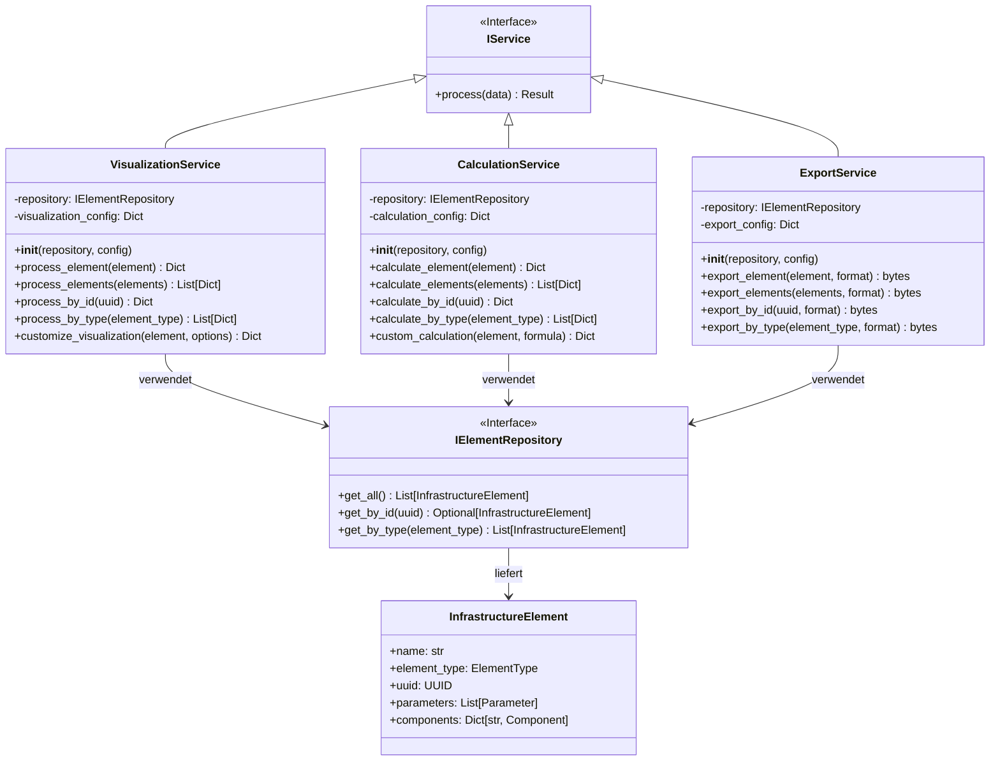
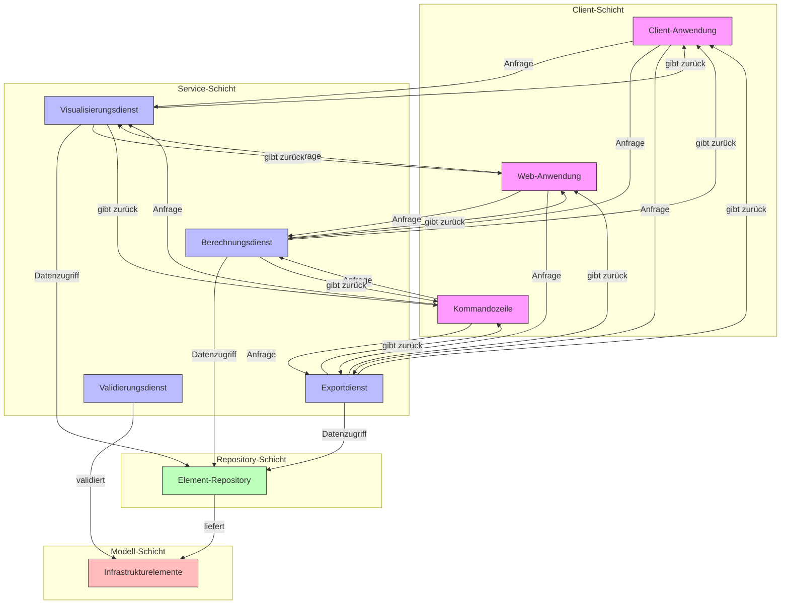
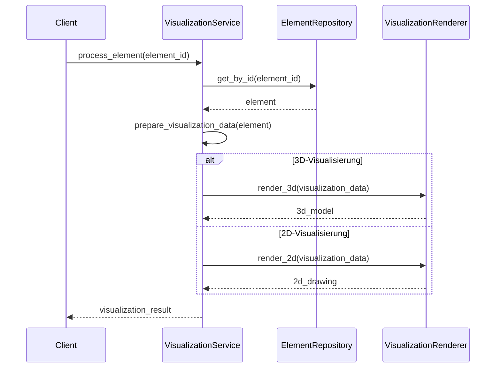
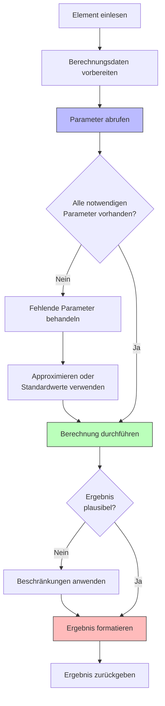
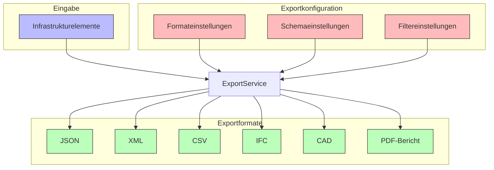
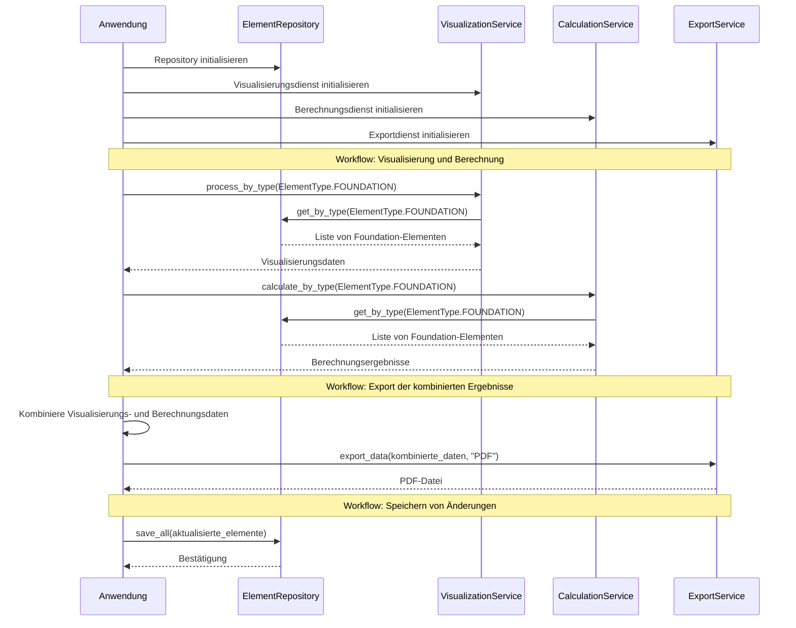
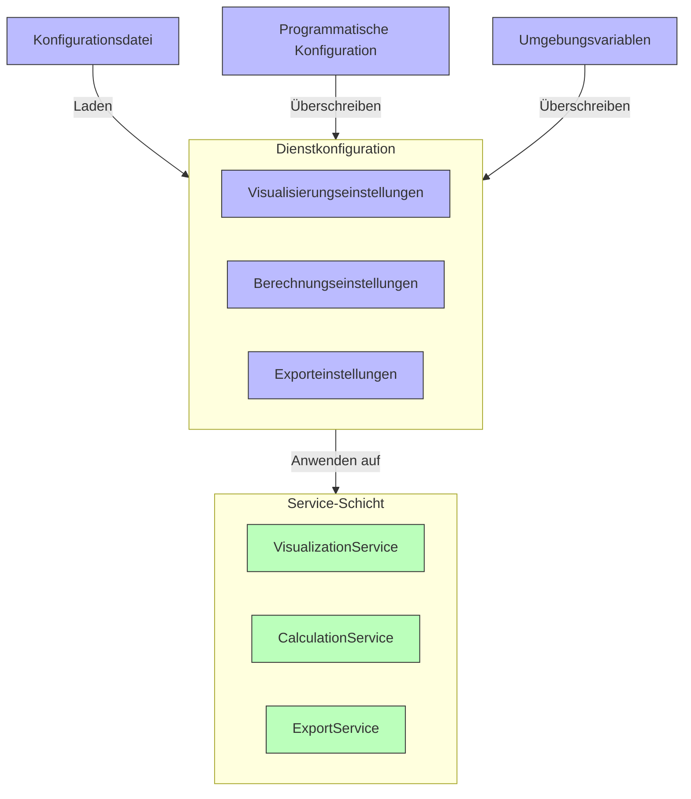

# Service-Layer in PyArm

Die Service-Layer in PyArm bildet eine wichtige Architekturschicht, die zwischen der Anwendungslogik und der Datenrepräsentation vermittelt. Sie implementiert prozessspezifische Operationen wie Visualisierung, Berechnung und Datenexport.

## Architektur der Service-Layer



## Service Layer im Gesamtsystem



## Prozessspezifische Dienste

### Visualisierungsdienst

Der Visualisierungsdienst wandelt Elemente in visuell darstellbare Formate um:



### Berechnungsdienst

Der Berechnungsdienst führt prozessspezifische Berechnungen für Elemente durch:



### Exportdienst

Der Exportdienst konvertiert Elemente in verschiedene Ausgabeformate:



## Implementierungsbeispiel: Visualisierungsdienst

```python
class VisualizationService:
    """Service für die Visualisierung von Infrastrukturelementen."""
    
    def __init__(self, repository: IElementRepository, config: Optional[Dict[str, Any]] = None):
        """Initialisiert den VisualizationService."""
        self.repository = repository
        self.config = config or {}
        
    def process_element(self, element: InfrastructureElement) -> Dict[str, Any]:
        """Verarbeitet ein einzelnes Element zur Visualisierung."""
        # Visualisierungsdaten vorbereiten
        visualization_data = self._prepare_visualization_data(element)
        
        # Komponenten extrahieren und hinzufügen
        if location := element.get_component("location"):
            visualization_data["position"] = {
                "x": location.x,
                "y": location.y,
                "z": location.z
            }
            
        if dimension := element.get_component("dimension"):
            if hasattr(dimension, "width"):  # RectangularDimension
                visualization_data["dimensions"] = {
                    "width": dimension.width,
                    "depth": dimension.depth,
                    "height": dimension.height,
                    "type": "rectangular"
                }
            elif hasattr(dimension, "diameter"):  # CylindricalDimension
                visualization_data["dimensions"] = {
                    "diameter": dimension.diameter,
                    "height": dimension.height,
                    "type": "cylindrical"
                }
        
        # Prozessspezifische Parameter
        for param in element.parameters:
            if param.process and param.process.value.startswith("VIS_"):
                visualization_data["parameters"][param.process.value] = {
                    "name": param.name,
                    "value": param.value,
                    "unit": param.unit.value if param.unit else None
                }
        
        # Element-Typ-spezifische Visualisierung
        if element.element_type == ElementType.FOUNDATION:
            self._enhance_foundation_visualization(element, visualization_data)
        elif element.element_type == ElementType.MAST:
            self._enhance_mast_visualization(element, visualization_data)
        # Weitere Elementtypen...
            
        return visualization_data
    
    def process_by_id(self, uuid: Union[UUID, str]) -> Optional[Dict[str, Any]]:
        """Verarbeitet ein Element anhand seiner UUID."""
        element = self.repository.get_by_id(uuid)
        if not element:
            return None
        return self.process_element(element)
    
    def process_by_type(self, element_type: ElementType) -> List[Dict[str, Any]]:
        """Verarbeitet alle Elemente eines bestimmten Typs."""
        elements = self.repository.get_by_type(element_type)
        return [self.process_element(element) for element in elements]
```

## Koordination der Dienste im Gesamtsystem



## Vorteile der Service-Layer

1. **Separation of Concerns**: Klare Trennung von Geschäftslogik und Datenzugriff
2. **Wiederverwendbarkeit**: Dienste können von verschiedenen Anwendungen genutzt werden
3. **Testbarkeit**: Services sind leicht zu testen, da sie keine UI-Abhängigkeiten haben
4. **Flexibilität**: Neue Dienste können hinzugefügt werden, ohne bestehenden Code zu ändern
5. **Unabhängige Entwicklung**: Entwicklungsteams können an verschiedenen Diensten parallel arbeiten

## Konfiguration der Dienste

Dienste können über Konfigurationsdateien oder programmatisch konfiguriert werden:



## Fazit

Die Service-Layer in PyArm folgt dem bewährten Service-Layer-Pattern und bietet:

1. Eine klare Trennung von Geschäftslogik und Datenzugriff
2. Prozessspezifische Dienste für verschiedene Aspekte der Anwendung
3. Eine erweiterbare Architektur, die neue Funktionalitäten unterstützt
4. Eine flexible Konfiguration für verschiedene Anwendungsszenarien

Diese Architektur ermöglicht es, komplexe Anwendungslogik in managebaren, fokussierten Komponenten zu organisieren und fördert die Wartbarkeit und Erweiterbarkeit des Systems.