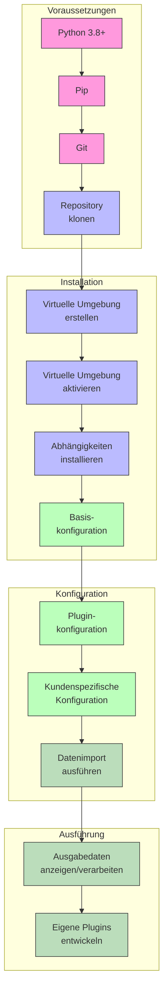
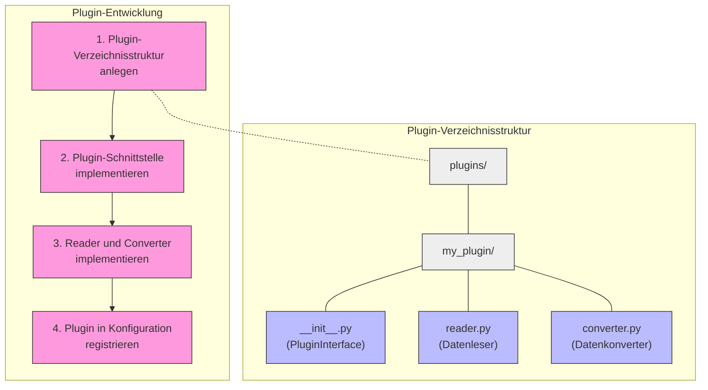

# PyArm: Setup und Konfigurationsanleitung

Diese Anleitung beschreibt die Installation und Konfiguration des PyArm Systems für die Verarbeitung von Infrastrukturdaten aus verschiedenen Quellen.



## Systemvoraussetzungen

- Python 3.8 oder höher
- Pip (Python-Paketmanager)
- Git (für das Klonen des Repositories)

## Installation

### 1. Repository klonen

```bash
git clone https://github.com/username/pyarm.git
cd pyarm
```

### 2. Virtuelle Umgebung erstellen und aktivieren

```bash
# Unter Linux/macOS
python -m venv venv
source venv/bin/activate

# Unter Windows
python -m venv venv
venv\Scripts\activate
```

### 3. Abhängigkeiten installieren

```bash
# Paket im Entwicklungsmodus mit Entwicklungsabhängigkeiten installieren
uv pip install -e ".[dev]"
```

## Konfiguration

### Grundlegende Konfiguration

Die Basiskonfiguration erfolgt über die Datei `config/default_client_config.json`. Diese enthält standardmäßige Einstellungen für alle Clients:

```json
{
  "repository": {
    "path": "./data/repository",
    "format": "json"
  },
  "output": {
    "path": "./data/output",
    "format": "json"
  },
  "logging": {
    "level": "INFO",
    "file": "./logs/pyarm.log"
  }
}
```

### Plugin-Konfiguration

Die Plugin-Konfiguration erfolgt über die Datei `config/plugins.json`. Detaillierte Informationen finden Sie in der [Plugin-Konfigurationsdokumentation](plugin_configuration.md).

```json
{
  "plugin_paths": [
    {
      "name": "Core Plugins",
      "path": "./plugins/core_plugins",
      "enabled": true
    }
  ],
  "plugin_settings": {
    "ClientA Plugin": {
      "element_links": {
        "project1": {
          "foundation_mast": {
            "source_type": "foundation",
            "target_type": "mast",
            "source_param": "MastID",
            "target_param": "ID"
          }
        }
      }
    }
  }
}
```

## Ausführung

### Datenimport

Die Anwendung ist darauf ausgelegt, Daten aus verschiedenen Kundenformaten über ein Plugin-System zu importieren. Beispielskripte werden bereitgestellt:

```bash
# Client A Daten importieren 
python import_client_a.py --input_dir examples/clients --project project1 --output_dir tests/output/client-a

# Client B Daten importieren
python import_client_b.py --input_dir examples/clients --output_dir tests/output/client-b

# Client C Daten importieren
python import_client_c.py --input_dir examples/clients --output_dir tests/output/client-c

# SBB DFA Daten importieren
python import_sbb_dfa.py --input_file examples/sbb/dfa_export.xlsx --output_dir tests/output/sbb
```

## Hinzufügen eines neuen Plugins



### 1. Plugin-Verzeichnisstruktur anlegen

```
plugins/
└── my_plugin/
    ├── __init__.py
    ├── reader.py
    └── converter.py
```

### 2. Plugin-Schnittstelle implementieren

In der `__init__.py` implementieren Sie die `PluginInterface` Klasse:

```python
from typing import Any, Dict, List, Optional
from pyarm.interfaces.plugin import PluginInterface

class MyPlugin(PluginInterface):
    @property
    def name(self) -> str:
        return "MyPlugin"
        
    @property
    def version(self) -> str:
        return "1.0.0"
        
    def initialize(self, config: Dict[str, Any]) -> bool:
        # Plugin initialisieren
        return True
        
    def get_supported_element_types(self) -> List[str]:
        return ["foundation", "mast"]
        
    def convert_element(self, data: Dict[str, Any], element_type: str) -> Optional[Dict[str, Any]]:
        # Daten in Elemente konvertieren
        # ...
```

### 3. Reader und Converter implementieren

Implementieren Sie Reader-Klassen für die Datenformate, die Ihr Plugin unterstützen soll, und Converter-Klassen für die Umwandlung in das kanonische Modell.

### 4. Plugin in der Konfiguration registrieren

Fügen Sie den Pfad zu Ihrem Plugin der `plugins.json` Konfigurationsdatei hinzu:

```json
{
  "plugin_paths": [
    {
      "name": "My Plugins",
      "path": "./plugins/my_plugin",
      "enabled": true
    }
  ],
  "plugin_settings": {
    "MyPlugin": {
      "option1": "value1"
    }
  }
}
```

## Fehlerbehebung

### Häufige Probleme

1. **Plugin wird nicht gefunden**
   - Prüfen Sie die Pfadkonfiguration in `plugins.json`
   - Stellen Sie sicher, dass die `__init__.py` eine PluginInterface-Implementation enthält

2. **Converter kann Daten nicht konvertieren**
   - Prüfen Sie die `can_convert`-Methode des Converters
   - Prüfen Sie die Struktur der Eingabedaten

3. **Element-Verknüpfungen funktionieren nicht**
   - Prüfen Sie die Element-Link-Konfiguration
   - Stellen Sie sicher, dass die referenzierten Parameter existieren

4. **Parameter werden nicht richtig zugeordnet**
   - Prüfen Sie die ProcessEnum-Zuordnung im Converter
   - Stellen Sie sicher, dass die richtigen Parameter-Namen verwendet werden

Für weitere Informationen konsultieren Sie die detaillierte Dokumentation zum [Element-Linking](element_linking.md) und zur [Plugin-Konfiguration](plugin_configuration.md).