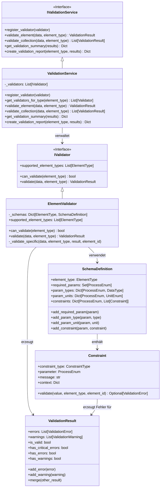
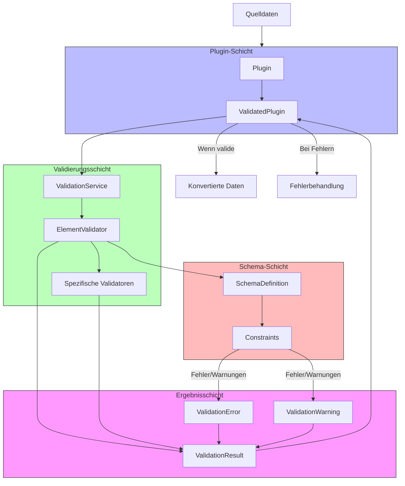
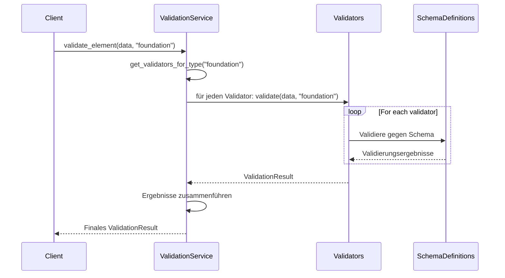
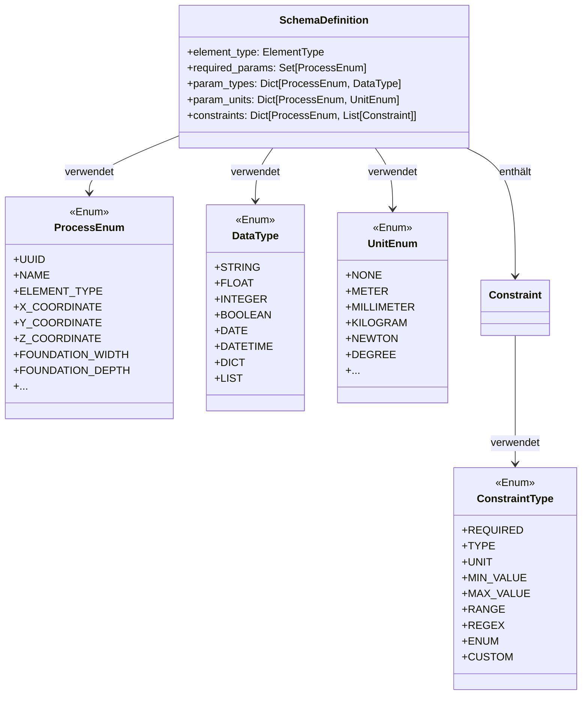
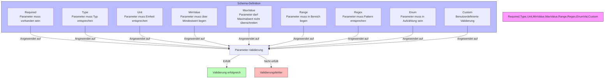
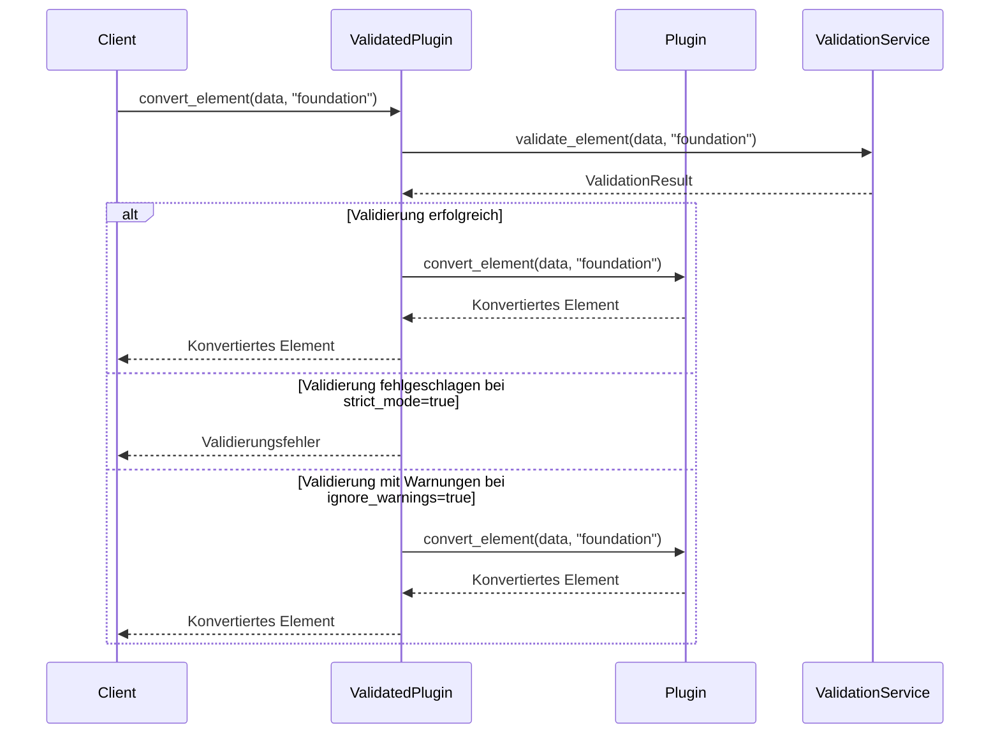
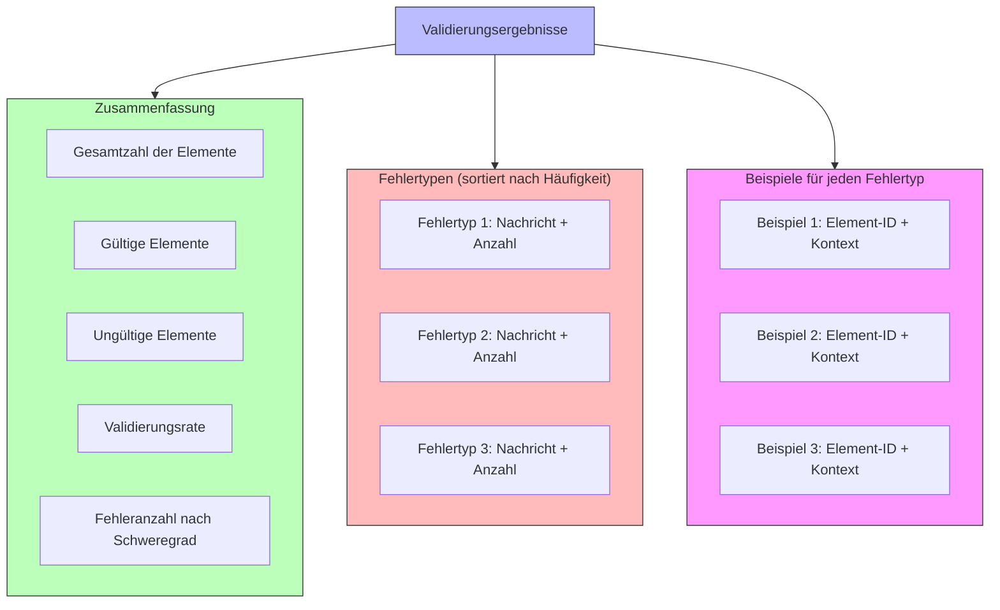
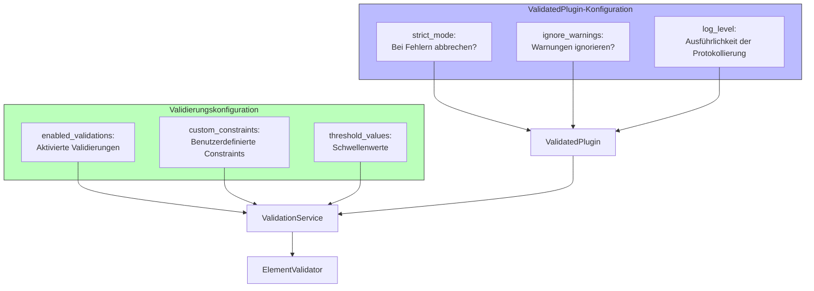
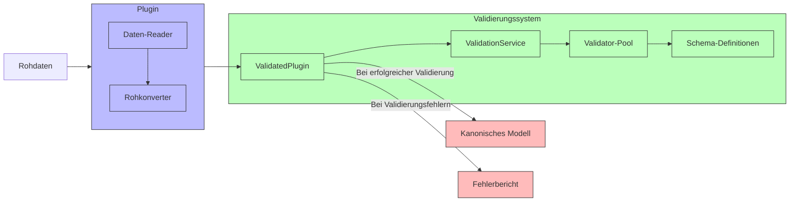

# Validierungssystem in PyArm

Das Validierungssystem ist eine zentrale Komponente in PyArm, die dafür sorgt, dass die durch Plugins konvertierten Daten den Anforderungen des kanonischen Modells entsprechen. Es ermöglicht die Definition von Regeln, die Überprüfung der Daten und die Meldung von Fehlern und Warnungen.

## Architektur des Validierungssystems



## Validierungsprozess

Der Validierungsprozess in PyArm folgt einem mehrschichtigen Ansatz:



## Komponenten des Validierungssystems

### ValidationService

Der ValidationService ist die zentrale Komponente des Validierungssystems und koordiniert die Validierung:



### SchemaDefinition

Die SchemaDefinition definiert die Anforderungen für einen bestimmten Elementtyp:



### Constraint-Typen

Das Validierungssystem unterstützt verschiedene Arten von Constraints:



### Plugin-Integration

Die Integration des Validierungssystems in Plugins erfolgt über den ValidatedPlugin-Wrapper:



## Implementierung eines benutzerdefinierten Validators

Beispielcode für einen benutzerdefinierten Validator:

```python
from pyarm.models.process_enums import ElementType, ProcessEnum
from pyarm.validation.validators import ElementValidator
from pyarm.validation.schema import Constraint, ConstraintType, SchemaDefinition
from pyarm.models.parameter import DataType, UnitEnum

class FoundationValidator(ElementValidator):
    """Spezialisierter Validator für Fundamente."""
    
    def __init__(self):
        super().__init__()
        
        # Schema für Fundamente definieren
        schema = SchemaDefinition(element_type=ElementType.FOUNDATION)
        
        # Erforderliche Parameter
        schema.add_required_param(ProcessEnum.X_COORDINATE)
        schema.add_required_param(ProcessEnum.Y_COORDINATE)
        schema.add_required_param(ProcessEnum.Z_COORDINATE)
        schema.add_required_param(ProcessEnum.FOUNDATION_WIDTH)
        schema.add_required_param(ProcessEnum.FOUNDATION_DEPTH)
        schema.add_required_param(ProcessEnum.FOUNDATION_HEIGHT)
        
        # Parametertypen festlegen
        schema.add_param_type(ProcessEnum.X_COORDINATE, DataType.FLOAT)
        schema.add_param_type(ProcessEnum.Y_COORDINATE, DataType.FLOAT)
        schema.add_param_type(ProcessEnum.Z_COORDINATE, DataType.FLOAT)
        schema.add_param_type(ProcessEnum.FOUNDATION_WIDTH, DataType.FLOAT)
        schema.add_param_type(ProcessEnum.FOUNDATION_DEPTH, DataType.FLOAT)
        schema.add_param_type(ProcessEnum.FOUNDATION_HEIGHT, DataType.FLOAT)
        
        # Einheiten festlegen
        schema.add_param_unit(ProcessEnum.X_COORDINATE, UnitEnum.METER)
        schema.add_param_unit(ProcessEnum.Y_COORDINATE, UnitEnum.METER)
        schema.add_param_unit(ProcessEnum.Z_COORDINATE, UnitEnum.METER)
        schema.add_param_unit(ProcessEnum.FOUNDATION_WIDTH, UnitEnum.METER)
        schema.add_param_unit(ProcessEnum.FOUNDATION_DEPTH, UnitEnum.METER)
        schema.add_param_unit(ProcessEnum.FOUNDATION_HEIGHT, UnitEnum.METER)
        
        # Constraints hinzufügen
        schema.add_constraint(
            ProcessEnum.FOUNDATION_WIDTH,
            Constraint(
                constraint_type=ConstraintType.RANGE,
                parameter=ProcessEnum.FOUNDATION_WIDTH,
                context={"min_value": 0.5, "max_value": 10.0},
                message="Fundamentbreite muss zwischen 0,5m und 10m liegen"
            )
        )
        
        schema.add_constraint(
            ProcessEnum.FOUNDATION_DEPTH,
            Constraint(
                constraint_type=ConstraintType.RANGE,
                parameter=ProcessEnum.FOUNDATION_DEPTH,
                context={"min_value": 0.5, "max_value": 10.0},
                message="Fundamenttiefe muss zwischen 0,5m und 10m liegen"
            )
        )
        
        schema.add_constraint(
            ProcessEnum.FOUNDATION_HEIGHT,
            Constraint(
                constraint_type=ConstraintType.RANGE,
                parameter=ProcessEnum.FOUNDATION_HEIGHT,
                context={"min_value": 0.3, "max_value": 5.0},
                message="Fundamenthöhe muss zwischen 0,3m und 5m liegen"
            )
        )
        
        # Schema registrieren
        self._schemas[ElementType.FOUNDATION] = schema
        
    def _validate_specific(self, data, element_type, result, element_id=None):
        """Spezifische Validierungslogik für Fundamente."""
        super()._validate_specific(data, element_type, result, element_id)
        
        # Zusätzliche, komplexere Validierungslogik
        if element_type == ElementType.FOUNDATION:
            # Beispiel: Prüfen, ob das Volumen in einem sinnvollen Bereich liegt
            width = data.get("width", 0)
            depth = data.get("depth", 0)
            height = data.get("height", 0)
            
            volume = width * depth * height
            
            if volume > 50:  # 50 m³
                result.add_warning(
                    ValidationWarning(
                        message=f"Fundamentvolumen ist sehr groß: {volume} m³",
                        element_type=element_type,
                        element_id=element_id,
                        context={"volume": volume, "max_expected": 50}
                    )
                )
```

## Validierungsergebnisse und Reporting

Das Validierungssystem erzeugt detaillierte Berichte:



Ein Beispiel für einen Validierungsbericht:

```json
{
  "element_type": "foundation",
  "summary": {
    "total_elements": 100,
    "valid_elements": 85,
    "invalid_elements": 15,
    "validation_rate": 0.85,
    "error_counts": {
      "CRITICAL": 2,
      "ERROR": 8,
      "WARNING": 10
    }
  },
  "error_types": [
    {
      "message": "Fundamentbreite muss zwischen 0,5m und 10m liegen",
      "count": 5,
      "severity": "ERROR",
      "examples": [
        {
          "element_index": 12,
          "element_type": "foundation",
          "element_id": "F12345",
          "parameter": "foundation_width",
          "context": {
            "value": 12.5,
            "min_value": 0.5,
            "max_value": 10.0
          }
        }
      ]
    },
    {
      "message": "Fundamentvolumen ist sehr groß",
      "count": 3,
      "severity": "WARNING",
      "examples": [
        {
          "element_index": 23,
          "element_type": "foundation",
          "element_id": "F67890",
          "context": {
            "volume": 65.2,
            "max_expected": 50
          }
        }
      ]
    }
  ]
}
```

## Konfiguration des Validierungssystems

Das Validierungssystem kann über die Konfiguration angepasst werden:



Beispiel für eine Konfiguration:

```json
{
  "plugins": {
    "ClientAPlugin": {
      "validation": {
        "strict_mode": true,
        "ignore_warnings": false,
        "log_level": "INFO",
        "enabled_validations": ["foundation", "mast", "track"],
        "custom_constraints": {
          "foundation": {
            "foundation_width": {
              "min_value": 0.8,
              "max_value": 8.0
            }
          }
        },
        "threshold_values": {
          "foundation_volume_warning": 40,
          "foundation_volume_error": 60
        }
      }
    }
  }
}
```

## Vorteile des Validierungssystems

1. **Datenqualität**: Stellt sicher, dass alle konvertierten Daten den Anforderungen entsprechen
2. **Frühzeitige Fehlererkennung**: Identifiziert Probleme bereits während der Konvertierung
3. **Flexible Validierungsregeln**: Unterstützt verschiedene Arten von Constraints
4. **Erweiterbarkeit**: Einfaches Hinzufügen neuer Validierungsregeln und Validator-Typen
5. **Detailliertes Reporting**: Bietet umfassende Berichte über Validierungsprobleme
6. **Konfigurierbarkeit**: Anpassbar an verschiedene Anforderungen und Szenarien

## Integration in den Konvertierungsprozess



## Fazit

Das Validierungssystem in PyArm ist eine leistungsstarke Komponente, die sicherstellt, dass alle Daten, die in das kanonische Modell konvertiert werden, den definierten Anforderungen entsprechen. Es bietet:

1. Eine flexible Schema-Definition für verschiedene Elementtypen
2. Verschiedene Arten von Constraints für umfassende Validierung
3. Detaillierte Fehlerberichte und Warnungen
4. Nahtlose Integration in das Plugin-System
5. Konfigurierbarkeit für verschiedene Anwendungsszenarien

Diese Architektur ermöglicht es, Probleme frühzeitig zu erkennen und zu beheben, bevor sie in nachgelagerten Prozessen zu Fehlern führen können, und trägt so wesentlich zur Datenqualität und Zuverlässigkeit des Systems bei.