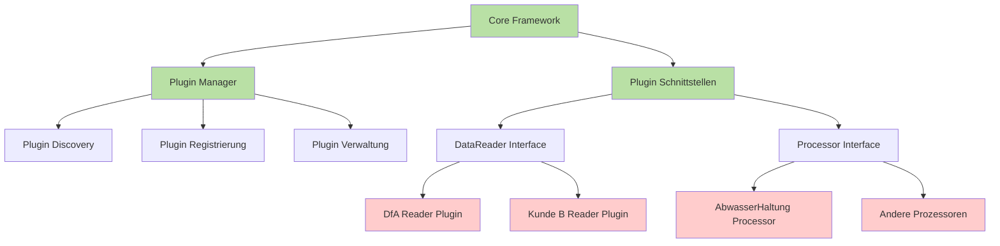
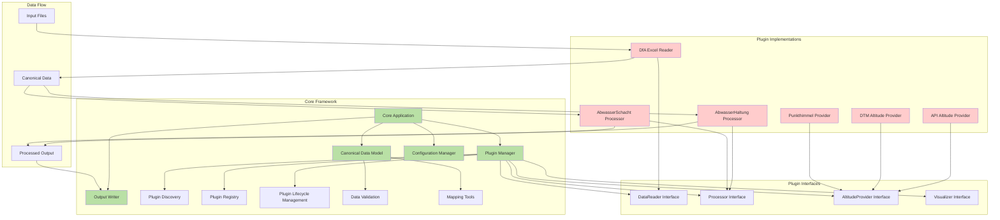
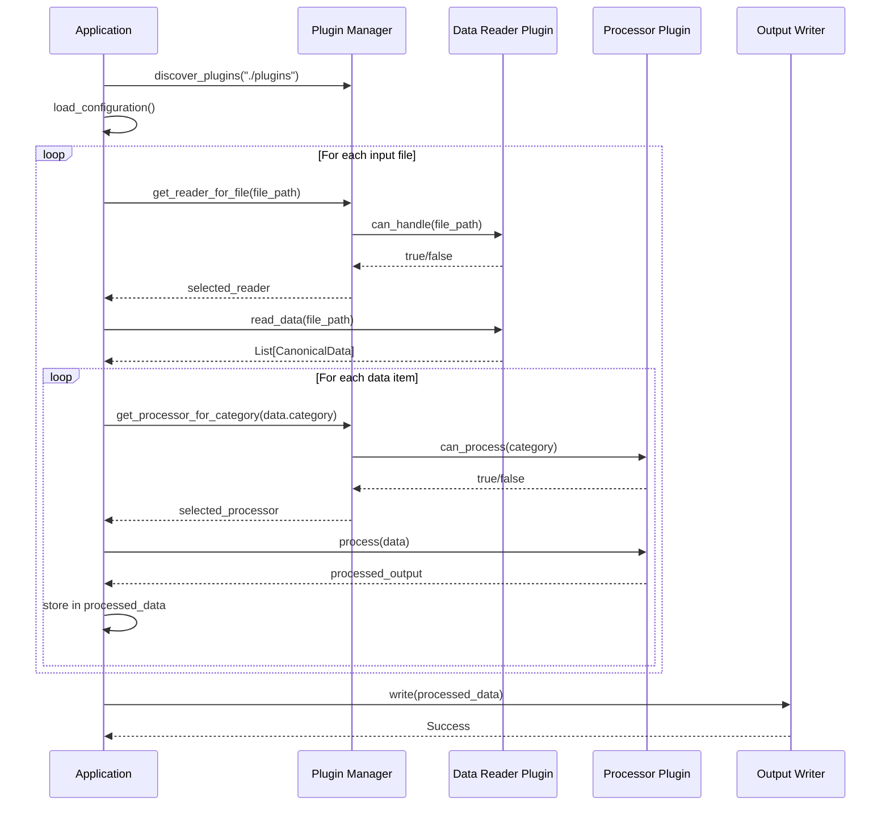

# Plugin-System für die Verarbeitung von Kundendaten

## Übersicht

Dieses Dokument beschreibt einen alternativen Refactoring-Ansatz basierend auf einem Plugin-System. Statt einer monolithischen Anwendung, die für jeden neuen Kunden angepasst werden muss, sieht dieser Ansatz vor, ein flexibles Plugin-System zu erstellen, über das kundenspezifische Datenimport- und Verarbeitungslogik als separate Module eingebunden werden kann.

## Vorteile eines Plugin-Systems

1. **Isolation**: Kundenspezifischer Code ist vollständig vom Kern-Framework getrennt.
2. **Einfache Erweiterbarkeit**: Neue Kunden können integriert werden, ohne den Kerncode zu ändern.
3. **Parallele Entwicklung**: Teams können unabhängig an verschiedenen Plugins arbeiten.
4. **Versionierung**: Verschiedene Versionen von Kundendatenformaten können durch separate Plugins unterstützt werden.
5. **Wartbarkeit**: Bugs in einem Plugin beeinflussen nicht die gesamte Anwendung.

## Plugin-System Architektur

### Grundlegende Komponenten



1. **Core Framework**:
   - Definiert Schnittstellen und Protokolle
   - Bietet gemeinsame Dienste
   - Verwaltet Plugins

2. **Plugin Manager**:
   - Entdeckt, lädt und verwaltet Plugins
   - Stellt sicher, dass Plugins die erforderlichen Schnittstellen implementieren
   - Ermöglicht dynamisches Laden/Entladen von Plugins

3. **Plugin-Schnittstellen**:
   - Klar definierte Verträge zwischen dem Framework und Plugins
   - Definiert notwendige Methoden und Datenformate

4. **Kundenpezifische Plugins**:
   - Implementieren die vom Framework definierten Schnittstellen
   - Fokussieren sich ausschließlich auf kundenspezifische Logik

### Detaillierte System-Architektur



## Implementierungsdetails

### 1. Definition der Plugin-Schnittstellen

```python
from abc import ABC, abstractmethod
from typing import Dict, List, Any, Protocol, TypedDict

class CanonicalData(TypedDict):
    """Kanonisches Datenmodell für die Kommunikation zwischen Plugins und Framework"""
    uuid: str
    easting: float
    northing: float
    attributes: Dict[str, Any]
    # weitere standardisierte Felder...

class DataReaderPlugin(Protocol):
    """Schnittstelle für Plugins, die Kundendaten einlesen"""
    
    @property
    def name(self) -> str:
        """Name des Plugins"""
        ...
    
    @property
    def version(self) -> str:
        """Version des Plugins"""
        ...
    
    @property
    def supported_formats(self) -> List[str]:
        """Liste der unterstützten Dateiformate"""
        ...
    
    def can_handle(self, file_path: str) -> bool:
        """Prüft, ob das Plugin die angegebene Datei verarbeiten kann"""
        ...
    
    def read_data(self, file_path: str) -> List[CanonicalData]:
        """Liest Daten aus der angegebenen Datei und konvertiert sie ins kanonische Format"""
        ...

class ProcessorPlugin(Protocol):
    """Schnittstelle für Plugins, die Daten verarbeiten"""
    
    @property
    def name(self) -> str:
        """Name des Plugins"""
        ...
    
    @property
    def version(self) -> str:
        """Version des Plugins"""
        ...
    
    @property
    def supported_categories(self) -> List[str]:
        """Liste der unterstützten Kategorien"""
        ...
    
    def can_process(self, category: str) -> bool:
        """Prüft, ob das Plugin die angegebene Kategorie verarbeiten kann"""
        ...
    
    def process(self, data: CanonicalData) -> Dict[str, Any]:
        """Verarbeitet die Daten und gibt ein Ausgabeformat zurück"""
        ...
```

### 2. Plugin-Manager Implementierung

```python
class PluginManager:
    """Verwaltet die Plugins für das System"""
    
    def __init__(self):
        self.reader_plugins: Dict[str, DataReaderPlugin] = {}
        self.processor_plugins: Dict[str, ProcessorPlugin] = {}
    
    def discover_plugins(self, plugin_dir: str) -> None:
        """Entdeckt alle Plugins im angegebenen Verzeichnis"""
        # Implementierung zum Durchsuchen des Verzeichnisses nach Plugins
        # Dynamisches Laden von Python-Modulen
        # Überprüfung der Plugin-Schnittstellen
        # Registrierung der gültigen Plugins
        pass
    
    def get_reader_for_file(self, file_path: str) -> DataReaderPlugin:
        """Findet ein geeignetes Reader-Plugin für die angegebene Datei"""
        for plugin in self.reader_plugins.values():
            if plugin.can_handle(file_path):
                return plugin
        raise ValueError(f"Kein passendes Plugin für {file_path} gefunden")
    
    def get_processor_for_category(self, category: str) -> ProcessorPlugin:
        """Findet ein geeignetes Processor-Plugin für die angegebene Kategorie"""
        for plugin in self.processor_plugins.values():
            if plugin.can_process(category):
                return plugin
        raise ValueError(f"Kein passendes Plugin für Kategorie {category} gefunden")
```

### 3. Beispiel-Plugin-Implementierung (Kunde: DfA)

```python
class DfaExcelReaderPlugin:
    """Plugin zum Lesen von DfA Excel-Dateien"""
    
    @property
    def name(self) -> str:
        return "DfaExcelReader"
    
    @property
    def version(self) -> str:
        return "1.0.0"
    
    @property
    def supported_formats(self) -> List[str]:
        return ["xlsx", "xls"]
    
    def can_handle(self, file_path: str) -> bool:
        """Prüft, ob die Datei eine DfA Excel-Datei ist"""
        # Implementierung der Logik zur Erkennung von DfA-Dateien
        return file_path.endswith((".xlsx", ".xls")) and self._is_dfa_format(file_path)
    
    def _is_dfa_format(self, file_path: str) -> bool:
        """Prüft das Dateiformat auf DfA-spezifische Merkmale"""
        # Implementierung der DfA-spezifischen Formatprüfung
        pass
    
    def read_data(self, file_path: str) -> List[CanonicalData]:
        """Liest DfA-Daten und konvertiert sie ins kanonische Format"""
        # Implementierung der DfA-spezifischen Leselogik
        # Zuordnung zu kanonischen Feldern
        pass

class AbwasserHaltungProcessor:
    """Plugin zur Verarbeitung von Abwasser_Haltung-Objekten"""
    
    @property
    def name(self) -> str:
        return "AbwasserHaltungProcessor"
    
    @property
    def version(self) -> str:
        return "1.0.0"
    
    @property
    def supported_categories(self) -> List[str]:
        return ["Abwasser_Haltung"]
    
    def can_process(self, category: str) -> bool:
        return category in self.supported_categories
    
    def process(self, data: CanonicalData) -> Dict[str, Any]:
        """Verarbeitet Abwasser_Haltung-Daten"""
        # Implementierung der spezifischen Verarbeitungslogik
        # Beispiel für die Behandlung von Koordinaten, Höhen, etc.
        pass
```

### 4. Framework-Integration

```python
def main():
    """Haupteinstiegspunkt der Anwendung"""
    # Initialisierung des Plugin-Managers
    plugin_manager = PluginManager()
    plugin_manager.discover_plugins("./plugins")
    
    # Konfiguration laden
    config = load_configuration("./config.json")
    
    # Daten einlesen
    processed_data = {}
    for input_file in config.get("input_files", []):
        reader = plugin_manager.get_reader_for_file(input_file)
        data_list = reader.read_data(input_file)
        
        # Daten verarbeiten
        for data in data_list:
            category = data.get("category")
            processor = plugin_manager.get_processor_for_category(category)
            processed_item = processor.process(data)
            
            if category not in processed_data:
                processed_data[category] = []
            processed_data[category].append(processed_item)
    
    # Ausgabe der verarbeiteten Daten für das Revit-Plugin
    output_writer = OutputWriter(config.get("output_path"))
    output_writer.write(processed_data)
```

## Prozessfluss im Plugin-System



1. **Plugin-Discovery-Phase**:
   - Das System durchsucht das Plugin-Verzeichnis
   - Lädt alle verfügbaren Plugins
   - Prüft, ob sie die erforderlichen Schnittstellen implementieren
   - Registriert gültige Plugins beim Plugin-Manager

2. **Konfigurationsphase**:
   - Laden der Systemkonfiguration
   - Festlegung der Eingabe- und Ausgabepfade
   - Festlegung der zu verwendenden Plugins (optional)

3. **Datenlesephase**:
   - Für jede Eingabedatei:
     - Ermittlung des passenden Reader-Plugins
     - Einlesen der Daten
     - Konvertierung in das kanonische Datenformat

4. **Verarbeitungsphase**:
   - Für jeden Datensatz:
     - Ermittlung des passenden Processor-Plugins anhand der Kategorie
     - Verarbeitung der Daten
     - Sammlung der Ergebnisse nach Kategorie

5. **Ausgabephase**:
   - Schreiben der verarbeiteten Daten in das Ausgabeformat
   - Bereitstellung für das Revit-Plugin

## Plugin-Verzeichnisstruktur

```
modeling-process-improvement/
├── app/
│   ├── core/
│   │   ├── __init__.py
│   │   ├── plugin_manager.py        # Plugin-Manager-Implementierung
│   │   ├── interfaces.py            # Definitionen der Plugin-Schnittstellen
│   │   ├── data_models.py           # Kanonisches Datenmodell
│   │   └── output_writer.py         # Ausgabe-Writer für Revit
│   ├── main.py                      # Haupteinstiegspunkt der Anwendung
│   └── config.py                    # Konfigurationshandling
├── plugins/
│   ├── dfa/                         # DfA-spezifische Plugins
│   │   ├── __init__.py
│   │   ├── dfa_reader.py            # DfA Excel-Reader
│   │   └── processors/              # DfA-spezifische Prozessoren
│   │       ├── __init__.py
│   │       ├── abwasser_haltung.py
│   │       ├── abwasser_schacht.py
│   │       └── ...
│   ├── kunde_b/                     # Plugins für Kunde B
│   │   ├── __init__.py
│   │   ├── kunde_b_reader.py
│   │   └── processors/
│   │       ├── __init__.py
│   │       └── ...
│   └── kunde_c/                     # Plugins für Kunde C
│       ├── __init__.py
│       └── ...
├── config/
│   ├── default.json                 # Standardkonfiguration
│   ├── dfa_client.json              # DfA-spezifische Konfiguration
│   └── ...
└── ...
```

## Plugin-Konfiguration

```json
{
  "plugin_directory": "./plugins",
  "enabled_plugins": [
    "DfaExcelReader",
    "AbwasserHaltungProcessor",
    "AbwasserSchachtProcessor",
    "..."
  ],
  "input_files": {
    "dfa_reports_folder": "./data/dfa",
    "mapping_file": "./data/Data Dictionaries Mapping.xlsx",
    "blueprint_file": "./data/Bauprojekt_BP_Export.dxf",
    "dtm_file": "./data/DGM.xml",
    "pointcloud_file": "./data/Punktehimmel.xlsx",
    "projectborder_file": "./data/DataRecords.geojson"
  },
  "output": {
    "folder": "./data/output",
    "timestamp": true
  }
}
```

## Erweiterung für einen neuen Kunden

### Schritt 1: Erstellen eines neuen Reader-Plugins

```python
# plugins/new_client/new_client_reader.py
from typing import List, Dict, Any
from app.core.interfaces import DataReaderPlugin
from app.core.data_models import CanonicalData

class NewClientCsvReader(DataReaderPlugin):
    """Plugin zum Lesen von CSV-Dateien für den neuen Kunden"""
    
    @property
    def name(self) -> str:
        return "NewClientCsvReader"
    
    @property
    def version(self) -> str:
        return "1.0.0"
    
    @property
    def supported_formats(self) -> List[str]:
        return ["csv"]
    
    def can_handle(self, file_path: str) -> bool:
        # Implementierung der Erkennung
        return file_path.endswith(".csv") and self._check_format(file_path)
    
    def _check_format(self, file_path: str) -> bool:
        # Kundenspezifische Formatprüfung
        pass
    
    def read_data(self, file_path: str) -> List[CanonicalData]:
        # Implementierung der kundenspezifischen Leselogik
        # Zuordnung zu kanonischen Feldern
        pass
```

### Schritt 2: Erstellen der erforderlichen Prozessor-Plugins

```python
# plugins/new_client/processors/custom_object.py
from typing import Dict, Any, List
from app.core.interfaces import ProcessorPlugin
from app.core.data_models import CanonicalData

class CustomObjectProcessor(ProcessorPlugin):
    """Plugin zur Verarbeitung von benutzerdefinierten Objekten für den neuen Kunden"""
    
    @property
    def name(self) -> str:
        return "CustomObjectProcessor"
    
    @property
    def version(self) -> str:
        return "1.0.0"
    
    @property
    def supported_categories(self) -> List[str]:
        return ["CustomObject"]
    
    def can_process(self, category: str) -> bool:
        return category in self.supported_categories
    
    def process(self, data: CanonicalData) -> Dict[str, Any]:
        # Implementierung der kundenspezifischen Verarbeitungslogik
        pass
```

### Schritt 3: Konfiguration für den neuen Kunden

```json
{
  "plugin_directory": "./plugins",
  "enabled_plugins": [
    "NewClientCsvReader",
    "CustomObjectProcessor"
  ],
  "input_files": {
    "data_folder": "./data/new_client",
    "mapping_file": "./data/new_client/mapping.xlsx"
  },
  "output": {
    "folder": "./data/output",
    "timestamp": true
  }
}
```

## Vorteile des Plugin-Systems gegenüber dem monolithischen Ansatz

| Aspekt | Monolithischer Ansatz | Plugin-System |
|--------|---------------------|--------------|
| **Code-Organisation** | Alle Funktionalität in einer Anwendung | Modular, mit klaren Grenzen |
| **Erweiterbarkeit** | Änderungen am Kerncode nötig | Neue Plugins, ohne Kernänderungen |
| **Wartbarkeit** | Schwieriger bei wachsender Komplexität | Leichter durch Isolation der Kundenlogik |
| **Parallele Entwicklung** | Schwieriger zu koordinieren | Teams können unabhängig an Plugins arbeiten |
| **Fehlerisolation** | Fehler können das gesamte System beeinflussen | Fehler in Plugins sind isoliert |
| **Versionierung** | Komplexe Unterscheidung für verschiedene Kunden | Ein Plugin pro Kunde/Version |
| **Deployment** | Gesamtes System muss neu deployt werden | Nur neue/geänderte Plugins müssen aktualisiert werden |

## Implementierungsschritte

### Phase 1: Grundlagen des Plugin-Systems

1. Definition der Plugin-Schnittstellen und des kanonischen Datenmodells
2. Implementierung des Plugin-Managers
3. Einfache Testplugins zur Validierung des Konzepts

### Phase 2: Migration des DfA-Codes

1. Extrahieren der DfA-spezifischen Leselogik in Reader-Plugins
2. Migration der prozessorbasierten Klassen in Processor-Plugins
3. Anpassung der Höhenberechnungslogik

### Phase 3: Framework-Integration und Tests

1. Integration des Plugin-Systems in die Hauptanwendung
2. Umfassende Tests mit DfA-Daten
3. Optimierung und Fehlerbehebung

### Phase 4: Dokumentation und Beispielimplementierung

1. Umfassende Dokumentation des Plugin-Systems
2. Erstellung von Beispielplugins als Referenz
3. Anleitung zur Erstellung neuer Plugins

## Aufwandschätzung

- **Phase 1**: 4-5 Tage für einen Vollzeit-Entwickler
- **Phase 2**: 7-10 Tage für einen Vollzeit-Entwickler
- **Phase 3**: 3-5 Tage für einen Vollzeit-Entwickler
- **Phase 4**: 2-3 Tage für einen Vollzeit-Entwickler

**Gesamtaufwand**: 16-23 Tage für einen Vollzeit-Entwickler

Bei einem Team von einem Vollzeit- und zwei Teilzeit-Entwicklern kann das Projekt in 1,5-2 Monaten abgeschlossen werden.

## Fazit

Ein Plugin-System bietet eine elegant erweiterbare Architektur für die Integration verschiedener Kundendatenformate und -prozesse. Der modulare Ansatz ermöglicht eine klare Trennung zwischen Kernfunktionalität und kundenspezifischer Logik, was die Wartbarkeit und Erweiterbarkeit des Systems erheblich verbessert.

Für neue Kunden oder neue Datenformate muss lediglich ein neues Plugin implementiert werden, ohne den Kerncode zu ändern. Dies reduziert das Risiko von Regressionen und ermöglicht eine schnellere Entwicklung und Bereitstellung von Kundenlösungen.

Die anfängliche Investition in die Entwicklung des Plugin-Systems wird sich langfristig durch reduzierte Wartungs- und Entwicklungskosten für neue Kunden auszahlen.